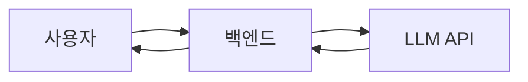
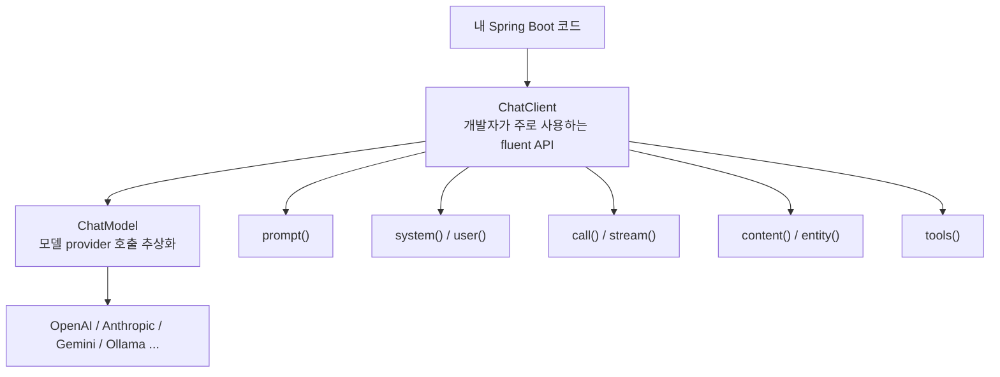
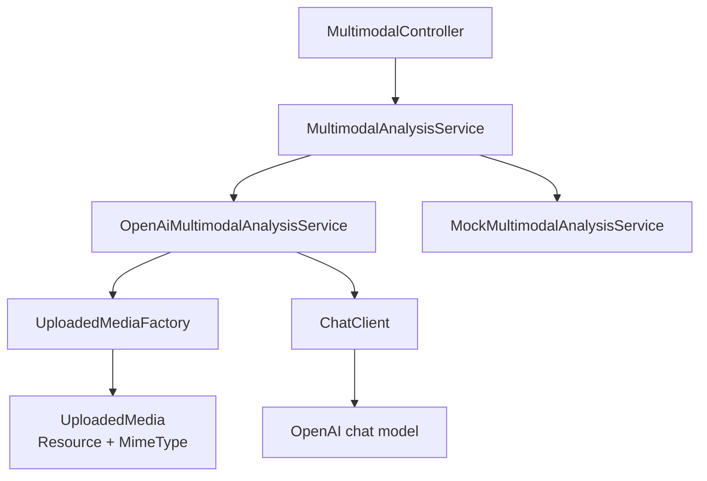

## 1. Spring AI: AI 앱 개발의 새로운 지평

최근 AI 기술의 발전은 소프트웨어 개발 방식에도 큰 변화를 가져오고 있습니다. 특히 LLM(Large Language Model)의 등장으로 개발자들은 AI 기능을 애플리케이션에 통합하는 새로운 도전에 직면했습니다. 초기 AI 앱은 대부분 사용자의 질문을 받아 백엔드가 LLM API를 호출하고, 그 결과를 문자열 형태로 사용자에게 돌려주는 단순한 형태였습니다.



하지만 실제 서비스 환경에서는 이러한 방식만으로는 한계에 부딪히게 됩니다. LLM이 서비스의 특정 도메인 지식(DB 내용, 회사 규정 등)을 알지 못하고, 응답이 매번 문자열이라 후속 로직에서 다루기 어렵다는 점, 그리고 프롬프트 관리가 어렵다는 점 등이 대표적인 문제였습니다. 예를 들어, "이 영수증을 회사 경비로 처리할 수 있어?"와 같은 질문에 LLM API만으로는 정확한 답변을 기대하기 어렵습니다.

### 요즘 AI 앱은 어디로 가는가

이러한 한계를 극복하기 위해 AI 앱 개발은 단순한 "답변 생성"을 넘어 다양한 방향으로 발전하고 있습니다. 그 흐름은 다음과 같습니다.


*   **Structured Output**: LLM의 응답을 문자열이 아닌 JSON/객체와 같은 구조화된 형태로 받아 후속 처리를 용이하게 합니다.
*   **Tool Calling**: LLM이 외부 API, DB, 또는 서비스를 안전하게 호출하여 특정 작업을 수행할 수 있도록 합니다.
*   **RAG (Retrieval Augmented Generation)**: 외부 문서나 지식을 검색하여 LLM의 답변을 보강함으로써 도메인 특화된 질문에 정확하게 답할 수 있게 합니다.
*   **Agentic Application**: 여러 도구와 절차를 조합하여 LLM이 스스로 판단하고 복잡한 업무를 수행하는 단계로 발전합니다.

이 글에서는 이 흐름 중 **Structured Output**과 **Tool Calling**을 Spring AI 프레임워크를 통해 어떻게 구현하고 활용할 수 있는지에 초점을 맞춥니다.

## 2. LLM API 직접 호출 vs Spring AI 방식

### LLM API 직접 호출 방식의 한계

LLM API를 직접 호출하는 방식은 초기 개발 단계에서는 간단해 보일 수 있습니다. 예를 들어, 다음과 같은 코드를 통해 LLM과 통신할 수 있습니다.

```java
String prompt = "사용자의 질문에 답해줘: " + userInput;

HttpRequest request = HttpRequest.newBuilder()
    .uri(URI.create("https://api.example-llm.com/chat"))
    .header("Authorization", "Bearer " + apiKey)
    .POST(HttpRequest.BodyPublishers.ofString("{\"model\": \"gpt-4o\", \"messages\": [{\"role\": \"user\", \"content\": \"" + prompt + "\"}]}"))
    .build();

String response = httpClient.send(request, HttpResponse.BodyHandlers.ofString()).body();
```

하지만 프로젝트 규모가 커지면 다음과 같은 문제에 직면하게 됩니다.

*   **API 요청/응답 포맷 관리**: 모델마다 다른 API 요청/응답 포맷을 직접 관리해야 합니다.
*   **모델 교체 어려움**: 모델을 변경할 때마다 코드 수정이 커질 수 있습니다.
*   **프롬프트 관리**: 프롬프트 문자열이 코드 곳곳에 흩어져 관리가 어렵습니다.
*   **응답 처리 복잡성**: JSON 파싱, 재시도, 오류 처리를 직접 구현해야 합니다.
*   **고급 기능 통합**: Tool Calling, Streaming, Structured Output과 같은 고급 기능을 직접 붙여야 하는 부담이 큽니다.
*   **Spring 생태계와의 단절**: Spring Boot의 설정, Bean 관리, 테스트, 관측(Observability) 흐름과 자연스럽게 연결되지 않아 통합적인 개발 경험을 저해합니다.

> **생각해보기**: 우리가 REST API를 만들 때 `Socket`부터 직접 열어서 HTTP 프로토콜을 구현하지 않는 것처럼, AI API도 고수준의 추상화된 클라이언트를 사용하는 것이 효율적입니다.

### Spring AI 방식의 등장

**Spring AI**는 이러한 문제를 해결하고 AI 모델 호출을 Spring Boot 애플리케이션 내에서 자연스럽게 다룰 수 있도록 돕는 프레임워크입니다. Spring AI를 사용하면 AI 호출도 하나의 외부 의존성으로 간주하고, Spring의 강력한 기능(Bean, 설정, 서비스 계층)을 활용하여 체계적으로 관리할 수 있습니다.


Spring Boot 개발자에게 익숙한 관점에서 Spring AI의 주요 구성요소는 다음과 같이 비유할 수 있습니다.

*   **Controller**: HTTP 요청을 받습니다.
*   **Application Service**: 비즈니스 흐름을 조립합니다.
*   **AI Service**: LLM과 대화하는 책임을 가집니다.
*   **ChatClient**: 모델 호출을 위한 고수준 API로, 개발자가 주로 사용합니다.
*   **ChatModel**: 실제 모델 프로바이더(OpenAI, Anthropic, Gemini 등)와 통신하는 추상화 계층입니다.

> 💡 **핵심**: Spring AI를 사용한다고 해서 기존의 Controller-Service-Repository 계층 구조가 사라지는 것이 아닙니다. AI 호출 역시 외부 의존성이므로, 이를 효과적으로 관리하기 위해 계층을 나누는 것이 중요합니다.

### 직접 호출과 Spring AI 비교

| 관점 | LLM API 직접 호출 | Spring AI 방식 |
| :-- | :---------------- | :------------- |
| **모델 호출** | HTTP 요청 직접 구성 | `ChatClient` 사용 |
| **모델 교체** | 코드 수정이 커질 수 있음 | 설정과 추상화로 완화 |
| **Prompt 관리** | 문자열이 흩어지기 쉬움 | `Prompt`, `Message`, `Template` 구조 활용 |
| **응답 처리** | 문자열 파싱 중심 | `content()`, `entity()` 등 활용 |
| **Tool Calling** | 직접 구현 부담 큼 | 도구 정의와 실행 흐름 지원 |
| **Spring 연동** | 직접 연결 필요 | Bean, Auto Configuration, 설정 기반 |

> **생각해보기**: AI 호출 코드를 Controller에 바로 넣으면 어떤 문제가 생길까요? 테스트가 어려워지고, 프롬프트 및 모델 변경이 HTTP API 코드와 섞이며, 프로젝트가 커질수록 재사용성이 떨어집니다.

## 3. Spring AI 핵심 구성요소

Spring AI를 처음 접할 때는 낯선 용어들 때문에 혼란스러울 수 있습니다. 하지만 몇 가지 핵심 개념만 이해하면 쉽게 접근할 수 있습니다.


### 핵심 용어 정리

| 용어 | 쉽게 말하면 | Spring Boot 비유 |
| :-- | :---------- | :--------------- |
| `ChatModel` | 실제 AI 모델과 통신하는 객체 | 외부 API Client의 하위 구현체 |
| `ChatClient` | 개발자가 주로 쓰는 고수준 대화 API | `WebClient`처럼 쓰는 클라이언트 |
| `Prompt` | 모델에게 보내는 지시와 입력의 묶음 | 요청 DTO + 실행 지시 |
| `System Message` | 모델의 역할, 규칙, 말투, 제약 | 전역 정책, 비즈니스 규칙 |
| `User Message` | 사용자가 실제로 입력한 내용 | HTTP request body |
| `Structured Output` | 문자열 대신 DTO/JSON 형태로 받기 | 응답 DTO |
| `Tool Calling` | 모델이 필요한 도구 사용을 요청하는 구조 | 외부 API 호출을 앱이 통제 |

### `ChatClient`와 `ChatModel`의 관계

`ChatClient`와 `ChatModel`은 같은 레벨의 개념이 아닙니다. `ChatClient`는 개발자가 애플리케이션 코드에서 직접 사용하는 고수준 API이며, `ChatModel`은 `ChatClient` 뒤에서 실제 LLM 프로바이더와 통신하는 추상화 계층입니다.



| 구분 | `ChatClient` | `ChatModel` |
| :-- | :----------- | :---------- |
| **강의에서의 위치** | 오늘의 중심 API | 뒤에서 동작하는 모델 추상화 |
| **개발자가 주로 하는 일** | prompt 구성, 호출, 응답 변환, tool 연결 | provider별 모델 호출 |
| **비유** | `WebClient`처럼 쓰는 고수준 클라이언트 | 실제 HTTP client/adapter에 가까운 하위 계층 |
| **언제 직접 보나** | 대부분의 AI 서비스 코드 | 모델을 직접 구성하거나 낮은 수준 API가 필요할 때 |

> **정리**: 처음 Spring AI를 배울 때는 "`ChatClient`로 모델과 대화한다"라고 이해하고, `ChatModel`은 그 뒤에서 실제 모델 프로바이더를 감싸는 객체라고 생각하면 됩니다.

## 4. ChatClient로 보는 기본 흐름

Spring AI에서 가장 먼저 접하게 되는 API는 `ChatClient`입니다. `ChatClient`는 LLM과의 대화를 위한 유연하고 직관적인 인터페이스를 제공합니다. 예를 들어, 멀티모달(Multimodal) 입력을 처리하는 코드는 다음과 같습니다.

```java
@Service
public class OpenAiMultimodalAnalysisService implements MultimodalAnalysisService {

    private final ChatClient chatClient;
    private final UploadedMediaFactory uploadedMediaFactory;

    public OpenAiMultimodalAnalysisService(
            ChatClient.Builder chatClientBuilder,
            UploadedMediaFactory uploadedMediaFactory
    ) {
        this.chatClient = chatClientBuilder.build();
        this.uploadedMediaFactory = uploadedMediaFactory;
    }

    private String callWithImage(String operation, UploadedMedia media, String userPrompt, String systemPrompt) {
        ChatResponse response = chatClient.prompt()
                .system(systemPrompt)
                .user(user -> user
                        .text(userPrompt)
                        .media(media.mimeType(), media.resource()))
                .call()
                .chatResponse();

        logTokenUsage(operation, response);
        return contentFrom(response);
    }
}
```

이 코드는 다음 네 단계로 읽을 수 있습니다.

1.  `prompt()`: 모델에게 보낼 입력 묶음(Prompt)을 만들기 시작합니다.
2.  `system(...)`: 모델의 역할과 규칙을 정의하는 System Message를 지정합니다.
3.  `user(user -> user.text(...).media(...))`: 사용자의 텍스트 입력과 업로드된 이미지(멀티모달)를 User Message로 함께 전달합니다.
4.  `call().chatResponse()`: 구성된 프롬프트로 모델을 호출하고, 응답 본문과 메타데이터를 포함하는 `ChatResponse`를 받습니다.

> ⚠️ **주의**: 이론 수업에서는 API 형태를 이해하는 것이 목적입니다. 실제 프로젝트에서는 사용하는 Spring AI 버전과 모델 프로바이더에 따라 설정과 일부 옵션이 달라질 수 있습니다.

### Spring Boot 계층 구조로 배치하기

AI 호출 로직을 Controller에 직접 넣기보다는, 별도의 서비스 계층으로 분리하는 것이 좋습니다. 이는 코드의 응집도를 높이고, 테스트 용이성을 확보하며, 프롬프트 및 모델 변경에 대한 유연성을 제공합니다.



## 5. Prompt 설계: System/User/출력 형식

### Prompt는 그냥 질문이 아니다

개발자가 LLM을 처음 사용할 때 흔히 "이 이미지를 분석해줘."와 같은 간단한 프롬프트로 시작합니다. 하지만 서비스 수준의 AI 앱을 개발하기 위해서는 이러한 단순한 프롬프트만으로는 부족합니다.

```
이 이미지를 분석해줘.
[image#1]
```

무엇이 부족할까요? 모델에게 다음과 같은 정보가 명확하게 전달되지 않았기 때문입니다.

*   **역할**: 모델은 어떤 전문가처럼 답해야 하는가?
*   **맥락**: 이미지에서 보이는 것만 말해야 하는가, 추정도 허용되는가?
*   **기준**: 어떤 기준으로 분석해야 하는가?
*   **출력 형식**: 표, 문단, DTO 중 어떤 형태로 응답해야 하는가?
*   **제약**: 금지해야 할 답변은 무엇인가?

> **핵심**: 사람이 봐도 애매한 요구사항은 모델에게도 애매합니다. 명확하고 구체적인 지시가 좋은 결과를 만듭니다.

### System Message와 User Message

LLM에 보내는 메시지는 크게 **System Message**와 **User Message**로 역할을 나눠 생각합니다.

*   **System Message**: 모델의 역할, 규칙, 말투, 제약사항 등 전반적인 행동 지침을 정의합니다. 이는 서비스의 정책과 같은 역할을 합니다.

    ```
    당신은 멀티모달 입력을 분석하는 한국어 AI 조교입니다.
    이미지에서 실제로 확인 가능한 내용과 추정을 구분하세요.
    개인정보, 얼굴, 신분증, 민감한 속성은 필요 이상으로 식별하거나 단정하지 마세요.
    ```

*   **User Message**: 사용자의 실제 입력 내용을 담습니다. 매 요청마다 달라지는 가변적인 입력에 해당합니다.

    ```
    첨부한 이미지는 웹/앱 UI 화면 캡처입니다.

    화면 맥락:
    쇼핑몰 결제 화면입니다. 모바일 사용자 기준으로 리뷰해주세요.

    다음 기준으로 UX 리뷰를 해주세요.
    1. 사용자가 헷갈릴 만한 부분
    2. 클릭해야 할 버튼이나 다음 행동이 명확한지
    3. 화면의 정보 우선순위
    4. 접근성 또는 모바일 가독성 문제
    5. 개선 제안

    출력은 마크다운 표로 작성하세요.
    ```

> 💡 **핵심**: System Message는 서비스의 정책에 가깝고, User Message는 매 요청마다 달라지는 입력에 가깝습니다.

### 좋은 Prompt는 출력 형식까지 포함한다

서비스에서 LLM을 활용할 때는 "좋은 말"로 된 답변보다 "다음 코드가 처리 가능한 응답"이 훨씬 중요합니다. 즉, LLM의 응답이 애플리케이션의 후속 로직에서 쉽게 파싱되고 활용될 수 있도록 출력 형식을 명확히 지정해야 합니다.

**나쁜 예:**

```
영수증을 읽어줘.
```

**좋은 예:**

```
첨부한 영수증 또는 표 이미지를 읽고 구조화해주세요.

출력은 아래 Java DTO에 매핑 가능한 JSON 객체 하나만 사용하세요.
형식:
{
  "merchant": "상호명 또는 null",
  "date": "날짜 또는 null",
  "items": [
    {
      "name": "품목명",
      "quantity": 1,
      "unitPrice": 1000,
      "lineTotal": 1000,
      "confidence": 0.9
    }
  ],
  "subtotal": 1000,
  "tax": 100,
  "total": 1100,
  "needsReview": ["확실하지 않은 항목"]
}

금액과 수량은 숫자로 출력하세요.
흐릿하거나 보이지 않는 값은 추측하지 말고 null 또는 needsReview에 기록하세요.
```

### Prompt 설계 체크포인트

효과적인 프롬프트를 만들기 위한 체크리스트는 다음과 같습니다.

*   **역할**: 모델은 어떤 전문가처럼 답해야 하는가?
*   **맥락**: 모델이 알아야 할 배경 정보는 무엇인가?
*   **입력**: 사용자 입력은 어디에 들어가는가?
*   **제약**: 하면 안 되는 말이나 행동은 무엇인가?
*   **출력**: 문자열, JSON, DTO 중 무엇으로 받을 것인가?
*   **실패 처리**: 모르면 어떻게 답해야 하는가?

## 6. Structured Output: 문자열 답변에서 서비스 데이터로

### 문자열 응답의 한계

LLM의 응답을 단순히 문자열로 받는 방식은 서비스가 복잡해질수록 여러 한계를 드러냅니다.

```java
String answer = chatClient.prompt()
    .user(user -> user
        .text("첨부한 이미지를 한국어로 설명해줘.")
        .media(media.mimeType(), media.resource()))
    .call()
    .content();
```

이러한 방식은 다음과 같은 문제를 야기합니다.

*   **데이터 검증 및 계산 어려움**: 영수증의 총액, 세금, 품목 개수 등을 코드로 검증하거나 금액 필드를 숫자로 계산하기 어렵습니다.
*   **데이터 저장 및 변환 번거로움**: DB에 저장하거나 프론트엔드가 원하는 응답 DTO로 변환하기 위해 추가적인 파싱 로직이 필요합니다.
*   **파싱 안정성 문제**: 모델이 설명 문장을 섞거나 예상치 못한 형식으로 응답하면 파싱 로직이 깨질 수 있습니다.

### Structured Output이란

**Structured Output**은 LLM 응답을 문자열이 아닌 구조화된 데이터(예: JSON, XML)로 받는 방식입니다. Spring AI는 이를 Java DTO(Data Transfer Object)나 Record에 매핑하여 쉽게 사용할 수 있도록 지원합니다.

`multimodal-spring-ai-boot4` 프로젝트의 영수증 추출 기능은 모델 응답을 아래와 같은 Java Record로 받습니다.

```java
public record ReceiptExtraction(
        String merchant,
        String date,
        List<ReceiptItem> items,
        BigDecimal subtotal,
        BigDecimal tax,
        BigDecimal total,
        List<String> needsReview
) {
}

public record ReceiptItem(
        String name,
        Integer quantity,
        BigDecimal unitPrice,
        BigDecimal lineTotal,
        Double confidence
) {
}
```

`ChatClient`를 사용하여 이미지와 프롬프트를 모델에 보내고, 응답을 `ReceiptExtraction` 타입으로 직접 받을 수 있습니다.

```java
ResponseEntity<ChatResponse, ReceiptExtraction> response = chatClient.prompt()
        .system(systemPrompt)
        .user(user -> user
                .text(userPrompt)
                .media(media.mimeType(), media.resource()))
        .call()
        .responseEntity(ReceiptExtraction.class);

ReceiptExtraction receipt = response.getEntity();
ChatResponse chatResponse = response.getResponse();
```

응답 본문만 필요한 경우 `entity(...)` 메서드를 사용하여 더 간결하게 코드를 작성할 수 있습니다.

```java
ReceiptExtraction receipt = chatClient.prompt()
        .system(systemPrompt)
        .user(user -> user
                .text(userPrompt)
                .media(media.mimeType(), media.resource()))
        .call()
        .entity(ReceiptExtraction.class);
```

> 💡 **핵심**: 처음에는 `OutputConverter`를 직접 외우기보다, `content()`는 문자열 응답이고 `entity(...)`는 Java 타입으로 받는 응답이라고 이해하면 됩니다.

### OutputConverter는 무엇을 해주는가

`OutputConverter`는 LLM이 생성한 **문자열 응답**을 Java에서 다루기 좋은 **객체**로 변환해주는 역할을 합니다. 예를 들어, LLM이 다음과 같은 JSON 문자열을 반환하면,

```json
{
  "merchant": "Mock Store",
  "date": "2026-05-12",
  "items": [
    {
      "name": "강의용 샘플 품목",
      "quantity": 1,
      "unitPrice": 10000,
      "lineTotal": 10000,
      "confidence": 1.0
    }
  ],
  "subtotal": 10000,
  "tax": 1000,
  "total": 11000,
  "needsReview": []
}
```

`OutputConverter`는 이 JSON 문자열을 `ReceiptExtraction`과 같은 Java 객체로 자동으로 매핑해줍니다. 이를 통해 개발자는 복잡한 파싱 로직 없이 LLM의 응답을 비즈니스 로직에 바로 활용할 수 있습니다.

## 7. Tool Calling: LLM이 외부 도구를 사용하는 방법

LLM은 방대한 지식을 가지고 있지만, 실시간 정보나 특정 도메인에 특화된 기능(예: 날씨 정보 조회, 주식 가격 확인, 데이터베이스 쿼리)에는 접근할 수 없습니다. **Tool Calling**은 LLM이 이러한 외부 도구들을 필요에 따라 호출하여 자신의 능력을 확장할 수 있도록 하는 메커니즘입니다.

### Tool Calling의 필요성

*   **실시간 정보 접근**: LLM의 학습 데이터는 특정 시점까지의 정보만을 포함합니다. Tool Calling을 통해 최신 정보를 조회할 수 있습니다.
*   **도메인 특화 기능**: 특정 API나 데이터베이스에 접근하여 도메인 특화된 작업을 수행할 수 있습니다.
*   **정확성 및 신뢰성 향상**: LLM이 "환각(Hallucination)"을 일으킬 수 있는 부분을 외부 도구의 정확한 결과로 보완할 수 있습니다.
*   **사용자 요청 처리**: 사용자의 복잡한 요청(예: "내일 서울 날씨 알려주고, 근처 맛집 추천해줘")을 여러 도구 호출로 분해하여 처리할 수 있습니다.

### Spring AI에서의 Tool Calling

Spring AI는 `ChatClient`를 통해 Tool Calling을 쉽게 통합할 수 있도록 지원합니다. 개발자는 사용할 도구를 정의하고, `ChatClient`에 등록하기만 하면 됩니다. LLM은 대화의 맥락을 파악하여 적절한 시점에 필요한 도구를 호출할지 여부를 결정하고, 필요한 인자를 추출하여 전달합니다.

```java
// 도구 정의 예시
@Bean
public Function<WeatherRequest, WeatherResponse> weatherFunction() {
    return new WeatherFunction();
}

// ChatClient를 통한 도구 호출
String response = chatClient.prompt()
    .user("내일 서울 날씨는 어때?")
    .functions("weatherFunction") // 등록된 도구 이름
    .call()
    .content();
```

LLM은 사용자의 질문을 분석하여 `weatherFunction`을 호출해야 한다고 판단하면, 필요한 인자(예: 도시명)를 추출하여 함수를 실행하도록 요청합니다. Spring AI는 이 과정을 자동으로 처리하고, 함수 실행 결과를 다시 LLM에 전달하여 최종 답변을 생성하게 합니다.

## 8. Agentic Application: LLM이 스스로 판단하고 행동하는 앱

**Agentic Application**은 LLM이 단순히 질문에 답하는 것을 넘어, 스스로 목표를 설정하고, 계획을 세우고, 필요한 도구를 사용하여 행동하며, 그 결과를 평가하여 다음 행동을 결정하는 자율적인 애플리케이션을 의미합니다. 이는 마치 소프트웨어 에이전트가 사람처럼 문제를 해결하는 방식과 유사합니다.

### Agentic Application의 특징

*   **자율성**: LLM이 외부의 명시적인 지시 없이 스스로 판단하고 행동합니다.
*   **계획 수립**: 복잡한 작업을 작은 단계로 분해하고 실행 계획을 세웁니다.
*   **도구 사용**: Tool Calling을 통해 외부 시스템과 상호작용하며 정보를 얻거나 작업을 수행합니다.
*   **피드백 루프**: 행동의 결과를 평가하고, 필요에 따라 계획을 수정하거나 재시도합니다.

이러한 Agentic Application의 개념은 이전에 [AI 에이전트의 Harness(하네스)에 대한 기술적 고찰](/posts/deep-dive-into-ai-agent-harness/) 포스팅에서 다룬 바 있습니다. Harness는 에이전트가 안전하고 효율적으로 작동할 수 있도록 제어하고 관리하는 역할을 합니다.

### Spring AI와 Agentic Application

Spring AI는 `ChatClient`의 `Tool Calling` 기능을 통해 Agentic Application의 기반을 제공합니다. LLM이 여러 도구를 조합하여 복잡한 작업을 수행할 수 있도록 함으로써, 개발자는 더욱 지능적이고 자율적인 AI 앱을 구축할 수 있습니다. 예를 들어, 사용자가 "이번 달 매출 보고서를 작성해줘"라고 요청하면, LLM은 다음과 같은 일련의 과정을 스스로 수행할 수 있습니다.

1.  **데이터 조회 도구 호출**: 데이터베이스에서 매출 데이터를 조회합니다.
2.  **데이터 분석 도구 호출**: 조회된 데이터를 분석하여 주요 지표를 추출합니다.
3.  **보고서 작성 도구 호출**: 분석 결과를 바탕으로 보고서 초안을 작성합니다.
4.  **피드백 및 수정**: 작성된 보고서를 검토하고, 필요에 따라 추가 분석이나 수정을 지시합니다.

## 9. 오늘의 마무리

Spring AI는 LLM을 활용한 AI 앱 개발을 Spring Boot 생태계 안에서 자연스럽고 효율적으로 수행할 수 있도록 돕는 강력한 도구입니다. 단순한 LLM API 직접 호출의 한계를 넘어, `ChatClient`를 통한 고수준의 추상화, `Structured Output`을 통한 데이터 중심의 응답 처리, 그리고 `Tool Calling`을 통한 LLM의 능력 확장까지 다양한 기능을 제공합니다.

이번 학습을 통해 AI 앱 개발이 단순히 LLM을 호출하는 것을 넘어, **어떻게 LLM과 애플리케이션의 비즈니스 로직을 유기적으로 연결하고, LLM의 응답을 서비스에 적합한 형태로 가공하며, LLM의 한계를 외부 도구로 보완할 것인가**에 대한 깊은 고민이 필요하다는 것을 느꼈습니다. 특히 `Structured Output`과 `Tool Calling`은 LLM을 실제 서비스에 통합하는 데 있어 필수적인 요소이며, 이를 통해 더욱 견고하고 지능적인 AI 앱을 구축할 수 있을 것입니다.

### Learned (배운 점)

*   **LLM API 직접 호출의 한계**: 서비스 규모가 커질수록 프롬프트 관리, 모델 교체, 응답 처리, 고급 기능 통합 등에서 많은 어려움이 발생한다.
*   **Spring AI의 역할**: Spring Boot 개발자에게 익숙한 방식으로 LLM 호출을 통합하고, Bean 관리, 설정, 서비스 계층 분리 등을 통해 체계적인 AI 앱 개발을 가능하게 한다.
*   **`ChatClient`의 중요성**: LLM과의 대화를 위한 고수준 API로, 개발자가 주로 사용하는 인터페이스이다.
*   **Prompt 설계의 중요성**: System Message와 User Message를 통해 모델의 역할, 맥락, 제약, 출력 형식을 명확히 정의하는 것이 고품질 응답을 얻는 핵심이다.
*   **`Structured Output`의 필요성**: LLM 응답을 문자열이 아닌 구조화된 데이터(DTO/JSON)로 받아 후속 비즈니스 로직에 쉽게 활용할 수 있게 한다.
*   **`Tool Calling`을 통한 LLM 능력 확장**: LLM이 외부 도구(API, DB 등)를 호출하여 실시간 정보 접근, 도메인 특화 기능 수행, 정확성 향상 등 LLM의 한계를 보완한다.
*   **Agentic Application의 비전**: `Tool Calling`을 기반으로 LLM이 스스로 목표를 설정하고, 계획을 세우고, 행동하며, 결과를 평가하는 자율적인 AI 앱 개발의 가능성을 엿볼 수 있었다.

---

### References

*   [Spring AI 공식 문서](https://docs.spring.io/spring-ai/reference/)
*   [AI 에이전트의 Harness(하네스)에 대한 기술적 고찰](/posts/deep-dive-into-ai-agent-harness/)
*   [Spring AI GitHub Repository](https://github.com/spring-projects/spring-ai)
