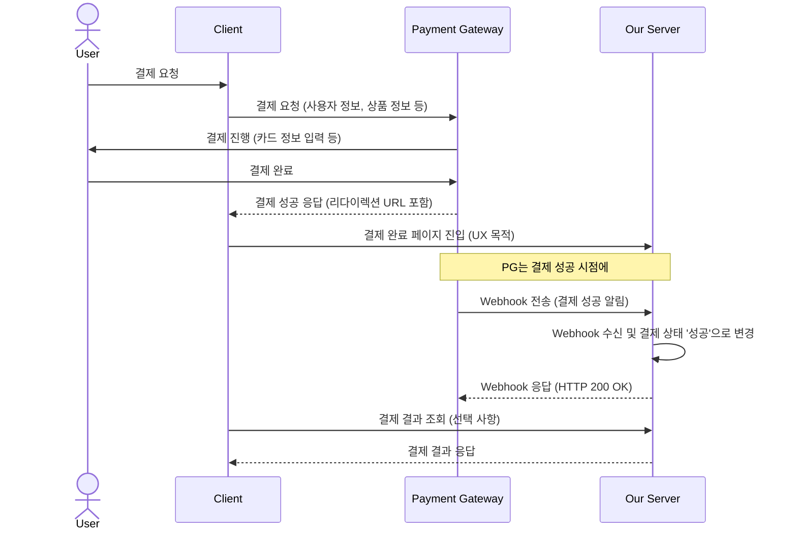
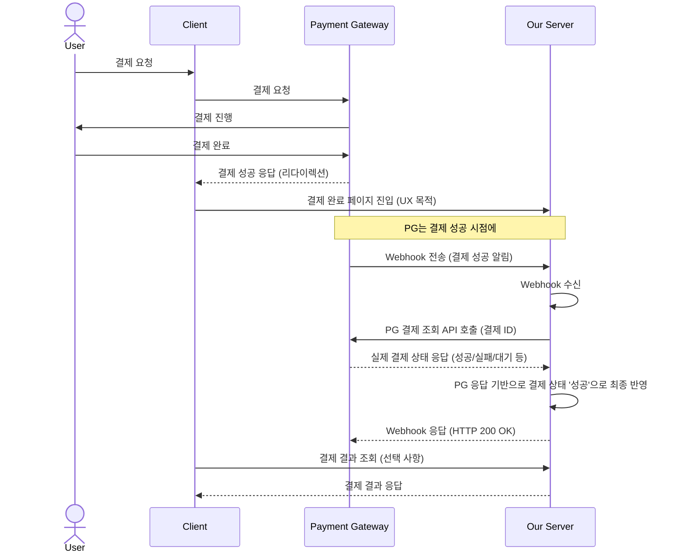

## 들어가며

백엔드 개발자라면 한 번쯤은 결제 시스템을 설계하거나 구현하는 과정에 참여하게 됩니다. 이때 가장 중요하게 고려해야 할 부분 중 하나가 바로 **결제 상태의 정확성과 일관성**입니다. "사용자가 결제 완료 페이지에 도달하면 결제가 성공한 것"이라고 단순하게 생각했다가는 실제 운영 환경에서 예상치 못한 문제에 직면하게 됩니다. 이번 글에서는 실제 결제 시스템 프로젝트 경험을 바탕으로, 왜 결제 상태를 사용자 액션에 의존하면 안 되는지, 그리고 웹훅(Webhook)과 PG 조회 API가 어떻게 견고한 결제 시스템을 만드는 핵심 요소가 되는지 깊이 있게 다뤄보겠습니다.

## 문제 상황: 사용자 액션 기반 설계의 함정

프로젝트 초기에 결제 시스템을 설계할 때, 많은 개발자들이 다음과 같은 직관적인 흐름을 떠올릴 수 있습니다.

```
사용자 결제 요청
  ↓
PG 결제 진행
  ↓
결제 완료 페이지 이동 (사용자 액션)
  ↓
우리 서버에 결제 완료 요청 (클라이언트)
  ↓
우리 서버: 결제 상태 '성공'으로 변경
```

이러한 방식은 겉보기에는 문제가 없어 보이지만, 실제 운영 환경에서는 치명적인 상태 불일치를 야기할 수 있습니다. 상상해보세요. 사용자가 결제 버튼을 누르고 PG사 페이지에서 결제를 완료했습니다. PG사에서는 분명히 결제가 성공했다고 응답했지만, 사용자가 결제 완료 페이지로 이동하는 도중 다음과 같은 상황이 발생한다면 어떻게 될까요?

*   **결제 후 브라우저 종료**: 사용자가 결제 완료 페이지를 보기도 전에 브라우저를 닫아버립니다.
*   **모바일 앱 강제 종료**: 모바일 앱에서 결제 후 앱을 강제로 종료합니다.
*   **네트워크 장애**: 결제 완료 페이지로의 리다이렉션 중 네트워크 연결이 끊깁니다.
*   **결제 완료 페이지 로딩 실패**: 서버 오류나 클라이언트 측 문제로 페이지가 제대로 로딩되지 않습니다.
*   **사용자 이탈**: 사용자가 결제 완료 페이지를 기다리지 않고 다른 페이지로 이동하거나 앱을 이탈합니다.

이러한 상황들은 사용자 액션에 기반한 결제 상태 변경 로직을 무력화시킵니다. PG사에서는 결제가 성공했지만, 우리 서버는 결제 완료 요청을 받지 못해 여전히 **'결제 대기' 상태**로 남아있게 됩니다. 이는 곧 **PG와 우리 서버 간의 심각한 상태 불일치**로 이어지며, 고객 불만, 매출 손실, 재고 관리 오류 등 다양한 문제의 원인이 됩니다.

## 사용자 액션 기반 설계의 문제점

결론부터 말하자면, **결제 성공 여부와 사용자의 행동은 별개의 문제**입니다. 사용자가 결제 완료 페이지에 진입했는지 여부는 UX(User Experience)를 위한 흐름일 뿐, 결제의 최종 성공 여부를 결정하는 기준이 되어서는 안 됩니다. 결제는 PG사와의 통신을 통해 이루어지는 금융 거래이며, 그 결과는 PG사가 가장 정확하게 알고 있습니다. 사용자의 브라우저나 앱 환경은 통제 불가능한 요소가 너무 많기 때문에, 이를 결제 상태의 '최종 진실(Source of Truth)'로 삼는 것은 매우 위험한 설계입니다.

## 웹훅(Webhook)의 등장: PG가 알려주는 상태 변경

이러한 사용자 액션 기반 설계의 한계를 극복하기 위해 등장하는 것이 바로 **웹훅(Webhook)**입니다. 웹훅은 결제 상태 변경의 주체를 사용자(클라이언트)에서 **PG사(서버)**로 변경하는 핵심적인 메커니즘입니다. 즉, PG사에서 결제가 성공하면, PG사가 직접 우리 서버로 결제 상태가 변경되었음을 알려주는 방식입니다.

**웹훅을 활용한 결제 흐름 예시:**



웹훅을 통해 우리 서버는 사용자의 브라우저나 앱 상태와 무관하게 PG사로부터 직접 결제 성공 알림을 받게 됩니다. 이는 결제 상태의 일관성을 확보하는 데 매우 중요한 역할을 합니다. 사용자가 결제 완료 페이지에 도달하지 못하더라도, PG사가 웹훅을 통해 우리 서버에 결제 성공을 알려주므로 상태 불일치 문제를 상당 부분 해소할 수 있습니다.

## 웹훅만 믿으면 안 되는 이유: 웹훅은 '알림'일 뿐

웹훅은 결제 상태 동기화에 있어 매우 강력한 도구이지만, **웹훅만으로 모든 것을 해결할 수 있는 것은 아닙니다.** 웹훅은 네트워크 환경에 의존하기 때문에 다음과 같은 상황에서 전송 실패가 발생할 수 있습니다.

*   PG사에서 웹훅 전송 중 네트워크 장애
*   우리 서버의 일시적인 장애로 웹훅 수신 실패
*   PG사의 웹훅 재전송 정책이 충분하지 않은 경우

이러한 경우, PG사에서는 결제가 성공했지만 우리 서버는 웹훅을 받지 못해 여전히 '결제 대기' 상태로 남아있을 수 있습니다. 즉, **웹훅은 '결제 성공' 그 자체가 아니라 '결제 상태가 변경되었으니 확인해달라'는 '알림'**이라는 관점으로 이해해야 합니다. 웹훅은 보조적인 수단이지, 결제 상태의 최종 진실(Source of Truth)이 아닙니다.

## PG 조회 API가 최종 진실(Source of Truth)인 이유

그렇다면 결제 상태의 최종 진실은 무엇일까요? 바로 **PG사의 결제 조회 API**입니다. 실제 운영 환경에서는 웹훅 수신만으로 결제 상태를 최종 확정하지 않고, 다음과 같은 흐름으로 처리하는 것이 일반적입니다.



웹훅을 수신하면, 우리 서버는 해당 웹훅의 `결제 ID`를 이용해 PG사의 결제 조회 API를 호출합니다. 이 API를 통해 PG사에 기록된 **실제 결제 상태**를 확인하고, 그 결과를 바탕으로 우리 서버의 결제 상태를 최종적으로 반영하는 것입니다. 이렇게 하면 웹훅 전송 실패와 같은 일시적인 문제에도 불구하고, PG사의 데이터가 항상 최종 진실(Source of Truth)이 되므로 결제 상태의 일관성과 정확성을 보장할 수 있습니다.

이러한 방식은 [동시성 제어 전략](/posts/concurrency-control-strategy/)에서 다루었던 **낙관적 락(Optimistic Lock)**이나 **비관적 락(Pessimistic Lock)**과 유사하게, 외부 시스템(PG)의 상태를 기준으로 우리 시스템의 상태를 업데이트하는 개념으로 볼 수 있습니다. 다만, 여기서는 데이터베이스의 락이 아닌, 외부 서비스의 API 호출을 통해 최종적인 상태를 확인한다는 차이가 있습니다.

## 실제 프로젝트 적용 사례: 전자상거래 결제 시스템

실제 전자상거래 결제 시스템에서는 위에서 설명한 원칙을 바탕으로 다음과 같은 흐름으로 결제 처리가 이루어집니다.

1.  **사용자 결제 요청**: 클라이언트에서 PG사로 결제 요청을 보냅니다.
2.  **PG 결제 처리**: PG사에서 결제를 처리하고, 성공/실패 여부를 결정합니다.
3.  **PG -> 클라이언트 응답**: PG사는 결제 결과를 클라이언트에 응답하고, 미리 설정된 `redirect_url`로 리다이렉션합니다. (이때 클라이언트는 결제 완료 페이지로 이동)
4.  **PG -> 우리 서버 (Webhook)**: PG사는 결제 성공 시점에 우리 서버의 웹훅 URL로 결제 성공 알림을 전송합니다.
5.  **우리 서버 (Webhook 수신)**: 웹훅을 수신한 우리 서버는 즉시 PG 결제 조회 API를 호출하여 해당 `결제 ID`의 실제 상태를 확인합니다.
6.  **결제 상태 최종 반영**: PG 조회 API 응답이 '성공'이면, 우리 서버의 `Payment` 상태를 `PAID`로 변경하고, `Order` 상태를 `CONFIRMED`로 변경합니다.
7.  **후처리 로직 실행**: 결제 성공에 따른 포인트 적립, 재고 차감, 주문 완료 알림 발송 등 비즈니스 로직을 실행합니다.
8.  **웹훅 응답**: 우리 서버는 PG사에 웹훅 수신 및 처리 완료 응답(HTTP 200 OK)을 보냅니다.
9.  **클라이언트 -> 우리 서버 (결과 조회)**: 클라이언트(결제 완료 페이지)는 우리 서버에 최종 결제 결과를 조회하여 사용자에게 보여줍니다.

이러한 복잡한 흐름은 모두 **결제 상태의 정확성과 일관성**을 보장하기 위함입니다. 사용자의 행동에 의존하지 않고, PG사의 데이터를 최종 진실로 삼아 시스템 간의 상태를 동기화하는 것이 핵심입니다.

## 결제 상태 동기화 흐름 비교


## 정리

이번 글을 통해 결제 시스템 설계에서 가장 중요한 원칙 중 하나인 **"결제 상태 동기화"**에 대해 깊이 있게 살펴보았습니다. 핵심 메시지는 다음과 같습니다.

*   **사용자 액션은 UX를 위한 흐름**: 결제 완료 페이지 진입은 사용자 경험을 위한 것이지, 결제 성공의 최종 지표가 아닙니다.
*   **Webhook은 상태 변경 알림**: PG사로부터의 웹훅은 결제 상태가 변경되었음을 알려주는 '알림'일 뿐, 그 자체로 최종적인 결제 성공을 의미하지 않습니다.
*   **PG 조회 API는 최종 진실(Source of Truth)**: PG사의 데이터가 가장 정확하며, 웹훅 수신 후 PG 조회 API를 통해 실제 결제 상태를 확인하고 우리 서버의 상태를 반영하는 것이 가장 견고한 설계입니다.

실제 결제 시스템은 사용자가 아니라 PG를 기준으로 상태를 동기화해야 합니다. 이 원칙을 이해하고 적용하는 것이 안정적이고 신뢰할 수 있는 결제 시스템을 구축하는 첫걸음입니다. 복잡한 금융 거래의 특성을 이해하고, 발생 가능한 모든 예외 상황을 고려하여 견고한 시스템을 설계하는 것이 백엔드 개발자의 중요한 역할임을 다시 한번 깨닫게 됩니다.

## Learned (배운 점)

*   사용자 액션에 의존하는 결제 상태 변경의 위험성을 이해하고, 실제 운영 환경에서 발생할 수 있는 다양한 문제 상황을 인지하게 되었다.
*   웹훅의 역할이 '상태 변경 알림'이며, 그 자체로 최종 진실이 아님을 명확히 구분할 수 있게 되었다.
*   PG 조회 API가 결제 상태의 '최종 진실(Source of Truth)'임을 이해하고, 웹훅과 PG 조회 API를 결합한 견고한 결제 상태 동기화 전략의 중요성을 깨달았다.
*   복잡한 금융 거래 시스템 설계 시, 외부 서비스의 신뢰할 수 있는 데이터를 기준으로 내부 시스템의 상태를 관리해야 한다는 원칙을 확립했다.
*   이러한 설계 원칙이 고객 신뢰, 매출 보호, 시스템 안정성 확보에 얼마나 중요한지 실무적 관점에서 깊이 있게 이해하게 되었다.

---
