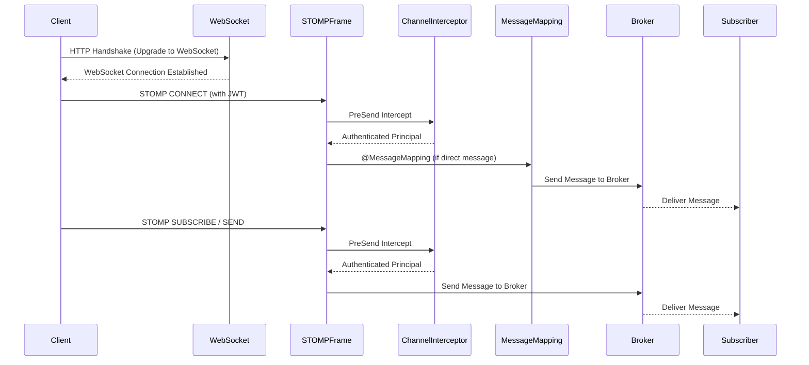
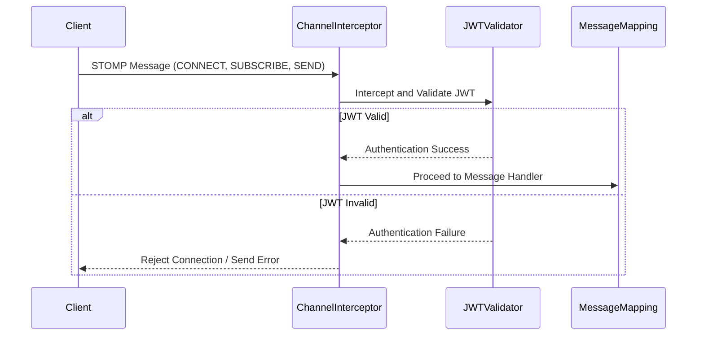

## 들어가면서

현대 웹 서비스에서 **실시간 통신**은 선택이 아닌 필수가 되었습니다. 채팅 애플리케이션, 실시간 알림, 협업 도구, 온라인 게임 등 다양한 서비스에서 사용자들은 즉각적인 정보 업데이트를 기대합니다. 하지만 웹의 근간을 이루는 HTTP 프로토콜은 이러한 실시간 요구사항을 충족하기에는 구조적인 한계를 가지고 있습니다. 저는 이러한 실시간 서비스의 복잡성을 해결하기 위한 여정에서 HTTP의 한계부터 WebSocket, STOMP, 그리고 마지막으로 인증 문제까지 깊이 있게 탐구하며 그 과정에서 얻은 지식과 인사이트를 공유하고자 합니다.

## HTTP의 구조적 특징과 한계

HTTP(HyperText Transfer Protocol)는 웹의 가장 기본적인 통신 프로토콜입니다. 그 특징은 **Request-Response** 모델에 기반한다는 것입니다. 클라이언트가 요청을 보내면 서버가 응답하는 방식으로 동작하며, 서버가 먼저 클라이언트에게 메시지를 보낼 수는 없습니다. 또한, 기본적으로 연결 지향적이지만, 요청-응답 후 연결을 종료하는 특성 때문에 실시간 이벤트 전달을 전제로 설계되지 않았습니다.

> **핵심 정리**: HTTP는 클라이언트의 요청에 대한 서버의 응답으로 동작하며, 서버 푸시나 지속적인 연결에는 적합하지 않습니다.

### HTTP의 한계: 실시간 서비스와의 충돌

이러한 HTTP의 특성은 실시간 서비스와 충돌합니다. 서버에서 발생하는 이벤트를 클라이언트에게 즉시 전달하기 어렵고, 이를 해결하기 위해 **Polling**과 같은 비효율적인 방법을 사용해야 합니다. 이는 불필요한 요청 증가와 트래픽 낭비로 이어져 실시간 서비스의 성능을 저하시키는 주된 원인이 됩니다.

## 실시간 서비스의 요구사항과 Polling

실시간 서비스는 **연결 유지**, **서버 푸시**, **즉시 이벤트 전달**을 요구합니다. HTTP는 이러한 요구사항을 직접적으로 제공하지 못합니다. 그래서 등장한 것이 Polling 방식입니다.

### Polling

**Polling**은 클라이언트가 주기적으로 서버에 새로운 데이터가 있는지 요청하고, 서버는 이에 응답하는 방식입니다. 마치 
클라이언트가 주기적으로 서버에 새로운 데이터가 있는지 요청하고, 서버는 이에 응답하는 방식입니다. 마치 '새로운 소식 있나요?'라고 계속 묻는 것과 같습니다.

*   **동작 방식**: 클라이언트가 일정 시간 간격으로 서버에 HTTP 요청을 보내고, 서버는 현재 가지고 있는 데이터를 응답합니다.
*   **장점**: 구현이 간단하고, 기존 HTTP 인프라를 그대로 활용할 수 있습니다.
*   **단점**: 실시간성이 요청 주기에 의존하며, 새로운 데이터가 없어도 계속 요청을 보내므로 불필요한 트래픽과 서버 부하를 유발합니다.

### Long Polling

**Long Polling**은 Polling의 비효율성을 개선한 방식입니다. 클라이언트가 요청을 보내면 서버는 새로운 데이터가 생길 때까지 응답을 지연시킵니다. 데이터가 생기면 즉시 응답하고 연결을 종료하며, 클라이언트는 응답을 받자마자 다시 요청을 보냅니다.

*   **동작 방식**: 클라이언트 요청 시 서버는 응답할 데이터가 없으면 연결을 유지한 채 대기하다가, 데이터가 발생하면 응답하고 연결을 닫습니다. 클라이언트는 응답을 받으면 즉시 새로운 요청을 보냅니다.
*   **장점**: Polling보다 불필요한 요청 횟수를 줄여 효율적입니다.
*   **단점**: 여전히 HTTP 기반이므로 연결 유지에 대한 오버헤드가 존재하며, 서버가 요청을 계속 붙잡고 있어야 하므로 확장성에 한계가 있습니다.

> **핵심 정리**: Polling과 Long Polling은 HTTP의 한계를 우회하려는 시도였지만, 근본적인 실시간 통신 문제를 해결하지 못하고 비효율성을 야기합니다.

## WebSocket 등장 배경: HTTP의 한계를 넘어서

Polling과 Long Polling의 한계를 극복하고 진정한 실시간 양방향 통신을 위해 **WebSocket**이 등장했습니다. WebSocket은 HTTP와는 다른 프로토콜이지만, 초기 연결 설정(핸드셰이크)은 HTTP를 통해 이루어집니다. 핸드셰이크가 성공하면 HTTP 연결은 WebSocket 연결로 업그레이드되고, 이후부터는 독립적인 TCP 기반의 양방향 통신 채널이 열립니다.

*   **지속 연결**: 한 번 연결되면 클라이언트와 서버 간의 연결이 계속 유지됩니다.
*   **Full Duplex 통신**: 클라이언트와 서버가 동시에 데이터를 주고받을 수 있습니다.
*   **서버 푸시 가능**: 서버가 클라이언트의 요청 없이도 데이터를 보낼 수 있습니다.
*   **이벤트 기반 통신**: 메시지 프레임을 통해 효율적인 데이터 전송이 가능합니다.

### HTTP와 WebSocket 비교

| 항목         | HTTP                                 | WebSocket                               |
| :----------- | :----------------------------------- | :-------------------------------------- |
| **연결 유지**  | 요청-응답 후 연결 종료 (비지속적)    | 한 번 연결 후 지속 유지 (지속적)        |
| **서버 푸시**  | 불가능 (Polling, Long Polling으로 우회) | 가능                                    |
| **통신 방식**  | 단방향 (클라이언트 요청 → 서버 응답) | 양방향 (클라이언트 ↔ 서버)             |
| **실시간 적합성** | 낮음                                 | 높음                                    |

> **핵심 정리**: WebSocket은 HTTP의 단방향, 비지속적 연결의 한계를 극복하고 진정한 양방향, 지속적 실시간 통신을 가능하게 합니다.

## Spring WebSocket 구조

Spring Framework는 WebSocket을 쉽게 사용할 수 있도록 다양한 추상화와 기능을 제공합니다. 핵심 컴포넌트는 `WebSocketConfig`와 `WebSocketHandler`입니다.

### WebSocketConfig 역할

`WebSocketConfig`는 WebSocket 엔드포인트를 등록하고, 어떤 URL을 WebSocket 진입점으로 사용할지, 그리고 어떤 `WebSocketHandler`가 해당 연결을 처리할지 설정합니다.

```java
@Configuration
@EnableWebSocket
public class WebSocketConfig implements WebSocketConfigurer {

    @Override
    public void registerWebSocketHandlers(WebSocketHandlerRegistry registry) {
        registry.addHandler(myWebSocketHandler(), "/ws")
                .setAllowedOrigins("*"); // 모든 도메인 허용
    }

    @Bean
    public WebSocketHandler myWebSocketHandler() {
        return new MyWebSocketHandler();
    }
}
```

### WebSocketHandler 역할

`WebSocketHandler`는 WebSocket 연결의 생명주기(연결 생성, 메시지 수신, 연결 종료)를 관리하고 실제 메시지 처리를 담당합니다.

```java
public class MyWebSocketHandler extends TextWebSocketHandler {

    @Override
    public void afterConnectionEstablished(WebSocketSession session) throws Exception {
        // WebSocket 연결이 생성된 후 호출
        System.out.println("Connected: " + session.getId());
    }

    @Override
    protected void handleTextMessage(WebSocketSession session, TextMessage message) throws Exception {
        // 메시지를 수신했을 때 호출
        System.out.println("Received: " + message.getPayload());
        session.sendMessage(new TextMessage("Echo: " + message.getPayload()));
    }

    @Override
    public void afterConnectionClosed(WebSocketSession session, CloseStatus status) throws Exception {
        // WebSocket 연결이 종료된 후 호출
        System.out.println("Disconnected: " + session.getId());
    }
}
```

> **핵심 정리**: Spring WebSocket은 `WebSocketConfig`로 엔드포인트를 설정하고 `WebSocketHandler`로 연결 및 메시지 이벤트를 처리합니다.

## 순수 WebSocket의 한계: 통신은 해결했지만 메시징은?

WebSocket은 클라이언트와 서버 간의 지속적인 양방향 통신 채널을 제공하여 HTTP의 한계를 성공적으로 극복했습니다. 하지만 순수 WebSocket만으로는 복잡한 메시징 애플리케이션을 개발하기에는 부족한 점이 많습니다. 예를 들어, 특정 사용자에게 메시지를 보내거나, 특정 주제(채팅방)에 참여한 모든 사용자에게 메시지를 브로드캐스트하는 등의 기능은 직접 구현해야 합니다.

*   **메시지 목적지 개념 없음**: 메시지를 어디로 보낼지에 대한 표준화된 방법이 없습니다.
*   **라우팅 직접 구현**: 메시지를 특정 핸들러나 사용자에게 라우팅하는 로직을 직접 작성해야 합니다.
*   **세션 관리 직접 구현**: 누가 연결되어 있고, 어떤 상태인지 등을 직접 관리해야 합니다.
*   **규모가 커질수록 복잡도 증가**: 애플리케이션의 규모가 커질수록 이러한 기능들을 직접 구현하고 관리하는 것이 매우 복잡해집니다.

결론적으로, WebSocket은 **통신 채널**을 제공하지만, 그 위에서 동작하는 **메시징 프로토콜**은 아닙니다. 즉, '통신은 해결하지만 메시징은 해결하지 못한다'는 한계가 있습니다.

> **핵심 정리**: 순수 WebSocket은 저수준 통신 채널일 뿐, 복잡한 메시징 애플리케이션 개발에 필요한 메시지 라우팅, 구독/발행 등의 기능을 직접 제공하지 않습니다.

## STOMP 등장: 메시징의 표준을 제시하다

순수 WebSocket의 메시징 한계를 해결하기 위해 **STOMP(Simple Text Oriented Messaging Protocol)**가 등장했습니다. STOMP는 WebSocket 위에서 동작하는 메시징 프로토콜로, 메시지 송수신에 대한 표준화된 형식을 제공하여 복잡한 메시징 로직을 쉽게 구현할 수 있도록 돕습니다.

### STOMP란?

STOMP는 텍스트 기반의 메시징 프로토콜로, 클라이언트와 메시지 브로커 간의 통신을 위한 프레임워크를 정의합니다. HTTP가 웹 문서 전송을 위한 프로토콜인 것처럼, STOMP는 메시징 시스템에서 메시지를 주고받기 위한 프로토콜이라고 생각할 수 있습니다.

### 핵심 개념

*   **Destination**: 메시지가 전달될 목적지를 나타냅니다. `/topic/public`이나 `/user/queue/private`과 같이 계층적인 구조를 가질 수 있습니다.
*   **SEND**: 클라이언트가 메시지를 특정 Destination으로 보낼 때 사용합니다.
*   **SUBSCRIBE**: 클라이언트가 특정 Destination의 메시지를 구독할 때 사용합니다.
*   **ACK/NACK**: 메시지 수신 확인 및 거부 메커니즘을 제공합니다.

### WebSocket과 STOMP 관계

WebSocket과 STOMP의 관계는 마치 **도로와 교통 규칙**에 비유할 수 있습니다.

*   **WebSocket = 도로**: 클라이언트와 서버가 연결되어 데이터를 주고받을 수 있는 물리적인 통신 채널을 제공합니다.
*   **STOMP = 교통 규칙**: 이 도로 위에서 메시지들이 어떻게 이동하고, 어떤 규칙으로 소통해야 하는지를 정의합니다. 덕분에 메시지가 어디로 가야 할지(Destination), 누가 메시지를 받을지(Subscribe) 등을 명확하게 알 수 있습니다.


### STOMP 사용 이유 (실무 관점)

실무에서 STOMP를 사용하는 주된 이유는 복잡한 실시간 메시징 기능을 효율적으로 구현할 수 있기 때문입니다.

*   **채팅 애플리케이션**: 특정 채팅방에 메시지를 보내고(SEND), 해당 채팅방의 메시지를 구독(SUBSCRIBE)하는 기능을 쉽게 구현할 수 있습니다.
*   **실시간 알림**: 특정 사용자에게만 알림 메시지를 보내거나(개인 Destination), 전체 사용자에게 공지 메시지를 보낼 수 있습니다.
*   **실시간 협업 도구**: 문서 공동 편집, 화이트보드 공유 등 실시간으로 상태를 동기화해야 하는 애플리케이션에 유용합니다.
*   **게임 서버**: 게임 내 이벤트 발생 시 관련 플레이어들에게 빠르게 메시지를 전달할 수 있습니다.

> **핵심 정리**: STOMP는 WebSocket 위에 메시징 개념을 추가하여 메시지 라우팅, 구독/발행 등의 복잡한 실시간 기능을 표준화된 방식으로 쉽게 구현할 수 있도록 돕습니다.

## Spring에서 STOMP 메시지 처리 흐름

Spring에서 STOMP를 사용하면 메시지 처리 흐름이 더욱 구조화됩니다. 다음은 일반적인 STOMP 메시지 처리 흐름입니다.



> **핵심 정리**: Spring STOMP는 `ChannelInterceptor`를 통해 메시지 전송 전/후를 가로채고, `@MessageMapping`으로 특정 Destination의 메시지를 처리하며, `Broker`를 통해 구독자에게 메시지를 전달합니다.

## Filter가 STOMP 인증에 사용할 수 없는 이유

Spring 애플리케이션에서 인증 및 권한 부여를 위해 `Filter`를 사용하는 것이 일반적입니다. 하지만 STOMP 메시지에 대한 인증에는 `Filter`를 직접 사용할 수 없습니다.

### Filter의 동작 조건

`Filter`는 Servlet 컨테이너에 의해 관리되며, **HTTP 요청**이 Servlet으로 전달되기 전/후에 동작합니다. 즉, `Filter`는 HTTP 프로토콜의 요청-응답 사이클에 묶여 있습니다.

### STOMP 메시지 발생 시

WebSocket 연결이 일단 수립되면, 그 위에서 주고받는 STOMP 메시지는 더 이상 **HTTP 요청이 아닙니다.** 이는 Servlet 요청도 아니므로, `Filter` 체인을 통과하지 않습니다. 따라서 JWT와 같은 토큰 기반 인증을 `Filter`에서 처리하던 방식으로는 STOMP 메시지에 대한 인증을 수행할 수 없습니다.

> **핵심 정리**: `Filter`는 HTTP 요청에만 동작하므로, WebSocket 연결 후 주고받는 STOMP 메시지에는 적용되지 않아 STOMP 인증에 직접 사용할 수 없습니다.

## STOMP 인증의 정답: ChannelInterceptor

STOMP 메시지에 대한 인증 및 권한 부여는 Spring이 제공하는 `ChannelInterceptor`를 통해 처리해야 합니다. `ChannelInterceptor`는 메시지 채널을 통해 전달되는 메시지를 가로채서 처리할 수 있는 기능을 제공합니다.

### ChannelInterceptor

`ChannelInterceptor`는 클라이언트로부터 들어오는 메시지(CONNECT, SUBSCRIBE, SEND 등)가 실제 핸들러나 브로커로 전달되기 전에 가로채서 다양한 로직을 수행할 수 있습니다. 이를 통해 JWT 검증, 사용자 식별, 권한 확인 등의 인증/인가 처리를 할 수 있습니다.

```java
@Configuration
public class WebSocketSecurityConfig implements WebSocketMessageBrokerConfigurer {

    @Override
    public void configureClientInboundChannel(ChannelRegistration registration) {
        registration.interceptors(new ChannelInterceptor() {
            @Override
            public Message<?> preSend(Message<?> message, MessageChannel channel) {
                StompHeaderAccessor accessor = StompHeaderAccessor.wrap(message);
                if (StompCommand.CONNECT.equals(accessor.getCommand())) {
                    // CONNECT 메시지에서 JWT 토큰 검증 및 인증 처리
                    String authToken = accessor.getFirstNativeHeader("Authorization");
                    // ... JWT 검증 로직 ...
                    // 인증 성공 시 SecurityContext에 Principal 설정
                    // accessor.setUser(authenticatedUser);
                }
                return message;
            }
        });
    }
}
```

### 처리 흐름



> **핵심 정리**: `ChannelInterceptor`는 STOMP 메시지 채널의 최전선에서 메시지를 가로채 JWT 검증 및 인증 처리를 수행하는 핵심 컴포넌트입니다.

## CONNECT에서 JWT를 검증하는 이유

STOMP 기반 WebSocket 애플리케이션에서 JWT 인증을 `CONNECT` 메시지에서 한 번만 수행하는 것이 일반적이고 효율적입니다. 그 이유는 STOMP 연결 과정의 특성 때문입니다.

### STOMP 연결 과정

1.  **HTTP Handshake**: 클라이언트가 서버에 HTTP 요청을 보내 WebSocket 연결을 시작합니다.
2.  **WebSocket 연결**: HTTP 핸드셰이크가 성공하면 WebSocket 연결이 수립됩니다.
3.  **STOMP CONNECT**: 클라이언트가 WebSocket 연결 위에서 STOMP 프로토콜을 사용하겠다는 `CONNECT` 프레임을 서버로 보냅니다. 이때 `Authorization` 헤더에 JWT를 포함하여 보낼 수 있습니다.
4.  **SUBSCRIBE**: 클라이언트가 특정 Destination을 구독합니다.
5.  **SEND**: 클라이언트가 특정 Destination으로 메시지를 보냅니다.

`CONNECT` 메시지는 STOMP 세션이 시작될 때 단 한 번만 발생합니다. 이 시점에서 JWT를 검증하여 사용자를 인증하고 `SecurityContext`에 `Principal`을 설정해두면, 이후 `SUBSCRIBE`나 `SEND`와 같은 모든 STOMP 메시지에 대해 별도의 JWT 검증을 수행할 필요가 없습니다.

### 실무 관점: 성능 향상 및 효율적인 사용자 관리

*   **매 메시지마다 JWT 검증 방지**: `SUBSCRIBE`나 `SEND` 메시지마다 JWT를 검증하는 것은 불필요한 오버헤드를 발생시킵니다. `CONNECT` 시점에 한 번만 검증하면 이후 메시지 처리의 성능을 향상시킬 수 있습니다.
*   **연결 단위 사용자 관리**: `CONNECT` 시점에 인증된 사용자 정보를 WebSocket 세션과 연결하여 관리할 수 있습니다. 이를 통해 특정 세션에 연결된 사용자의 정보를 쉽게 조회하고, 필요에 따라 메시지를 전송하거나 권한을 확인할 수 있습니다.

> **핵심 정리**: `CONNECT` 메시지에서 JWT를 검증하는 것은 STOMP 세션당 한 번의 인증으로 이후 모든 메시지에 대한 인증 상태를 유지하여 성능을 최적화하고 효율적인 사용자 관리를 가능하게 합니다.

## 공부하면서 느낀 점

이번 주제를 공부하면서 실시간 서비스 구현의 복잡성과 그를 해결하기 위한 기술들의 발전 과정을 깊이 이해할 수 있었습니다. 특히 HTTP의 한계를 극복하기 위한 Polling과 Long Polling의 시도, 그리고 궁극적으로 WebSocket의 등장과 그 위에 메시징 표준을 제공하는 STOMP의 역할은 매우 인상 깊었습니다. 단순히 기술의 기능을 아는 것을 넘어, '왜 이 기술이 등장했는가?'라는 질문을 통해 각 기술의 존재 이유와 가치를 파악하는 것이 중요함을 다시 한번 깨달았습니다.

또한, Spring Security의 `Filter`가 HTTP 요청에만 국한된다는 점과 WebSocket/STOMP 환경에서는 `ChannelInterceptor`를 통해 인증을 처리해야 한다는 점은 실무에서 흔히 겪을 수 있는 문제 상황에 대한 명확한 해결책을 제시해주었습니다. 특히 `CONNECT` 시점에 한 번의 인증으로 전체 세션의 인증 상태를 관리하는 방식은 성능과 보안을 동시에 고려한 효율적인 설계 패턴임을 알 수 있었습니다.

이러한 지식은 앞으로 실시간 기능을 포함하는 백엔드 시스템을 설계하고 구현할 때 견고하고 확장 가능한 아키텍처를 구축하는 데 큰 도움이 될 것이라고 확신합니다.

## 한 줄 정리

> **WebSocket은 통신 채널을, STOMP는 메시징 규약을 제공하며, `ChannelInterceptor`는 STOMP 메시지의 인증을 위한 핵심적인 역할을 수행한다.**

## References

*   [Spring WebSocket 공식 문서](https://docs.spring.io/spring-framework/reference/web/websocket.html)
*   [STOMP Protocol Specification](https://stomp.github.io/stomp-specification-1.2.html)
*   [Filter를 이해하면서 정리한 생각 — 인증은 어디서 시작되는가](/posts/filter-authentication-start/)
*   [Interceptor를 이해하면서 정리한 생각 — 요청 흐름은 어디서 제어되는가](/posts/interceptor-request-flow-control/)
