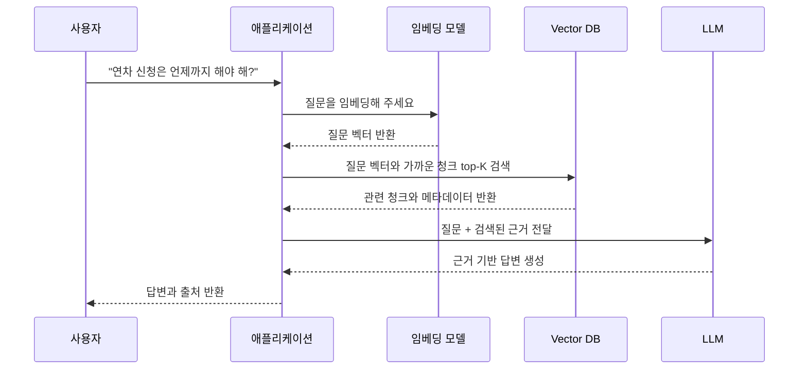

## 들어가면서

최근 LLM(Large Language Model) 기반 AI 서비스가 빠르게 늘면서, 그 핵심 기술의 하나인 Vector DB가 크게 주목받고 있습니다. 저도 백엔드 개발을 하면서 키워드 기반 검색으로는 풀기 어려운 문제를 자주 만났고, '의미'를 이해하는 검색이 필요하다고 느꼈습니다. 예를 들어 "환불", "돈 돌려받기", "금액 반환"처럼 표현은 달라도 결국 같은 뜻인 질문을 시스템이 어떻게 알아듣고 정확한 정보를 내줄 수 있을까 하는 고민이었습니다. 이런 배경에서 Vector DB를 깊이 파고들었고, 그 과정에서 배운 내용과 실무 관점을 정리해 봤습니다.

## Vector DB가 필요한 이유

우리에게 익숙한 검색은 대개 단어에서 출발합니다. `LIKE` 검색이나 풀텍스트 검색은 특정 키워드가 문서에 들어 있는지, 혹은 얼마나 자주 나오는지를 보고 결과를 찾아줍니다. 정확한 키워드 매칭에는 강하지만, 의미가 얼마나 비슷한지를 따지는 데는 한계가 뚜렷합니다.

예를 들어 데이터베이스에 "반품 절차가 승인되면 영업일 기준 3일 이내에 결제 수단으로 금액이 반환됩니다."라는 내용이 있다고 합시다. 이때 사용자가 "결제 취소하고 돈 돌려받는 방법 알려줘."라고 물으면 기존 검색으로는 원하는 답을 찾기 어렵습니다. 사람은 "환불", "돈 돌려받기", "금액 반환"이 비슷한 뜻임을 알지만, 시스템은 이걸 그저 문자열로만 보기 때문입니다.

| 검색 방식 | 기준 | 잘하는 일 | 어려운 일 |
| --- | --- | --- | --- |
| `LIKE` 검색 | 문자열 포함 여부 | 간단한 부분 일치 | 오타, 동의어, 표현 차이 |
| 풀텍스트 검색 | 단어, 형태소, 역색인 | 문서 검색, 키워드 랭킹 | 단어가 다르면 의미를 놓칠 수 있음 |
| 벡터 검색 | 임베딩 벡터 간 거리 | 의미가 비슷한 문서 찾기 | 정확한 키워드 조건만 필요한 검색 |
| 하이브리드 검색 | 키워드 + 벡터 | 정확한 용어와 의미 검색을 함께 처리 | 구현과 튜닝이 복잡해짐 |

Vector DB는 텍스트, 이미지, 코드 같은 데이터를 숫자 벡터로 바꿔 저장하고, 벡터 사이의 거리로 의미가 얼마나 비슷한지 판단합니다. 덕분에 기존 키워드 검색이 놓치던 '의미'를 찾아낼 수 있습니다. 특히 RAG 챗봇, 추천 시스템, 중복 탐지, 이미지 검색, 코드 검색 등 여러 분야에서 Vector DB의 쓰임새가 점점 넓어지고 있습니다.

## Vector DB란 무엇인가

Vector DB는 말 그대로 **벡터를 저장하는 데이터베이스**입니다. 다만 벡터만 저장하지는 않고, 보통 아래 데이터들을 함께 저장하고 관리합니다.

- **원본 텍스트 또는 청크 내용**: 검색 결과로 사용자에게 보여줄 원본 데이터의 일부 또는 전체.
- **해당 텍스트를 숫자로 바꾼 임베딩 벡터**: 텍스트의 의미를 다차원 공간의 한 점으로 표현한 숫자 배열.
- **출처, 문서 ID, 페이지, 권한 같은 메타데이터**: 검색 결과에 대한 추가 정보나 필터링 조건으로 활용될 수 있는 데이터.
- **빠른 유사도 검색을 위한 인덱스**: 대규모 벡터 데이터에서 효율적으로 유사한 벡터를 찾기 위한 구조.

```
documents
---------------------------------------------------------------
id          101
content     "연차는 최소 3일 전에 사내 포털에서 신청해야 합니다."
embedding   [0.012, -0.031, 0.887, ...]  (예: 1024차원)
metadata    {"source": "company-policy", "section": "휴가 규정"}
---------------------------------------------------------------
```

### Vector DB가 저장하는 것은 "의미의 좌표"

임베딩 모델은 "강아지 사료 추천"과 "반려견 먹이 고르는 법"처럼 표현은 달라도 뜻이 비슷한 문장을 벡터 공간에서 가까이 놓도록 학습됩니다. 반대로 "법인카드 정산 규정"처럼 뜻이 다른 문장은 멀찍이 떨어뜨려 둡니다. 그리고 Vector DB는 **질문 벡터와 가장 가까운 문서 벡터를 찾아주는 역할**을 합니다.


> 질문 벡터와 가장 가까운 문서 벡터를 찾는다.

### Vector DB는 꼭 별도 제품이어야 할까

꼭 그렇지는 않습니다. Vector DB는 독립 제품으로 나오기도 하지만, 기존 데이터베이스의 확장 기능으로 제공되기도 합니다. 실무에서는 프로젝트 규모와 요구사항에 따라 선택지가 여럿입니다.

| 선택지 | 예시 | 특징 |
| --- | --- | --- |
| 기존 RDB 확장 | PostgreSQL + pgvector | 기존 테이블, 트랜잭션, 조인과 함께 쓰기 좋음 |
| 전용 Vector DB | Qdrant, Milvus, Weaviate | 대규모 벡터 검색과 분산 처리에 특화 |
| 매니지드 서비스 | Pinecone 등 | 운영 부담이 적고 빠르게 시작 가능 |
| 검색엔진 확장 | Elasticsearch, OpenSearch | 키워드 검색과 벡터 검색을 같이 쓰기 좋음 |
| 기존 DB의 벡터 기능 | Redis, MongoDB Atlas 등 | 이미 쓰는 인프라에 기능을 추가하기 쉬움 |

## 데이터 적재 흐름

Vector DB에 데이터를 그냥 넣는다고 검색이 잘 되지는 않습니다. 검색 품질을 끌어올리려면 데이터를 적재하는 과정, 곧 **인제스천(Ingestion) 파이프라인**이 무척 중요합니다.


### 1. 문서 준비

가장 먼저 원본 문서를 검색할 수 있는 텍스트 형태로 준비합니다. PDF, Word 문서, 위키, HTML 페이지, FAQ 데이터, 고객 상담 로그처럼 다양한 원본에서 필요한 텍스트를 뽑아내고, 메뉴나 푸터, 광고 같은 군더더기를 걷어내 다듬습니다.

### 2. 청크 분할

다듬은 문서는 검색할 수 있는 작은 단위인 **청크(Chunk)**로 나눕니다. 청크 크기와 분할 전략은 검색 품질을 크게 좌우합니다. 너무 크면 여러 의미가 뒤섞여 정확도가 떨어지고, 너무 작으면 문맥이 모자랄 수 있습니다. 문맥을 살리면서도 알맞은 크기로 나누는 게 중요합니다.

### 3. 임베딩 생성

나눈 청크는 임베딩 모델을 거쳐 다차원 벡터로 바뀝니다. 이 벡터가 청크의 의미를 숫자로 나타낸 "의미의 좌표"입니다. 이때 **저장할 때 쓴 임베딩 모델과 검색할 때 쓸 임베딩 모델은 반드시 같아야 합니다.** 모델이 다르면 좌표계도 달라지므로, 모델을 섞어 쓰면 검색 오류로 이어집니다.

### 4. Vector DB 저장

이렇게 만든 임베딩 벡터는 원본 청크 내용, 그리고 출처, 권한, 날짜 등의 메타데이터와 함께 Vector DB에 저장됩니다.

### 5. 인덱스 생성 또는 갱신

대규모 벡터 데이터에서 유사도 검색을 빠르게 하려고 인덱스를 만들거나 갱신합니다. 이 인덱스는 뒤에서 설명할 ANN(Approximate Nearest Neighbor) 검색의 핵심입니다.

## 검색 흐름

사용자 질문이 들어오면 Vector DB는 어떤 과정을 거쳐 결과를 돌려줄까요? RAG(Retrieval-Augmented Generation) 시스템 관점에서 검색 흐름을 살펴보겠습니다.



Vector DB 자체의 검색 단계만 보면 아래와 같습니다.

```
질문 -> 질문 임베딩 -> 유사도 검색 -> top-K 청크 반환
```

### 1. 질문을 임베딩한다

사용자 질문도 문서 청크와 같은 임베딩 모델로 벡터화합니다. 이 질문 벡터가 Vector DB에서 비슷한 문서 벡터를 찾는 기준점이 됩니다.

### 2. Vector DB에서 가까운 벡터를 찾는다

Vector DB는 질문 벡터와 가장 가까운, 곧 의미가 비슷한 문서 벡터들을 찾아냅니다. SQL로 나타내면 대략 이런 형태입니다.

```sql
SELECT
    id,
    content,
    metadata,
    embedding <=> :query_embedding AS distance
FROM document_chunks
WHERE metadata->>'source' = 'company-policy'
ORDER BY embedding <=> :query_embedding
LIMIT 3;
```

여기서 `:query_embedding`은 사용자 질문을 임베딩한 벡터이고, `embedding <=> :query_embedding`은 벡터 사이의 코사인 거리를 계산하는 연산자입니다.

### 3. 결과는 보통 top-K로 가져온다

Vector DB 검색은 보통 가장 비슷한 문서 하나만 돌려주지 않고, **top-K**개의 결과를 돌려줍니다. 이유는 이렇습니다.

- 질문 하나에 답하려면 문서 조각 여러 개가 필요할 때가 있습니다.
- 가장 가까운 하나가 늘 충분한 근거가 되어 주지는 않습니다.
- LLM이 여러 근거를 종합하면 더 안정적이고 풍부한 답변을 낼 수 있습니다.

다만 top-K 값이 너무 크면 관련 없는 문서가 섞이고, LLM 프롬프트가 길어져 비용과 지연 시간이 늘 수 있으니 K 값을 적절히 잡는 게 중요합니다.

### 4. similarityThreshold로 너무 먼 결과를 거른다

top-K만 쓰면 질문과 별로 상관없는 문서까지 억지로 딸려 나올 수 있습니다. 예를 들어 회사 규정 문서에 주차장 규정이 없는데 사용자가 "우리 회사 주차장 이용 규정 알려줘."라고 물으면, Vector DB는 그래도 가장 가까운 문서 몇 개를 찾아냅니다. 이때 "가장 가까움"이 "충분히 가까움"을 뜻하지는 않습니다.

그래서 실무에서는 `similarityThreshold` 같은 거리나 유사도 기준을 함께 두어, 정해 둔 임계값보다 멀리 떨어진 결과는 걸러 내 검색 품질을 높입니다.

### 5. 메타데이터 필터를 함께 쓴다

Vector DB 검색은 벡터 거리만으로 끝나지 않습니다. 실무에서는 특정 문서 묶음에서만 찾거나, 최신 버전 문서만, 특정 부서 문서만, 로그인한 사용자가 볼 수 있는 문서만 찾는 등 여러 조건이 필요합니다. 이런 조건은 메타데이터 필터로 걸며, 메타데이터를 잘 설계하면 검색의 정확성과 쓸모가 크게 올라갑니다.

## pgvector로 이해하는 벡터 검색

PostgreSQL의 확장 기능인 `pgvector`는 관계형 데이터베이스에서도 벡터 검색을 할 수 있게 해줍니다. `pgvector`는 벡터 사이 거리를 계산하는 연산자를 여럿 제공합니다.

| 연산자 | 의미 | 값의 해석 |
| --- | --- | --- |
| `<=>` | cosine distance (코사인 거리) | 작을수록 유사 |
| `<->` | L2 distance (유클리드 거리) | 작을수록 유사 |
| `<#>` | negative inner product (음수 내적) | 작을수록 내적이 큼 |

예를 들어 3차원 벡터를 저장하는 `items` 테이블이 있다고 해봅시다.

```sql
CREATE EXTENSION IF NOT EXISTS vector;

CREATE TABLE items (
    id bigserial PRIMARY KEY,
    name text NOT NULL,
    embedding vector(3)
);

INSERT INTO items (name, embedding) VALUES
  ('강아지', '[1.0, 0.9, 0.1]'),
  ('고양이', '[0.9, 1.0, 0.2]'),
  ('자동차', '[0.1, 0.2, 1.0]'),
  ('오토바이', '[0.2, 0.1, 0.9]');
```

"강아지"와 가까운 항목을 코사인 거리로 찾으려면 다음 SQL 쿼리를 쓸 수 있습니다.

```sql
SELECT
    name,
    embedding <=> '[1.0, 0.9, 0.1]' AS cosine_distance
FROM items
ORDER BY embedding <=> '[1.0, 0.9, 0.1]'
LIMIT 3;
```

이 쿼리는 "강아지" 벡터와 가장 가까운 벡터들을 코사인 거리 순으로 정렬해 돌려줍니다. 여기서 중요한 건 "고양이"가 "강아지"와 문자열이 닮아서가 아니라, 벡터 공간에서 의미가 가깝기 때문에 검색된다는 점입니다.

### pgvector 인덱스 연산자 클래스

대규모 데이터에서 빠르게 검색하려면 인덱스가 꼭 필요합니다. `pgvector`는 거리 기준마다 맞는 인덱스 연산자 클래스를 제공합니다.

| 거리 기준 | 정렬 연산자 | 인덱스 연산자 클래스 |
| --- | --- | --- |
| 코사인 거리 | `<=>` | `vector_cosine_ops` |
| L2 거리 | `<->` | `vector_l2_ops` |
| 내적 | `<#>` | `vector_ip_ops` |

인덱스를 만들 때는 쓰려는 거리 기준에 맞는 연산자 클래스를 지정해야 합니다.

## kNN과 ANN

Vector DB의 핵심 작업은 **가장 가까운 이웃(Nearest Neighbor) 검색**입니다. 질문 벡터와 가장 가까운 K개의 벡터를 찾는 **kNN(k-Nearest Neighbors)** 검색이지요.

### 정확한 kNN

정확한 kNN은 저장된 모든 벡터와 질문 벡터의 거리를 하나하나 계산해 가장 가까운 K개를 찾아냅니다. 데이터가 적을 때는 괜찮지만, 수백만 건이 넘는 대규모 데이터에서는 모든 벡터를 훑어야 해서 검색이 아주 느려집니다.

| 데이터 규모 | 정확한 kNN 체감 |
| --- | --- |
| 수백~수천 건 | 충분히 가능 |
| 수만~수십만 건 | 쿼리와 환경에 따라 부담 |
| 수백만 건 이상 | 인덱스 없이 매번 풀스캔은 부담이 큼 |

### ANN (Approximate Nearest Neighbor)

**ANN(Approximate Nearest Neighbor)**은 정확한 kNN의 속도 문제를 풀려고 나왔습니다. ANN은 가장 가까운 벡터를 '정확히' 찾는 대신, '가까울 법한' 후보를 빠르게 추려냅니다. **정확도를 조금 내주고 검색 속도를 얻는 방식**이지요.

> 정확도 일부를 양보하고 검색 속도를 얻는다.

ANN 성능을 볼 때는 **재현율(Recall)**이 중요합니다. 재현율은 정확한 top-K 결과 가운데 ANN이 몇 개를 찾아냈는지 나타내는 지표입니다. 예를 들어 정확한 top-10 결과 중 ANN이 9개를 찾아냈다면 재현율은 90%입니다.

> **Callout - ANN의 본질**
>
> ANN은 "틀려도 되는 검색"이 아니라, "대부분 맞으면서 훨씬 빠른 검색"을 목표로 합니다.

### kNN과 ANN 비교

| 구분 | kNN | ANN |
| --- | --- | --- |
| 검색 방식 | 모든 벡터와 거리 계산 | 인덱스를 이용해 후보를 빠르게 탐색 |
| 정확도 | 가장 정확 | 근사값, 일부 누락 가능 |
| 속도 | 데이터가 커지면 느림 | 대규모에서 빠름 |
| 인덱스 | 없어도 가능 | HNSW, IVFFlat 같은 인덱스 필요 |
| 사용 상황 | 작은 데이터, 품질 검증, 오프라인 평가 | 실시간 검색, 대규모 서비스 |

실무에서는 대규모 서비스의 실시간 검색을 위해 HNSW, IVFFlat 같은 ANN 인덱스를 주로 쓰며, 정확도와 속도 사이의 트레이드오프를 따져 알맞은 인덱스 전략을 골라야 합니다.

## RAG에서 Vector DB의 역할

**RAG(Retrieval-Augmented Generation)**는 "검색으로 보강한 생성"을 뜻하며, LLM의 한계를 메우는 중요한 기술입니다. LLM은 언어 생성 능력이 뛰어나지만, 최신 정보나 특정 도메인 지식에는 약하고, 때로는 사실과 다른 내용을 지어내는 환각(Hallucination) 문제도 있습니다.

RAG는 LLM이 답을 만들기 전에 관련 문서를 먼저 검색해 **근거(Context)**로 건네주는 식으로 이 문제를 풉니다. Vector DB는 이 과정에서 LLM에게 줄 관련 문서를 효율적으로 찾아내는 핵심 역할을 맡습니다.


### RAG에서 역할 분담

| 구성 요소 | 역할 |
| --- | --- |
| 문서 파이프라인 | 문서를 읽고, 청크로 나누고, 임베딩해서 저장 |
| 임베딩 모델 | 문서와 질문을 같은 벡터 공간으로 변환 |
| Vector DB | 질문과 가까운 문서 청크 검색 |
| 애플리케이션 | 검색 조건, 권한, top-K, 프롬프트 구성 관리 |
| LLM | 검색된 근거를 읽고 자연어 답변 생성 |

Vector DB가 직접 답변을 만드는 게 아니라, **LLM에게 답변의 근거가 될 문서를 건네주는 역할**을 합니다. LLM은 이 근거를 바탕으로 자연어 답변을 만듭니다.

### 프롬프트에는 보통 검색 결과가 들어간다

RAG 시스템에서 LLM에 넘기는 프롬프트에는 보통 사용자 질문과 함께 Vector DB에서 검색한 관련 문서 청크가 담깁니다.

```
아래 문서 내용을 근거로 사용자의 질문에 답하세요.
문서에 없는 내용은 모른다고 답하세요.

[문서 1]
연차 신청은 사내 포털에서 최소 3일 전에 신청해야 합니다.

[문서 2]
연차는 입사일 기준으로 매년 15일이 부여됩니다.

[질문]
연차 신청은 언제까지 해야 해?
```

LLM은 이 프롬프트를 보고 "연차는 사내 포털에서 최소 3일 전에 신청해야 합니다."처럼 근거에 기반한 답변을 만듭니다.

### Vector DB가 RAG 품질에 미치는 영향

RAG 시스템의 답변 품질은 Vector DB의 검색 결과 품질에 곧바로 좌우됩니다. 관련 청크가 제대로 검색되지 않거나, 엉뚱한 청크가 섞이거나, 필요한 청크가 빠지면 LLM은 부정확하거나 어설픈 답을 내놓습니다. 그래서 Vector DB를 효율적으로 구성하고 검색 품질을 다듬는 일이 RAG 시스템 성패의 핵심입니다.

## 실무 선택 기준

Vector DB를 고를 때는 "가장 유명한 제품"보다 **"우리 문제에 맞는가"**를 기준으로 삼아야 합니다. Vector DB 솔루션마다 나름의 장단점과 어울리는 사용 사례가 있습니다.

### pgvector가 잘 맞는 경우

- 이미 PostgreSQL을 사용하고 있고, 벡터 검색 기능이 필요한 경우
- 기존 관계형 데이터와 벡터 데이터를 함께 관리하고 싶을 때
- 복잡한 조인이나 트랜잭션이 필요한 경우
- 데이터 규모가 아주 크지 않고, QPS(Query Per Second)가 매우 높지 않은 경우

### 전용 Vector DB (Qdrant, Milvus, Weaviate 등)가 잘 맞는 경우

- 대규모 벡터 데이터셋을 다루고, 높은 QPS가 필요한 경우
- 분산 처리 및 확장성이 중요한 경우
- 벡터 검색 기능에 특화된 고급 기능(예: 필터링, 스케일링)이 필요한 경우

### 검색엔진 확장 (Elasticsearch, OpenSearch)과 하이브리드 검색

- 키워드 검색과 벡터 검색을 모두 중요하게 다루는 경우
- 기존에 Elasticsearch나 OpenSearch를 사용하고 있어 통합 관리가 용이한 경우
- 정확한 키워드 매칭과 의미 기반 검색을 결합하여 더 정교한 검색 결과를 얻고자 할 때

실무에서는 Vector DB 제품만 볼 게 아니라 권한 관리, 최신성 유지, 메타데이터 필터링, 그리고 임베딩 모델을 바꿀 때의 재임베딩 전략까지 같이 챙겨야 합니다. 예전에 [AOP를 정리하면서](/posts/aop-common-logic/) 공통 로직의 중요성을 느꼈듯이, Vector DB도 전체 시스템 아키텍처 안에서 어떻게 맞물려 돌아갈지 설계하는 게 중요합니다.

## 흔한 오해와 오류

Vector DB를 처음 도입하거나 쓸 때 자주 겪는 오해와 실무 오류를 정리했습니다.

- **Vector DB에 넣는다고 LLM이 학습하는 것은 아님**: Vector DB는 LLM에게 근거를 건넬 뿐, LLM 자체의 지식을 갱신하지는 않습니다.
- **검색 결과 1등이 항상 정답은 아님**: 가장 가까운 벡터가 늘 사용자 질문에 딱 맞는 답을 담고 있지는 않습니다. `similarityThreshold`와 같은 추가적인 필터링이 필요할 수 있습니다.
- **청크를 대충 나누면 검색 품질이 떨어짐**: 청크 분할 전략은 검색 품질을 크게 좌우합니다. 문맥을 고려하지 않은 무분별한 분할은 검색 정확도를 떨어뜨립니다.
- **Vector DB만으로 키워드 검색을 완전히 대체할 수 없음**: 정확한 제품명, 코드, 고유명사 등은 키워드 검색이 더 나을 수 있습니다. 하이브리드 검색을 같이 생각해야 합니다.
- **임베딩 모델을 바꾸면 기존 문서도 다시 임베딩해야 함**: 임베딩 모델은 벡터 공간의 좌표계를 정합니다. 모델이 바뀌면 기존 벡터의 의미적 위치도 달라지므로, 반드시 재임베딩을 해야 합니다.
- **dimension mismatch, 모델 불일치, 권한 필터 누락**: 임베딩 벡터의 차원 불일치, 저장/검색 시 다른 임베딩 모델 사용, 메타데이터 필터링 누락 등은 실무에서 자주 나오는 오류입니다.

## 공부하면서 느낀 점

Vector DB를 공부하면서 가장 크게 느낀 건, 이게 단순한 새 데이터베이스 기술을 넘어 **'의미'를 다루는 새로운 패러다임의 시작**이라는 점입니다. 기존 관계형 데이터베이스나 검색 엔진이 '정확한 매칭'에 집중했다면, Vector DB는 '비슷한 의미'를 찾아내는 데 특화돼 있습니다. 덕분에 백엔드 개발자로서 데이터를 다루는 방식과 사용자에게 정보를 주는 방식을 두고 한참 고민하게 됐습니다.

특히 RAG 아키텍처에서 Vector DB는 LLM의 한계를 메우고 더 믿을 만한 AI 서비스를 만드는 데 꼭 필요하다는 걸 깨달았습니다. 기술을 그냥 도입하는 데서 그치지 않고 데이터 적재 파이프라인 설계, 청크 전략, 메타데이터 관리, ANN 인덱스 튜닝처럼 실무에서 따질 거리가 많다는 점도 흥미로웠습니다. 앞으로 AI 기반 서비스 개발에서 Vector DB는 핵심 인프라로 자리 잡을 것이고, 백엔드 개발자에게는 이걸 잘 활용하고 최적화하는 역량이 점점 더 중요해지리라 봅니다.

## 한 줄 정리

> Vector DB는 **텍스트, 이미지, 코드 같은 데이터를 숫자 벡터로 바꿔 저장하고, 질문과 의미가 가까운 데이터를 빠르게 찾기 위한 데이터베이스**이며, 키워드 검색이 "같은 단어가 들어 있는가?"를 묻는다면, Vector DB는 "의미가 가까운가?"를 묻습니다.

## References

- [Spring AI로 AI 앱 개발 시작하기: ChatClient와 Structured Output](/posts/spring-ai-chatclient-structured-output/)
- [Spring AI 실전: Tool Calling 설계와 멀티 모델 활용 전략](/posts/spring-ai-tool-calling-multi-model/)
- [pgvector GitHub Repository](https://github.com/pgvector/pgvector)
- [What is a Vector Database? - Pinecone](https://www.pinecone.io/learn/vector-database/)
- [Retrieval-Augmented Generation (RAG) - LlamaIndex](https://docs.llamaindex.ai/en/stable/module_guides/concepts/retrieval.html)

---

## 오늘의 핵심 정리

Vector DB는 의미 기반 검색을 가능하게 해주는 도구입니다. 기존 키워드 검색의 한계를 넘어 데이터의 '의미'를 이해하고 비슷한 정보를 찾아내는 데 특화돼 있습니다. 특히 RAG 같은 LLM 기반 시스템에서 Vector DB는 LLM의 환각을 줄이고 믿을 만한 답변을 내놓는 핵심 역할을 합니다. Vector DB를 제대로 쓰려면 데이터 적재 파이프라인, 청크 전략, 메타데이터 설계, ANN 인덱스 선택까지 여러 실무 요소를 챙겨야 합니다. 백엔드 개발자로서 이런 개념을 이해하고 잘 활용하는 일은 AI 시대의 필수 역량이 되리라 봅니다.
