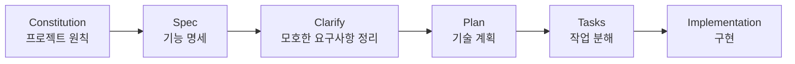

최근 AI 코딩 에이전트를 사용하면서 단순히 "이 기능 구현해줘"라고 요청하는 것만으로는 부족하다는 생각이 들었다.

작은 실험이라면 에이전트가 어느 정도 알아서 판단해도 괜찮을 수 있다. 하지만 팀 프로젝트에서는 이야기가 달라진다. 요구사항이 명확하지 않으면 에이전트가 빈칸을 임의로 채울 수 있고, 정책이나 예외 케이스, API 경계가 문서마다 다르게 흩어질 수 있다. 구현은 빠르게 끝난 것처럼 보여도, 나중에 "왜 이렇게 만들었지?"를 추적하기 어려워질 수도 있다.

특히 AI 에이전트는 구현 속도를 크게 높여주지만, 그만큼 합의되지 않은 결정이 코드에 먼저 반영될 위험도 있다. 이런 문제의식에서 GitHub의 [`spec-kit`](https://github.com/github/spec-kit) 저장소를 살펴보게 되었다.

---

## Spec Kit은 무엇인가

공식 저장소를 살펴보니, `spec-kit`은 Spec-Driven Development를 시작할 수 있게 도와주는 도구킷에 가깝다. README에서는 Spec-Driven Development를 코드보다 명세를 먼저 중심에 두는 개발 방식으로 설명한다. 즉, 코드를 바로 작성하는 것이 아니라 요구사항과 계획을 먼저 구조화하고, 그 결과를 바탕으로 구현을 진행하는 흐름이다.

README 기준으로 전체 흐름은 대략 다음과 같다.

초기화는 `specify init`으로 시작한다. 이후 AI 코딩 에이전트 안에서 `/speckit.constitution`, `/speckit.specify`, `/speckit.plan`, `/speckit.tasks` 같은 명령을 사용해 명세와 계획, 작업 목록을 만들어가는 방식이다.

README에는 대부분의 에이전트가 `/speckit.*` 형태의 slash command를 사용한다고 되어 있고, Codex CLI의 skills mode에서는 `$speckit-*` 형태를 사용할 수 있다고 설명되어 있다. 자세한 사용법을 따라 하는 튜토리얼이라기보다는, "AI에게 바로 구현을 맡기기 전에 어떤 순서로 생각을 정리할 것인가"를 도와주는 흐름으로 이해했다.

---

## Constitution: 프로젝트의 헌법 만들기

`/speckit.constitution`은 프로젝트의 헌법 같은 역할을 한다.

여기에는 코드 품질 기준, 테스트 기준, 사용자 경험 기준, 성능 기준, 팀의 개발 원칙 같은 내용이 들어갈 수 있다. 한 번 정해두면 이후 기능 명세, 기술 계획, 작업 분해를 판단하는 기준이 된다.

이 단계가 중요한 이유는 AI 에이전트에게 "우리 팀은 어떤 선택을 좋은 선택으로 보는가"를 알려주기 때문이다. 예를 들어 테스트를 어느 수준까지 요구할지, 외부 의존성을 얼마나 허용할지, API 변경 시 어떤 호환성을 지킬지 같은 기준이 없다면 에이전트는 매번 그럴듯한 선택을 새로 만들어낼 수 있다.

---

## Specify: 무엇을 만들지 먼저 정리하기

`/speckit.specify`는 기능 명세를 만드는 단계다.

README 기준으로 이 단계에서는 기술 스택보다 "무엇을 만들지"와 "왜 필요한지"에 집중한다. 아직 어떻게 구현할지를 정하는 단계가 아니라, 기능이 만족해야 하는 요구사항을 먼저 드러내는 단계다.

이 흐름이 마음에 들었던 이유는 정책과 예외 케이스를 코드보다 앞에 둘 수 있기 때문이다. 예를 들어 "사용자는 댓글을 수정할 수 있다"라는 문장만으로는 부족하다. 본인 댓글만 수정 가능한지, 관리자 권한은 예외인지, 삭제된 게시글의 댓글은 어떻게 되는지 같은 정책이 함께 정리되어야 한다.

명세 단계는 이런 질문을 코드 작성 전에 끌어올리는 역할을 한다.

---

## Clarify: 애매한 부분을 질문으로 줄이기

공식 문서의 상세 프로세스에서는 계획을 만들기 전에 `/speckit.clarify`로 불명확한 요구사항을 정리하는 흐름을 권장한다. 이 단계가 특히 중요해 보였다.

AI 에이전트는 비어 있는 부분을 그대로 비워두기보다, 문맥상 그럴듯한 답을 채우려는 경향이 있다. 그래서 요구사항이 애매한 상태로 바로 계획이나 구현에 들어가면 할루시네이션이나 임의 구현으로 이어질 수 있다.

팀 프로젝트에서는 이 문제가 더 커진다. 사람끼리도 합의하지 않은 정책을 에이전트가 먼저 코드로 만들어버리면, 나중에는 그 코드가 사실상의 기준처럼 굳어질 수 있다. Clarify 단계는 이런 위험을 줄이기 위한 안전장치처럼 보였다.

---

## Plan: 이제 어떻게 만들지 정하기

`/speckit.plan`부터는 "어떻게 만들지"를 다룬다.

기술 스택, 아키텍처, 데이터 저장 방식, 외부 연동 방식, API 계약 같은 내용이 이 단계에서 정리된다. 중요한 점은 계획이 앞선 명세와 constitution을 기준으로 만들어진다는 점이다.

즉, 기술 선택이 단순히 "요즘 많이 쓰는 방식"으로 흘러가는 것이 아니라, 앞에서 정리한 요구사항과 프로젝트 원칙에 맞는지 검토되는 구조다. README에서도 plan 단계가 명세를 읽고 기술적 결정으로 변환하며, 데이터 모델이나 API 계약 같은 문서를 생성하는 흐름을 설명한다.

---

## Tasks: 구현 가능한 작업 단위로 나누기

`/speckit.tasks`는 계획을 실제 작업 목록으로 분해하는 단계다.

이 단계가 있어야 GitHub Issue, PR, 커밋 단위와 연결하기 쉬워 보인다. 기능을 한 번에 "구현"하는 것이 아니라, 사용자 스토리나 의존성에 맞춰 작업을 나누고, 병렬로 처리할 수 있는 항목을 구분할 수 있기 때문이다.

팀 프로젝트에서는 작업 단위가 명확할수록 리뷰하기도 쉽다. 어떤 PR이 어떤 명세의 어떤 요구사항을 구현하는지 연결할 수 있다면, 나중에 변경 이력을 추적하기도 좋아진다.

---

## 내 프로젝트에 적용한다면

아직 `spec-kit`을 직접 사용해본 것은 아니지만, 내가 진행 중인 백엔드 팀 프로젝트에 적용한다면 몇 가지 문제를 줄이는 데 도움이 될 수 있겠다고 느꼈다.

현재 팀 프로젝트에서는 요구사항 문서, MVP 문서, 정책 문서, API 스펙 문서가 서로 다른 내용을 말할 위험이 있다. v1과 v2 API가 생겼을 때 어떤 문서가 최신 기준인지 헷갈릴 수도 있고, 정책 변경 사항을 아카이브하지 않으면 왜 바뀌었는지 추적하기 어려워질 수도 있다.

또 stub이나 fake로 먼저 경계를 잡고 나중에 실제 구현체를 붙이는 방식에서는 인터페이스와 명세가 더 중요해진다. 경계가 명확하지 않으면 fake 구현은 돌아가지만, 실제 구현체를 붙일 때 정책이나 예외 처리가 달라질 수 있다.

이런 맥락에서 핵심은 하나로 정리된다.

> AI에게 구현을 맡기기 전에, 팀이 합의한 명세와 경계를 먼저 만들어야 한다.

---

## 장점과 한계

공식 저장소를 살펴보며 이해한 `spec-kit`의 장점은 다음과 같다.

- 구현 전에 요구사항을 구조화할 수 있다.
- AI 에이전트가 임의 판단하는 범위를 줄일 수 있다.
- 문서, 이슈, PR, 구현 사이의 추적성이 좋아질 수 있다.
- 팀 프로젝트에서 정책과 경계를 맞추기 쉬워질 수 있다.
- 기능 단위로 작업을 쪼개기 좋아 보인다.

반대로 한계도 있어 보인다.

처음에는 문서 작성 단계가 늘어난 것처럼 느껴질 수 있다. 작은 실험 프로젝트나 빠른 프로토타입에서는 과하게 느껴질 수도 있다. 또한 기존 기능을 수정하거나 명세를 계속 진화시키는 흐름은 별도 운영 규칙이 필요해 보인다.

무엇보다 도구가 모든 결정을 대신해주는 것은 아니다. 중요한 정책 판단은 결국 사람이 해야 한다. 아직 직접 사용해본 것은 아니므로, 실제 도입 시 어떤 부분이 번거로운지, 기존 팀 문서 흐름과 얼마나 잘 맞는지는 별도로 확인해야 한다.

---

## 정리

`spec-kit`은 코딩을 대신해주는 도구라기보다, AI가 코딩하기 전에 생각의 순서를 정리하게 해주는 도구에 가깝다.

AI 코딩 에이전트가 빨라질수록 중요한 것은 단순한 구현 속도가 아니라, 잘못된 구현을 빠르게 만드는 일을 줄이는 것이다. 특히 팀 프로젝트에서는 "무엇을 만들지", "왜 그렇게 만들지", "어디까지 만들지"가 먼저 합의되어야 한다.

AI 코딩 시대에는 프롬프트를 잘 쓰는 것만큼, 에이전트가 참고할 수 있는 명세를 잘 관리하는 것이 중요해질 것 같다.

참고:

- [github/spec-kit README](https://github.com/github/spec-kit)
- [Specification-Driven Development 문서](https://github.com/github/spec-kit/blob/main/spec-driven.md)
