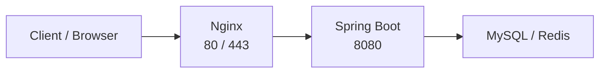

처음 Spring Boot 애플리케이션을 EC2에 배포한다고 생각했을 때, 가장 단순한 구조는 애플리케이션을 실행하고 8080 포트로 직접 접근하는 방식이었다.

```text
User
  ↓
Spring Boot : 8080
```

접근 주소도 자연스럽게 다음처럼 떠올렸다.

```text
http://example.com:8080
```

개발 환경에서는 `localhost:8080`으로 접속하는 일이 익숙하다. 그래서 처음에는 운영 환경에서도 Spring Boot가 실행되는 포트로 바로 들어가면 되는 줄 알았다.

그런데 막상 실제 서비스 주소를 생각해보니 어색했다. 사용자가 매번 `:8080` 같은 포트 번호를 붙여서 접근하는 것도 자연스럽지 않았고, Spring Boot의 애플리케이션 포트를 외부에 직접 노출하는 것도 부담스럽게 느껴졌다.

그러다 궁금해졌다.

> 왜 실제 서비스에서는 보통 80번이나 443번 포트로 접근하게 만들까?

이 질문을 따라가다 보니 Spring Boot 앞단에 Nginx를 두는 이유를 조금씩 이해하게 되었다.

---

## 1. 운영 환경에서는 외부 진입점이 필요하다

HTTP의 기본 포트는 80이고, HTTPS의 기본 포트는 443이다. 사용자는 보통 다음과 같은 주소로 서비스에 접근하기를 기대한다.

```text
https://example.com
```

이때 Nginx는 외부 요청을 가장 먼저 받는 입구 역할을 한다.

```text
User
  ↓
Nginx : 80 / 443
  ↓
Spring Boot : 8080
```

다만 Nginx가 Spring Boot를 대신 실행하는 서버는 아니다. Spring Boot 애플리케이션은 여전히 8080 포트에서 실행된다. 대신 Nginx가 80번이나 443번 포트에서 외부 요청을 먼저 받고, 그 요청을 내부에서 실행 중인 Spring Boot 애플리케이션으로 전달한다.

사용자는 Nginx를 바라보고, Nginx는 다시 내부 애플리케이션을 바라보는 구조다.

---

## 2. 이 구조를 Reverse Proxy라고 이해했다

Nginx가 클라이언트 요청을 먼저 받은 뒤 내부 서버로 전달하는 구조를 Reverse Proxy라고 한다.

```text
Client → Nginx → Spring Boot
```

처음에는 Reverse Proxy라는 말이 어렵게 느껴졌다. 하지만 배포 구조 안에서 보면 핵심은 단순했다.

클라이언트는 Spring Boot가 실제로 어떤 포트에서 실행되는지 알 필요가 없다. 클라이언트는 Nginx만 바라본다. 그리고 Nginx가 내부 Spring Boot 애플리케이션으로 요청을 넘겨준다.

그래서 Nginx는 외부 사용자와 내부 애플리케이션 사이의 경계 역할을 한다. 외부에는 표준 포트인 80/443만 열어두고, Spring Boot의 8080 포트는 내부에서만 사용하도록 둘 수 있다.




이 구조를 보고 나니 Nginx가 단순히 정적 파일을 서빙하는 웹 서버로만 보이지 않았다. Spring Boot 배포에서는 외부 요청을 받아 내부 애플리케이션으로 연결해주는 앞단 서버에 가깝게 느껴졌다.

---

## 3. proxy_pass가 요청 전달의 핵심 설정이다

Nginx에서 Spring Boot로 요청을 전달할 때 핵심이 되는 설정은 `proxy_pass`다.

예를 들어 다음과 같이 설정할 수 있다.

```nginx
server {
    listen 80;
    server_name example.com;

    location / {
        proxy_pass http://localhost:8080;

        proxy_set_header Host $host;
        proxy_set_header X-Real-IP $remote_addr;
        proxy_set_header X-Forwarded-For $proxy_add_x_forwarded_for;
        proxy_set_header X-Forwarded-Proto $scheme;
    }
}
```

각 설정을 처음 공부하는 관점에서 정리하면 다음과 같다.

* `listen 80`: Nginx가 80번 포트에서 HTTP 요청을 받는다.
* `server_name example.com`: 해당 도메인으로 들어온 요청에 이 설정을 적용한다.
* `location /`: `/`로 시작하는 요청을 처리한다.
* `proxy_pass http://localhost:8080`: 요청을 내부 Spring Boot 애플리케이션으로 전달한다.
* `proxy_set_header`: 원래 요청의 도메인, 클라이언트 IP, 프로토콜 정보를 Spring Boot에 전달한다.

여기서 가장 중요하게 본 설정은 `proxy_pass`였다. 이 한 줄이 있어야 Nginx가 받은 요청이 내부 Spring Boot 애플리케이션으로 넘어간다.

`proxy_pass`는 Reverse Proxy 구조에서 요청 전달 방향을 정하는 핵심 설정이다.

---

## 4. proxy_set_header가 필요한 이유

Nginx를 거치면 Spring Boot는 요청을 사용자에게서 직접 받은 것이 아니라 Nginx에게서 받은 것처럼 볼 수 있다.

예를 들어 실제 사용자는 브라우저에서 `https://example.com`으로 접근했지만, Spring Boot 입장에서는 Nginx가 내부에서 넘겨준 요청만 보게 될 수 있다. 그래서 원래 요청 정보를 Spring Boot에 알려주기 위해 `proxy_set_header`를 사용한다.

주요 헤더는 다음과 같다.

* `Host`: 원래 요청한 도메인
* `X-Real-IP`: 실제 클라이언트 IP
* `X-Forwarded-For`: 프록시를 거쳐온 IP 목록
* `X-Forwarded-Proto`: 원래 요청이 HTTP인지 HTTPS인지

특히 `X-Forwarded-Proto`는 생각보다 중요할 수 있다. 사용자는 HTTPS로 접근했는데 Spring Boot가 내부 HTTP 요청만 보고 있다면, HTTPS 리다이렉트나 OAuth callback URL, Swagger URL 생성, 로그 분석에서 헷갈리는 상황이 생길 수 있기 때문이다.

처음에는 `proxy_set_header`가 부가 설정처럼 보였지만, 실제 운영 환경에서는 “원래 요청이 어떤 모습이었는지”를 애플리케이션에 전달하는 중요한 역할을 한다.

---

## 5. HTTPS 처리는 보통 Nginx에서 담당한다

Spring Boot도 HTTPS를 직접 처리할 수 있다. 하지만 운영 환경에서는 보통 Nginx가 HTTPS 처리를 담당하고, Spring Boot는 내부에서 HTTP로 통신하게 두는 구조를 많이 사용한다.

```text
Client
  ↓ HTTPS
Nginx : 443
  ↓ HTTP
Spring Boot : 8080
```

이 구조의 장점은 명확하다.

* 인증서 관리와 애플리케이션 로직을 분리할 수 있다.
* Nginx가 80 → 443 리다이렉트를 담당할 수 있다.
* Spring Boot는 API와 비즈니스 로직 처리에 집중할 수 있다.
* 외부에는 80/443만 공개하고, 8080은 내부 포트로 둘 수 있다.

처음에는 “Spring Boot도 서버인데 왜 굳이 Nginx가 필요하지?”라고 생각했다. 하지만 HTTPS 인증서 관리, 표준 포트 처리, 내부 포트 숨김을 같이 생각해보니 역할을 분리하는 이유가 보였다.

Spring Boot는 애플리케이션을 실행하고 비즈니스 로직을 처리한다. Nginx는 외부 요청을 안정적으로 받아 내부 애플리케이션으로 전달한다. 둘의 책임이 다르다.


---

## 6. Docker Compose 배포 구조와 연결하기

내 프로젝트에서는 Spring Boot, MySQL, Redis를 Docker Compose로 함께 실행하는 구조를 공부했다.

이때 외부 사용자가 직접 접근해야 하는 대상은 MySQL이나 Redis가 아니다. Spring Boot 컨테이너에 직접 접근하는 것도 운영 구조로는 부담스럽다. 외부 진입점은 Nginx가 맡는 것이 자연스럽다.

```text
외부 사용자
  ↓
Nginx : 80 / 443
  ↓
Spring Boot Container : 8080
  ↓
MySQL / Redis
```

MySQL과 Redis는 사용자가 직접 접근하는 서비스가 아니라 Spring Boot가 내부적으로 사용하는 인프라 구성 요소다. 따라서 외부에는 Nginx만 공개하고, Spring Boot, MySQL, Redis는 Docker Compose 내부 네트워크에서 통신하도록 구성하는 것이 더 자연스럽다.

예를 들어 Spring Boot 컨테이너는 다음과 같은 환경 변수로 MySQL과 Redis에 접근할 수 있다.

```yaml
DB_URL: jdbc:mysql://mysql:3306/realtime_chat
REDIS_HOST: redis
REDIS_PORT: 6379
```

여기서 `mysql`, `redis`는 외부 도메인이 아니다. Docker Compose 내부에서 사용하는 서비스 이름이다.

즉, 같은 Compose 네트워크 안에 있는 Spring Boot 컨테이너는 `mysql`이라는 이름으로 MySQL 컨테이너를 찾고, `redis`라는 이름으로 Redis 컨테이너를 찾을 수 있다.

배포 구조는 다음처럼 정리된다.

* 외부 사용자는 Nginx로 접근한다.
* Nginx는 요청을 Spring Boot 컨테이너로 전달한다.
* Spring Boot는 내부 네트워크에서 MySQL과 Redis를 사용한다.
* MySQL과 Redis는 외부에 직접 공개하지 않는다.

이 구조를 이해하고 나니 Nginx는 단순히 하나 더 띄우는 서버가 아니라, Docker Compose 배포에서 외부와 내부를 나누는 진입점이라는 생각이 들었다.

---

## 7. CI/CD와 Blue-Green 배포로 확장할 수 있다

Nginx 자체가 CI/CD 도구는 아니다. GitHub Actions처럼 이미지를 빌드하거나, EC2에 접속해서 컨테이너를 교체하는 일을 직접 해주는 도구는 아니다.

하지만 Nginx는 배포 구조에서 외부 요청 주소와 내부 애플리케이션 실행 구조를 분리해준다.

GitHub Actions가 새 Docker 이미지를 빌드하고, EC2에서 Spring Boot 컨테이너를 교체하더라도 사용자는 계속 같은 도메인으로 접근한다.

```text
User
  ↓
Nginx
  ↓
Current Spring Boot Container
```

나중에 Blue-Green 배포를 공부하면 이 구조는 다음처럼 확장될 수 있다.

```text
User
  ↓
Nginx
  ├── Blue  : 8080
  └── Green : 8081
```

기존 버전을 Blue, 새 버전을 Green이라고 보면, Nginx의 `proxy_pass` 대상을 Blue에서 Green으로 바꾸는 방식으로 내부 애플리케이션 버전을 전환할 수 있다.

사용자는 여전히 같은 도메인으로 접근한다. 바뀌는 것은 외부 주소가 아니라 Nginx 뒤쪽의 내부 연결 대상이다.

물론 단일 EC2 + Docker Compose 구조에서 이것만으로 완전한 무중단 배포가 항상 보장되는 것은 아니다. 헬스체크, 컨테이너 기동 시간, 포트 전환 시점, 롤백 방식까지 함께 설계해야 한다.

그래도 Nginx를 앞단에 두면 적어도 외부 요청 경로와 내부 실행 구조를 분리할 수 있고, 이후 Blue-Green 배포 같은 구조로 확장할 수 있는 기반이 생긴다.

---

## 8. 내가 이해한 Nginx

처음에는 Nginx를 단순한 웹 서버라고만 생각했다. 정적 파일을 내려주거나, 웹 서버 역할을 하는 도구 정도로만 알고 있었다.

하지만 Spring Boot 애플리케이션을 EC2와 Docker Compose로 배포하는 구조에서 보면 Nginx는 외부 요청을 먼저 받는 앞단 서버에 가깝다.

Spring Boot는 여전히 8080 포트에서 실행된다. Nginx는 80/443 포트에서 요청을 받은 뒤, 내부 Spring Boot 애플리케이션으로 요청을 전달한다.

이 구조 덕분에 사용자는 포트 번호 없이 도메인으로 접근할 수 있다. 그리고 Spring Boot의 애플리케이션 포트는 외부에 직접 노출하지 않을 수 있다.

이번에 내가 이해한 Nginx는 다음과 같다.

> Nginx는 Spring Boot를 대신 실행하는 서버가 아니라, 외부 요청을 먼저 받고 내부 Spring Boot 애플리케이션으로 전달하는 앞단 서버다.

이렇게 정리하고 나니 `proxy_pass`, `proxy_set_header`, HTTPS 처리, Docker Compose 내부 네트워크, Blue-Green 배포가 서로 따로 떨어진 개념처럼 보이지 않았다.

Nginx는 외부 사용자와 내부 애플리케이션 사이의 경계이며, Docker Compose 배포, HTTPS 처리, 배포 전환 구조를 만들기 위한 기반이 되는 구성 요소라고 정리할 수 있었다.

---

## 글 중간에 넣을 이미지 위치 제안

### 이미지 1. Nginx Reverse Proxy 구조

현재 `2. 이 구조를 Reverse Proxy라고 이해했다` 섹션의 Mermaid 다이어그램 아래에 삽입했다. 이 위치에 넣으면 `Client → Nginx → Spring Boot → MySQL / Redis` 흐름을 글 초반에 한 번에 보여줄 수 있다.

### 이미지 2. Nginx가 없는 구조와 있는 구조 비교

현재 `5. HTTPS 처리는 보통 Nginx에서 담당한다` 섹션 뒤에 삽입했다. 8080 직접 접근 방식의 어색함과 Nginx를 둔 구조의 장점을 비교해서 보여주면, 왜 앞단 서버가 필요한지 더 직관적으로 연결된다.

---

## 이미지 생성 프롬프트

### 프롬프트 1. Nginx Reverse Proxy 구조

> 16:9 technical blog diagram, clean corporate presentation style, white or very light background, thin lines, rounded boxes, red accent color. Show a left-to-right architecture flow with Korean labels: "Client / Browser" → "Nginx Reverse Proxy" → "Spring Boot Application" → "MySQL / Redis". In the Nginx card include small keywords: "80/443", "HTTPS", "proxy_pass", "Routing". In the Spring Boot card include: "8080", "API", "Business Logic". MySQL and Redis should appear as internal resources behind Spring Boot, visually indicating that external users cannot access them directly. Minimal flat vector style, no excessive 3D, clear Korean typography.

### 프롬프트 2. Nginx가 없는 구조와 있는 구조 비교

> 16:9 technical blog comparison diagram, split layout left and right, clean white background, red accent color, thin lines, rounded boxes, professional tech blog style. Left side title in Korean: "Nginx 없는 구조"; show "Client" → "Spring Boot : 8080" and list problems in Korean: "포트 직접 노출", "주소가 어색함", "HTTPS 처리 부담", "배포 전환 어려움". Right side title in Korean: "Nginx가 있는 구조"; show "Client" → "Nginx : 80/443" → "Spring Boot : 8080" and list benefits in Korean: "표준 포트 접근", "내부 포트 숨김", "HTTPS 처리 분리", "배포 전환 지점 확보". Minimal flat vector design, balanced spacing, readable Korean text.
