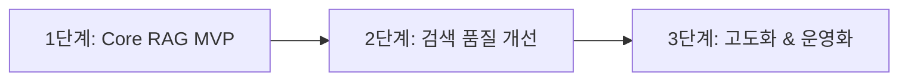

> **RAG는 LLM에게 새로운 지식을 직접 학습시키는 기술이 아니라, 질문에 필요한 정보를 검색해 문맥으로 제공하는 구조다.**

LLM(Large Language Model) 기반 서비스를 다루다 보면 "사내 문서를 학습시켜서 AI가 답하게 만들자"라는 말을 자주 듣게 됩니다. 하지만 기술적으로 RAG(Retrieval-Augmented Generation)를 적용했다고 해서 LLM이 내 문서를 스스로 기억하거나 뇌 속에 저장(학습)한 것은 아닙니다. 

RAG는 모델 내부 매개변수(Weight)를 바꾸는 학습(Training) 기술이 아니라, **백엔드 검색 파이프라인을 통해 가장 적절한 외부 문서를 찾아 프롬프트(Prompt)라는 제한된 공간에 문맥(Context)으로 주입해 주는 시스템 구조**입니다.

이번 글에서는 RAG의 기본 개념부터 전체 데이터 흐름, 검색 정확도를 높이기 위한 핵심 요소(Chunking, Embedding, Hybrid Search, Reranking), 그리고 개인 개발 기록 검색 서비스에 RAG를 적용할 때 고려해야 하는 백엔드 시스템적 트레이드오프와 운영 이슈까지 깊이 있게 정리합니다.

---

## 1. RAG를 알아보게 된 배경

개발자로 일하면서 작성한 TIL(Today I Learned), 트러블슈팅 일지, 기술 선택의 아키텍처 결정 기록(ADR)과 회고 포스팅이 늘어날수록 아이러니하게도 **"내가 정리했던 지식을 다시 찾아보는 비용"**이 커졌습니다.

예를 들어 과거 해결했던 문제나 고민했던 트레이드오프를 다시 찾아보고 싶을 때, 정확한 문서 제목이나 클래스명, 에러 코드가 기억나지 않는 경우가 많습니다. 대신 우리는 다음과 같이 당시의 '상황'이나 '이유'를 자연어로 검색하고 싶어 합니다.

* *"포인트 결제에서 동시에 요청이 들어왔을 때 적용했던 동시성 제어 방법이 뭐였지?"*
* *"예전에 캐시 TTL을 너무 길게 설정해서 발생했던 문제가 뭐라고 정리해 뒀더라?"*
* *"Redis Lock을 선택하면서 Lettuce와 Redisson 사이에서 어떤 트레이드오프를 고민했었지?"*
* *"단일 EC2 무중단 배포 중에 오류가 발생했을 때 어떤 방식으로 롤백하도록 설계했었지?"*

기존의 단순 키워드 검색이나 디렉터리 탐색으로는 이러한 맥락(Context) 기반 질문에 정확한 문서를 찾아주지 못합니다. 이 문제를 해결하기 위해 자연어로 내 과거 경험을 질문하고, 시스템이 그 상황에 맞는 과거 기록을 종합해 답변해 주는 **개인 개발 기록 검색 서비스**를 구상하게 되었고, 그 핵심 기술로 RAG를 탐구하게 되었습니다.

---

## 2. LLM만 사용할 때 발생하는 한계

LLM은 방대한 일반 지식을 가지고 있지만, 독립적인 백엔드 시스템 구축이나 도메인 특화 서비스를 만들 때 다음과 같은 명확한 한계를 드러냅니다.

1. **최신 지식의 부재**: LLM은 학습이 완료된 지식 컷오프(Knowledge Cutoff) 시점 이후의 정보를 알지 못합니다.
2. **개인 및 내부 문서 미인지**: 개발자 개인의 TIL, 사내 Wiki, 프라이빗 저장소의 기술 문서는 LLM의 학습 데이터에 존재하지 않습니다.
3. **환각(Hallucination) 현상**: LLM은 모르는 내용에 대해 "모른다"고 답하기보다, 확률적으로 그럴듯한 거짓 문장을 생성하는 경향이 있습니다.
4. **재학습(Retraining)의 높은 비용과 운영 부담**: 새로운 지식을 반영하기 위해 매번 모델을 파인튜닝하거나 재학습하는 것은 막대한 컴퓨팅 비용과 시간이 소요되어 실시간 업데이트가 불가능합니다.
5. **명확한 출처 제시 불가**: LLM이 출력한 답변이 어떤 문서의 어느 구절에 근거한 것인지 검증하거나 출처를 추적하기 어렵습니다.

이러한 한계를 극복하기 위해 **"질문이 들어왔을 때 외부 저장소에서 관련 자료를 먼저 검색(Retrieval)하고, 그 검색된 내용을 LLM에 프롬프트 문맥(Context)으로 주입하여 답변을 생성(Generation)하게 만드는 구조"**인 RAG가 탄생했습니다.

---

## 3. RAG의 전체 동작 구조

RAG 시스템은 단일 처리 과정이 아니라 **문서를 저장하는 과정(Ingestion Pipeline)**과 **사용자의 질문에 답변하는 과정(Query Processing Pipeline)**이라는 두 개의 독립된 백엔드 파이프라인으로 구성됩니다.


> RAG는 문서를 조각내어 벡터 DB에 저장하는 Ingestion 파이프라인과, 질문을 받아 유사한 조각을 검색한 뒤 LLM에 전달하는 Query 파이프라인으로 나뉜다.

### (1) 문서를 저장하는 과정 (Ingestion Pipeline)

```text
문서 수집 → 문서 정제 → 문서 분할 (Chunking) → 임베딩 생성 (Embedding) → 벡터 DB 저장
```

* **문서 수집 및 정제**: Markdown, PDF, Wiki 등의 원본 문서에서 HTML 태그나 불필요한 노이즈를 제거합니다.
* **문서 분할 (Chunking)**: 긴 문서를 LLM이 수용할 수 있고 의미 단위가 유지되는 적절한 크기(Chunk)로 잘라냅니다.
* **임베딩 생성**: 각 청크를 텍스트의 의미적 특징을 담은 고차원 수치 배열(Vector)로 변환합니다.
* **벡터 DB 저장**: 생성된 임베딩 벡터와 원문 청크, 메타데이터(Metadata)를 Vector Database에 인덱싱하여 저장합니다.

### (2) 사용자의 질문에 답변하는 과정 (Query Processing Pipeline)

```text
사용자 질문 → 질문 임베딩 생성 → 관련 문서 검색 (Similarity Search) → 검색 결과 재정렬 (Reranking) → 프롬프트 문맥 구성 → LLM 답변 생성 → 원문 출처 제공
```

* **질문 임베딩 생성**: 사용자의 자연어 질문을 동일한 임베딩 모델을 통해 벡터로 변환합니다.
* **관련 문서 검색**: 질문 벡터와 벡터 DB 내 청크 벡터들 간의 거리를 계산하여 의미적으로 가장 가까운 청크 Top-K를 검색합니다.
* **검색 결과 재정렬 (Reranking)**: (선택) 검색된 후보 청크들을 질문과의 정밀한 관련성 기준으로 재평가하여 순위를 바꿉니다.
* **프롬프트 문맥 구성**: 최종 선택된 최상위 청크들을 LLM의 시스템/유저 프롬프트 문맥(Context)에 포함시킵니다.
* **LLM 답변 생성 & 출처 제공**: LLM은 주입된 문맥만을 기반으로 답변을 작성하고, 사용된 청크의 원문 링크나 메타데이터를 함께 출력합니다.

---

### 💡 초보자를 위한 핵심 RAG 용어 정리

* **Chunk (청크)**: 긴 원본 문서를 일정한 단위로 분할한 작은 텍스트 조각.
* **Chunking (청킹)**: 원본 문서를 의미 있는 작은 청크 단위로 나누는 작업.
* **Embedding (임베딩)**: 텍스트(단어, 문장, 문단)를 의미적 유사도를 계산할 수 있는 고차원 숫자 배열(Vector)로 변환하는 기술.
* **Vector (벡터)**: 임베딩 과정을 거쳐 생성된 숫자들의 배열(예: `[0.12, -0.45, 0.89, ...]`).
* **Vector Database (벡터 데이터베이스)**: 고차원 벡터 데이터를 효율적으로 저장하고, 벡터 간 유사도 검색을 빠르게 수행할 수 있도록 최적화된 DB (예: Pinecone, Qdrant, Chroma, pgvector).
* **Similarity Search (유사도 검색)**: 코사인 유사도(Cosine Similarity)나 유클리드 거리 등을 이용해 두 벡터 간의 의미적 거리가 얼마나 가까운지 계산하는 검색 방식.
* **Context (문맥)**: LLM이 답변을 생성할 때 참고하도록 프롬프트에 주입하는 검색된 문서 조각들의 집합.
* **Retrieval (검색)**: 사용자의 질문과 관련된 정보를 외부 데이터베이스에서 찾아오는 과정.
* **Generation (생성)**: 검색된 문맥을 바탕으로 LLM이 자연스러운 최종 답변 텍스트를 만들어 내는 과정.
* **Metadata (메타데이터)**: 청크와 함께 저장되는 부가 정보(문서 제목, 작성일, 원문 URL, 프로젝트명 등).
* **Reranking (리랭킹)**: 1차 벡터 검색으로 뽑은 문서 후보군을 2차 정밀 모델(Cross-Encoder 등)로 재평가하여 질문과의 실질적 관련성 순서대로 재정렬하는 과정.

---

## 4. 임베딩과 벡터 검색

임베딩(Embedding)은 문장이 담고 있는 **의미적 맥락을 고차원 수치 공간의 점(Vector)으로 매핑**하는 과정입니다. 핵심은 **문장에 사용된 단어가 완전히 다르더라도, 의미가 유사하면 벡터 공간에서 서로 가까운 위치에 존재**하게 된다는 점입니다.


> 키워드 검색은 정확한 용어 매칭에 강하고, 벡터 검색은 단어가 달라도 의미적 유사성을 찾아내는 데 강하다.

예를 들어 다음과 같은 상황을 봅니다.

* **사용자 질문**: `"포인트 결제에서 동시에 요청이 들어왔을 때 어떻게 처리했지?"`
* **실제 기록 문서**: `"Redisson 분산 락을 사용해 포인트 차감 임계 구역의 동시성을 제어했다."`

두 문장은 `'동시에 요청'`, `'처리'` 같은 일반 단어를 제외하면 `'Redisson'`, `'분산 락'`, `'임계 구역'`, `'동시성 제어'` 등 서로 일치하는 핵심 단어가 거의 없습니다. 기존 키워드 검색(LIKE 검색이나 RDBMS Full-Text Search)으로는 이 기록을 찾아내기 어렵습니다.

그러나 임베딩 모델은 두 문장 모두 **"다중 요청으로 인한 동시성 이슈를 기술적으로 해결한 맥락"**을 포함하고 있음을 이해하고, 고차원 벡터 공간에서 두 문장의 거리를 매우 가깝게 배치합니다. 이것이 바로 벡터 검색(Similarity Search)의 강력함입니다.

단, **임베딩 모델이 문장의 고차원적 의미나 비즈니스 로직을 '완벽히 이해'하는 것은 아닙니다.** 임베딩은 대규모 언어 데이터로 사전 학습된 모델이 통계적으로 계산해 낸 '의미적 유사도 산출 결과'일 뿐이므로, 맥락에 따라 엉뚱한 문서가 높은 유사도 점수를 받을 가능성도 항상 존재합니다.

---

## 5. 키워드 검색과 벡터 검색의 차이

백엔드 시스템 관점에서 키워드 검색(BM25, ElasticSearch 등)과 벡터 검색(Vector Search)은 대립하는 기술이 아니라 **서로의 약점을 보완하는 관계**입니다.

### 키워드 검색이 유리한 경우

개발 문서에는 의미보다 **정확한 문자열 매칭**이 중요한 데이터가 수없이 존재합니다.

* **클래스명 및 메서드명**: `RedissonLockManager`, `PaymentFacade.charge()`
* **에러 코드 및 예외 메시지**: `SQLSTATE 23505`, `NullPointerException`
* **정확한 기술명 및 식별자**: `Kafka DLT`, `UUID-v4`, `JWT Bearer`

이런 텍스트는 임베딩 모델을 거치면 의미가 뭉개지거나 적절한 유사도를 얻지 못할 수 있습니다. `SQLSTATE 23505`라는 에러 코드를 검색할 때, 의미적으로 유사한 다른 에러 코드를 찾는 것보다 **정확히 그 에러 코드가 적힌 문서**를 찾는 것이 훨씬 중요하기 때문입니다.

### 벡터 검색이 유리한 경우

* 정확한 용어가 기억나지 않고 의도나 상황만 자연어로 설명하는 질문
* 같은 의미를 서로 다른 표기나 동의어로 작성한 문서
* 전체적인 트레이드오프나 해결 아이디어를 탐색하는 질의

### Hybrid Search(하이브리드 검색)의 필요성

실제 운영 환경의 RAG 시스템에서는 키워드 검색의 정확도(Exact Match)와 벡터 검색의 문맥 이해(Semantic Match)를 결합한 **Hybrid Search**를 채택합니다. 두 검색 결과를 RRF(Reciprocal Rank Fusion) 같은 알고리즘으로 병합하면 검색 실패율을 획기적으로 낮출 수 있습니다.

> **💡 백엔드 개발자의 실무 팁**:
> 초기 MVP 구현 단계부터 복잡한 Hybrid Search 엔진이나 별도의 ElasticSearch 클러스터를 붙이는 것은 과도한 엔지니어링이 될 수 있습니다. **1단계 MVP에서는 백엔드 구조가 단순한 Vector Search만으로 시작**하고, 실제 질의 로그를 수집하면서 에러 코드나 기술명 검색 실패 사례가 누적될 때 Hybrid Search로 확장하는 방식이 현실적입니다.

---

## 6. Chunking이 중요한 이유

RAG에서 원본 문서를 적절한 크기(Chunk)로 나누는 **Chunking 전략은 RAG 전체 성능의 70% 이상을 결정**한다고 해도 과언이 아닙니다.


> 청크가 너무 작으면 문맥이 잘리고, 너무 크면 주제가 섞여 임베딩 정확도와 토큰 효율이 떨어진다.

### (1) 문서를 너무 작게 나누었을 때 (Under-chunking)
* **문맥 잘림 현상**: 문장의 의미나 의사결정 배경이 소실됩니다.
* **예시**: `"Redis Lock을 사용했다."`라는 세 단어짜리 청크만 검색되면, *왜 사용했는지*, *어떤 동시성 문제를 해결하려 했는지*에 대한 이유가 사라져 LLM이 제대로 된 답변을 만들어 낼 수 없습니다.

### (2) 문서를 너무 크게 나누었을 때 (Over-chunking)
* **주제 혼재**: 하나의 청크에 동시성 제어, 캐시 TTL 설정, CI/CD 배포 등 여러 주제가 섞입니다.
* **임베딩 노이즈**: 임베딩 벡터가 청크 내의 핵심 주제를 명확히 표현하지 못하고 어정쩡한 중간값으로 희석됩니다.
* **토큰 비용 및 Latency 증가**: 질문과 관련 없는 내용까지 LLM 프롬프트에 들어가면서 토큰 비용이 상승하고 응답 속도가 느려집니다.

### 주요 Chunking 방식 비교

1. **고정 길이 방식 (Fixed-size / Token Count)**: 문자 수나 토큰 수(예: 500자)로 단순 분할. 구현은 쉬우나 문장이 중간에 잘릴 위험이 큼.
2. **Overlap 방식**: 고정 분할 시 문맥 끊김을 막기 위해 이전 청크의 일부(예: 50자)를 중첩시키는 방식.
3. **문단/문장 단위 분할**: 줄바꿈(`\n\n`)이나 마침표 기준으로 분할하여 완결된 문장 구조 유지.
4. **Markdown 헤더 기반 분할 (Header-based Structural Chunking)**: `#`, `##`, `###` 등 마크다운 목차 구조를 기준으로 섹션을 분할.
5. **Semantic Chunking**: 문장 간 임베딩 유사도를 계산하다가 의미가 급격히 바뀌는 지점을 감지하여 가변적으로 자르는 방식.

> **💡 개발 기록(TIL)에 적합한 전략**:
> 개발 블로그나 TIL 문서는 기본적으로 Markdown 형식으로 작성되며 헤더(`## 1. 문제 상황`, `## 2. 해결 방법`) 구조가 매우 명확합니다. 따라서 단순 고정 길이 분할보다 **Markdown 헤더와 문단을 기준으로 분할하고, 상위 헤더 제목을 청크에 포함시키는 구조적 Chunking**이 가장 우수한 검색 품질을 보여줍니다.

### Metadata(메타데이터) 저장의 중요성

청크를 DB에 저장할 때 텍스트만 넣는 것이 아니라 다음과 같은 **Metadata**를 함께 인덱싱해야 합니다.

```json
{
  "chunk_id": "chk_98123",
  "document_id": "doc_20260715_point_concurrency",
  "title": "포인트 결제 동시성 제어 설계 회고",
  "section_title": "Redisson 분산 락 도입 이유",
  "created_at": "2026-07-15",
  "tags": ["Redis", "Concurrency", "Lock", "Backend"],
  "project_name": "point-service",
  "source_url": "/posts/point-payment-concurrency-design/"
}
```

이 메타데이터는 **"최근 3개월 내 작성된 문서만 검색"**하거나 **"`Redis` 태그가 붙은 문서로 필터링"**하는 등 백엔드 사전 필터링(Pre-filtering)과 최종 답변의 원문 링크 제공에 핵심적인 역할을 합니다.

---

## 7. 검색 결과 개수와 Top-K

Vector DB에서 질문과 가장 유사한 청크를 상위 몇 개까지 가져올지 결정하는 파라미터를 **Top-K**라고 합니다.

* **Top-K가 너무 작을 때 (e.g., K=1)**: 질문에 답하기 위해 여러 청크의 정보(예: 원인 청크 + 해결법 청크)가 필요한 경우 필요한 정보를 놓칩니다(Recall 저하).
* **Top-K가 너무 클 때 (e.g., K=20)**: 관련도가 떨어지는 노이즈 청크까지 프롬프트에 들어가면서 LLM이 혼란을 겪거나 환각을 일으킵니다(Precision 저하).

실무에서는 이를 극복하기 위해 **2단계 검색 좁히기 전략**을 사용합니다.

```text
1차: Vector Search로 Recall을 높이기 위해 후보를 넉넉히 조회 (Top-K = 20)
  ↓
2차: Reranker로 질문과의 실질적 관련도를 정밀 평가하여 Top 3~5개로 압축 (Precision 향상)
  ↓
LLM 프롬프트 주입
```

* **Recall(재현율)**: 시스템이 필요한 핵심 문서를 놓치지 않고 얼마나 잘 찾아왔는가.
* **Precision(정밀도)**: 가져온 문서들 중 실제로 질문과 관련 있는 유용한 문서의 비율이 얼마나 높은가.

---

## 8. Reranking이 필요한 이유

벡터 검색에 사용되는 Dense Embedding 모델은 빠르게 유사한 후보를 찾는 데 최적화되어 있지만, **질문 문장 전체와 각 문서 조각 간의 미세한 논리적 관련성까지 완벽히 순위화(Ranking)하지는 못합니다.**

Reranker(Cross-Encoder 모델)는 질문 텍스트와 검색된 청크 텍스트를 **하나의 쌍(Pair)으로 묶어 모델에 동시에 입력**하여 두 문장 사이의 정밀한 관련성 점수를 다시 계산합니다.

그러나 백엔드 개발자 관점에서 Reranking 추가는 **명확한 시스템적 트레이드오프**를 가져옵니다.

| 장점 | 발생 비용 및 운영 리스크 (트레이드오프) |
| --- | --- |
| • 검색 Precision(정밀도) 대폭 향상<br>• 상위 3~5개 청크만 프롬프트에 넣어 토큰 절약 | • **응답 지연시간(Latency) 증가**: 100ms~300ms 추가<br>• **추가 API/모델 호출 비용** 발생<br>• **외부 장애 포인트 증가**: Reranker API/서버 장애 시 검색 전체 마비<br>• **시스템 구성 복잡도 및 모니터링 대상 증가** |

> **💡 MVP 도입 가이드**:
> 초기 시스템 구축 시에는 Reranker 없이 단순 Vector Search 결과의 Top-3만 추출하여 LLM에 넘기는 방식으로 최소 파이프라인을 구축하세요. 이후 실제 검색 실패 사례 데이터를 수집하고 검색 정밀도가 아쉬울 때 Reranker를 레이어로 추가하는 편이 시스템 복잡도를 관리하기에 좋습니다.

---

## 9. RAG를 적용해도 환각이 사라지지 않는 이유

RAG는 LLM의 환각을 현저히 줄여주지만, **환각을 100% 제거하는 완벽한 치트키는 아닙니다.** RAG 시스템에서도 다음과 같은 다양한 지점에서 실패가 일어납니다.


> RAG 시스템의 답변 실패는 검색 단계(Retrieval Failure)와 생성 단계(Generation Failure) 중 어느 곳에서도 발생할 수 있다.

### RAG의 대표적인 실패 시나리오

1. **Retrieval 실패 (검색 문제)**
   * 질문에 해당하는 문서가 DB에 아예 없음 (데이터 부재).
   * 엉뚱하거나 관련 없는 청크가 Top-K로 검색됨.
   * 작성된 지 오래되어 폐기된 이전 버전의 기술 문서가 최신 문서보다 먼저 검색됨.
   * 여러 청크 간의 내용이 서로 상충하거나 충돌함.

2. **Generation 실패 (생성 문제)**
   * 올바른 청크가 전달되었으나, LLM이 문맥 해석을 잘못함.
   * 청크에 답이 없는데도 LLM이 자체 사전 학습 지식을 동원해 거짓 답변을 지어냄.
   * 너무 많은 청크(과도한 토큰)가 전달되어 프롬프트 중간의 내용을 놓침 (Lost in the Middle 현상).

결과적으로 RAG의 최종 답변 품질은 단지 '어떤 LLM을 쓰느냐'로 결정되는 것이 아니라, **전체 파이프라인 요소들의 곱셈 방정식**으로 결정됩니다.

$$\text{RAG 품질} = \text{원본 문서 품질} \times \text{Chunking 전략} \times \text{Embedding 성능} \times \text{검색/필터링} \times \text{Top-K/Reranking} \times \text{프롬프트 설계} \times \text{LLM 성능}$$

---

## 10. 출처와 근거 제공

RAG 서비스가 단순 LLM 대화 서비스와 차별화되는 가장 강력한 백엔드 기능은 **답변의 출처(Source Attribution)를 명확히 제시할 수 있다는 점**입니다.

개인 개발 기록 검색 서비스라면 답변 하단에 다음과 같은 원문 근거 풋프린트를 함께 보여주어야 합니다.

```text
[AI 답변]
포인트 결제 시 동시성 요청은 Redisson 분산 락을 활용해 임계 구역을 보호했습니다. 
Pub/Sub 기반의 락 획득 방식으로 Redis 부하를 줄였으며, 락 획득 타임아웃은 3초로 설정했습니다.

📌 참고한 개발 기록 (출처):
1. [포인트 결제 동시성 제어 전략.md] (작성일: 2026-07-15) - 섹션: Redisson 락 타임아웃 설정
2. [Redis 분산 락 vs Lettuce 성능 비교.md] (작성일: 2026-06-01) - 섹션: Pub/Sub 부하 테스트
```

이처럼 원문 제목, 작성일, 관련 문단, 프로젝트명, 원문 URL을 함께 제공함으로써 사용자는 **AI의 답변을 blind하게 믿는 것이 아니라, 자신이 작성했던 원문 포스팅으로 즉시 이동하여 정확성을 검증**할 수 있습니다.

단, **"출처가 표시되었다고 해서 답변 전체가 100% 진실인 것은 아니다"**라는 점을 유의해야 합니다. LLM이 출처 링크는 맞게 달아놓고 문장 해석을 아예 반대로 요약해 버리는 경우도 존재하기 때문입니다.

---

## 11. RAG와 Fine-tuning의 차이

LLM 기반 개발을 할 때 가장 많이 혼동하는 **RAG**와 **Fine-tuning**의 차이를 명확히 비교합니다.

| 비교 항목 | RAG (Retrieval-Augmented Generation) | Fine-tuning (미세 조정) |
| --- | --- | --- |
| **작동 원리** | 외부 DB에서 지식을 검색해 프롬프트 문맥으로 제공 | 모델 내부 파라미터(Weight)를 직접 수정/학습 |
| **주 목적** | **최신 지식 및 외부/사내 보안 데이터 참조** | **답변 말투, 스타일, 특정 출력 형식(JSON 등) 고정** |
| **데이터 업데이트** | 문서 DB 업데이트만으로 **즉시 반영** | 매번 데이터를 구축하고 **재학습 과정 필요** |
| **출처 제시** | 메타데이터를 기반으로 **원문 출처 제시 용이** | 모델 내부 지식이므로 **출처 제시 불가능** |
| **환각 억제** | 문맥 제약으로 **환각 대폭 감소** | 잘못된 정보를 학습하면 **환각 고착화 위험** |
| **주요 한계** | 검색 파이프라인 품질에 답변이 의존함 | 지식 업데이트 비용이 높고 환각 조절이 어려움 |

> **핵심 요약**:
> **새로운 지식이나 자주 바뀌는 지식을 제공하려면 RAG를 선택**하고, **LLM의 출력 스타일이나 특정한 행동 패턴, 도메인 특화 문체를 이식하려면 Fine-tuning을 선택**하는 것이 정석입니다. 두 기술은 대립 관계가 아니며, RAG 문맥을 잘 이해하도록 모델을 Fine-tuning하는 방식으로 조합할 수도 있습니다.

---

## 12. 개인 개발 기록 검색 서비스에 적용한다면

내가 작성한 과거 TIL과 트러블슈팅 기록을 찾아주는 **개인 개발 기록 검색 서비스**를 RAG로 설계한다면 다음과 같은 백엔드 파이프라인을 갖게 됩니다.


> 작성된 TIL 및 기술 블로그 마크다운 포스팅을 파싱 및 인덱싱하고, 자연어 질의에 따라 검색 및 Reranking을 거쳐 출처와 함께 답변을 반환하는 전체 서비스 구조.

### 실제 사용자 자연어 질의 처리 흐름 예시

* **질문 1**: *"예전에 캐시 TTL을 길게 설정하면 어떤 문제가 있다고 정리했었지?"*
  * ➔ 백엔드에서 `[Cache, TTL, Redis]` 메타데이터와 벡터 검색 수행 ➔ 과거 작성한 [Spring Cache & Redis 캐시 전략 포스팅](/posts/Spring-Cache-Design-Sync-RedisTemplate/) 청크 추출 ➔ *"캐시 스탬피드(Cache Stampede) 현상 및 데이터 불일치 위험이 발생할 수 있다고 정리하셨습니다"* 답변과 해당 글 링크 제공.

* **질문 2**: *"Redis Lock을 선택할 때 Lettuce 대신 Redisson을 선택한 이유가 뭐였지?"*
  * ➔ [포인트 결제 동시성 설계 포스팅](/posts/point-payment-concurrency-design/) 검색 ➔ *"Lettuce의 스피닝 락(Spin Lock) 방식으로 인한 Redis CPU 과부하를 방지하고, Pub/Sub 기반의 Lock 획득을 위해 Redisson을 선택했습니다"* 답변 제공.

* **질문 3**: *"단일 EC2 배포를 선택하면서 어떤 트레이드오프를 고려했었지?"*
  * ➔ [CI/CD 배포 전략 포스팅](/posts/cicd-design-not-yaml/) 검색 ➔ *"인프라 비용 절감 및 단순성을 얻는 대신, 배포 순간의 순간적 인스턴스 과부하 및 Multi-AZ 장애 대응 불가를 트레이드오프 노트로 작성하셨습니다"* 답변 제공.

* **질문 4**: *"Kafka 에러가 발생했을 때 재처리 전략을 어떻게 정리했었지?"*
  * ➔ [Kafka Retry & DLT 운영 포스팅](/posts/kafka-retry-dlt-operation/) 검색 ➔ *"단순 재시도 후 실패 시 Dead Letter Topic(DLT)으로 이관하여 메인 로직의 지연을 막는 구조로 정리하셨습니다"* 답변 제공.

이처럼 RAG 서비스를 통해 머릿속에 파편화되어 있던 과거의 기술적 고민과 회고를 **단 한 줄의 자연어 질문으로 빠르게 소환**할 수 있습니다. (나아가 이러한 기록 통합 관점은 [온톨로지 기반 세컨드 브레인 구축](/posts/ontology-ai-second-brain/)과도 긴밀하게 이어집니다.)

---

## 13. MVP 구현 전략

처음부터 Hybrid Search, Reranking, Multi-Query Rewriting 등 모든 최신 기술을 한꺼번에 구축하려고 하면 백엔드 복잡도가 폭발합니다. 단계별 확장 전략이 필요합니다.



### 1단계: Core RAG MVP (최소 기능 제품)
* Markdown 파일 업로드 및 단순 문단/헤더 기준 Chunking
* 기본 Embedding 모델(OpenAI text-embedding-3-small 등) 활용
* 간단한 Vector DB(Chroma 또는 pgvector) 적용
* Vector Search Top-3 청크를 프롬프트에 주입 후 LLM 답변 생성
* 답변 하단에 원문 제목 및 URL 링크 표기

### 2단계: Chunking & Metadata 최적화
* Markdown 구조 기반 헤더 청킹 적용 및 Chunk Overlap 미세 조정
* `tags`, `created_at`, `project_name` 메타데이터 인덱싱 및 필터링 기능 추가
* 평가 데이터셋을 통한 Top-K 파라미터 최적화

### 3단계: Advanced RAG 고도화
* 키워드 검색(BM25)과 벡터 검색을 결합한 **Hybrid Search** 도입
* **Reranker** 적용을 통한 검색 Precision 극대화
* 질의 변형(Query Rewriting) 및 사용자 피드백(좋아요/나빠요) 로깅 구축
* 백엔드 Caching 레이어(동일 질문 재활용) 및 임베딩 자동 갱신 파이프라인 구축

---

## 14. 검색 품질 평가

RAG 백엔드를 만들고 나서 단순히 "어? 답변이 제법 그럴듯하게 나오네?" 하고 넘어가는 것은 매우 위험합니다. **Retrieval 평가와 Generation 평가를 명확히 분리하여 측정**해야 합니다.

### RAG 백엔드 체크리스트

1. 질문과 실제 관련된 문서를 Top-K에 찾아왔는가? (Retrieval Recall)
2. 가져온 문서 중 관련 없는 노이즈 문서 비율은 얼마나 되는가? (Retrieval Precision)
3. 오래된 과거 문서보다 최근 수정된 최신 문서가 우선 순위에 올랐는가?
4. LLM 답변이 전달된 문서의 내용에 명확히 근거(Grounded)하고 있는가?
5. LLM이 문서에 전혀 없는 내용을 임의로 지어내지 않는가? (Faithfulness)
6. 출처 링크가 실제 청크와 정확히 일치하게 매핑되었는가?

### 평가 데이터셋 구축 예시

검색 시스템을 개편할 때마다 품질 저하(Regression)를 방지하기 위해 **골든 테스트 데이터셋(Golden Dataset)**을 만들어야 합니다.

```json
{
  "test_id": "tc_001",
  "query": "Lettuce 대신 Redisson을 선택한 이유는?",
  "expected_documents": ["Redis 분산 락 설계 기록.md"],
  "acceptable_documents": ["포인트 결제 동시성 TIL.md"],
  "irrelevant_documents": ["Redis 캐시 TTL 설정 정리.md"]
}
```

RAG의 개선 작업은 **"LLM 모델을 바꿨더니 답이 더 좋아졌다"**는 감상적인 평가가 아니라, **"Retrieval 단계에서 기대 문서의 Top-3 진입 비율(Hit Rate)이 70%에서 92%로 올랐다"**는 정량적 수치 기반으로 이루어져야 합니다. (이전에 정리했던 [Vector DB 가이드](/posts/vector-db-guide/) 및 [RAG 검색 중심 설계 포스팅](/posts/rag-search-not-generation/)에서도 강조했던 핵심 원칙입니다.)

---

## 15. 운영 관점에서 고려할 점 (백엔드 개발자의 시각)

RAG를 장난감 프로젝트가 아닌 실제 서비스로 운영하려면, 백엔드 개발자는 단순한 AI API 호출 이상의 **전형적인 분산 데이터베이스 및 ETL 파이프라인 문제**들을 고민해야 합니다.

1. **문서 수정 및 삭제 시 임베딩 동기화 (CDC)**
   * 원본 마크다운 포스팅이 수정되거나 삭제되면, Vector DB에 저장된 기존 청크 벡터도 즉시 수정/삭제되어야 합니다. 그렇지 않으면 폐기된 옛날 글이 계속 검색되는 데이터 정합성 문제가 발생합니다.
2. **동일 문서 중복 저장 방지**
   * 문서 수집 파이프라인 재실행 시 동일 청크가 겹쳐서 Vector DB에 멱등성(Idempotency) 없이 중복 누적되지 않도록 `chunk_hash` 기반 중복 체크가 필요합니다.
3. **Embedding 모델 변경 시 Re-indexing 비용**
   * 차후 더 성능이 좋은 임베딩 모델로 변경하는 경우, **기존 저장된 모든 벡터 데이터를 전부 폐기하고 원본 문서로부터 처음부터 재임베딩**해야 합니다. (벡터 공간의 차원과 좌표계가 완전히 바뀌기 때문입니다.)
4. **문서 접근 권한 제한 (ACL Filter)**
   * 사내 RAG 시스템의 경우, 검색 단계(Retrieval)에서 사용자의 권한(Role)에 맞는 메타데이터 필터링(`where team = 'backend'`)을 걸어주지 않으면, 일반 직원의 질의에 임원진 비밀 문서 청크가 뚫려 나가는 심각한 보안 사고가 발생할 수 있습니다.
5. **개인정보 및 민감정보 마스킹**
   * 개인 TIL이나 트러블슈팅에 포함된 API Secret Key, DB 접속 비밀번호, 개인 식별 정보가 임베딩되어 외부 LLM API(OpenAI 등)로 전송되지 않도록 Ingestion 단계에서 정규식 마스킹 처리가 필수적입니다.
6. **장애 처리 및 Fallback 전략**
   * Vector DB 장애나 LLM API Rate Limit(429 Error) 발생 시 사용자에게 지연 없이 "현재 검색 서비스를 사용할 수 없습니다"라는 캐시된 답변이나 일반 키워드 검색 결과로 덤프해 주는 Fallback 처리가 필요합니다.
7. **비용 및 Latency 모니터링**
   * 임베딩 API 비용, Vector DB 호스팅 비용, LLM 토큰 비용을 추적하고, RAG 전체 응답 시간이 2초를 넘지 않도록 검색 Latency를 APM(Application Performance Monitoring)으로 모니터링해야 합니다.

> **RAG는 단순한 AI 프롬프트 엔지니어링이 아닙니다. 데이터 수집, 파싱, 인덱싱, 검색, 권한 제어, 갱신, 비용 관리가 종합적으로 작용하는 복합 백엔드 시스템입니다.**

---

## 글의 결론

* RAG의 본질은 **LLM 내부 뇌(Parameter)에 지식을 학습시키는 것이 아니라, 질문에 필요한 외부 데이터를 백엔드 검색으로 정확히 찾아 제한된 문맥으로 제공하는 기술**입니다.
* RAG 시스템의 성패는 어떤 LLM을 쓰는지보다 **"원문 문서를 어떻게 자르고(Chunking), 어떤 메타데이터와 함께 저장하며, 얼마나 정밀하게 찾아내는지(Retrieval)"**에 달려 있습니다.
* Chunking, Metadata, Hybrid Search, Reranking은 검색 품질을 높여주는 핵심 수단이지만, **초기 MVP에서는 단순한 Vector Search 구조로 빠르게 시작한 뒤 실제 검색 실패 사례 데이터를 기반으로 단계별 확장을 진행하는 것이 백엔드 엔지니어링 관점에서 바람직**합니다.
* 개인 개발 기록 검색 서비스에 RAG를 적용하면, 키워드가 생각나지 않는 과거의 기술적 고민과 트레이드오프 기록을 자연어로 찾아내고, 원문 링크와 함께 검증 가능한 지식 자산으로 활용할 수 있습니다.

> **RAG의 성능은 LLM이 얼마나 똑똑한지만으로 결정되지 않는다. 사용자의 질문에 필요한 기록을 얼마나 정확히 찾아 제공하는지가 답변의 품질을 결정한다.**
