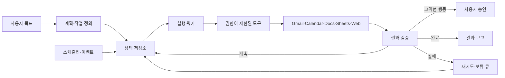

생성형 AI는 보통 사용자가 질문해야 움직인다. 답변을 받은 뒤 대화창을 닫으면 작업도 사실상 끝난다. 그런데 Google이 I/O 2026에서 공개한 **Gemini Spark**는 목표와 일정을 받아 클라우드에서 계속 실행되고, 연결된 앱을 사용해 실제 작업까지 처리한다.

이 차이는 단순히 답변이 더 좋아졌다는 뜻이 아니다. 요청 하나를 처리하는 챗봇에서 **상태를 보존하고 조건을 기다리며 행동하는 실행 시스템**으로 무게중심이 옮겨간다는 뜻이다. Spark의 공개 기능을 살펴보면서 24시간 에이전트를 백엔드 관점에서 어떻게 이해해야 하는지 정리했다.

_생성 파일: `assets/images/2026-07-31-gemini-spark/chatbot-to-agent.png` — 글 도입부에 삽입_

## Gemini Spark는 무엇인가

Google은 Spark를 사용자의 지시 아래 디지털 작업을 수행하는 24시간 개인 AI 에이전트로 소개한다. Spark는 Gemini 3.5와 Antigravity 실행 환경을 사용하며, 전용 Google Cloud 가상 머신에서 동작한다. 그래서 노트북을 닫거나 휴대전화를 잠가도 백그라운드 작업을 이어갈 수 있다.

사용자는 자연어로 목표와 실행 시점을 지정하고, 반복 일정이나 여러 단계의 작업을 만들 수 있다. Spark는 연결된 앱, 웹사이트, 대화와 스킬을 활용한다. 받은 편지함 정리, 뉴스 추적, 조사와 문서 작성이 대표 사례다.

2026년 7월 31일 기준 한국에서는 개인 Google 계정과 Google AI Ultra 구독, 활동 저장 설정이 필요하다. 만 18세 이상이어야 하며, 모바일·웹·Mac용 Gemini 앱에서 사용할 수 있다. 미국 외 지역은 Ultra가 필요하고, 회사나 학교 계정은 아직 지원하지 않는다. 구독과 지역 범위는 바뀔 수 있으므로 실제 사용 전 공식 도움말을 다시 확인해야 한다.

## Gemini 챗봇과 무엇이 다른가

기존 Gemini 대화와 Spark의 가장 큰 차이는 모델이 아니라 **실행 생명주기**다.

| 기준 | 대화형 Gemini | Gemini Spark |
|---|---|---|
| 시작 | 사용자가 프롬프트 입력 | 목표·일정·트리거 설정 |
| 실행 시간 | 한 번의 대화 중심 | 백그라운드에서 장시간·반복 실행 |
| 상태 | 대화 문맥 중심 | 진행 단계와 다음 실행 시점 유지 |
| 도구 | 요청 중 필요한 기능 사용 | 연결 앱과 스킬로 여러 단계 수행 |
| 결과 | 주로 답변과 생성물 | 실제 작업 완료와 진행 보고 |
| 사용자 개입 | 매 요청마다 지시 | 주요 행동 확인과 필요 시 개입 |
| 실패 | 다시 질문하거나 재시도 | 재개·보류·보고가 필요한 운영 문제 |

챗봇은 `질문 → 답변`에 가깝다. Spark는 `목표 → 계획 → 도구 실행 → 상태 저장 → 조건 확인 → 다음 행동 → 보고`를 반복한다. Google이 이를 AI 비서보다 에이전트라고 부르는 이유도 여기에 있다. 자연어를 잘 쓰는 것보다 목표를 여러 단계로 나누고, 외부 세계의 상태를 확인하며, 실제 결과가 생길 때까지 실행을 이어가는 능력이 핵심이다.

## 24시간 에이전트에 필요한 백엔드 구조

Google은 Spark의 내부 구현 전체를 공개하지 않았다. 따라서 아래 구조는 공개된 동작을 일반적인 에이전트 시스템 관점에서 해석한 것이다.

먼저 자연어 목표를 실행 가능한 작업으로 바꿔야 한다. 목표, 실행 조건, 반복 주기, 허용 도구, 완료 조건과 승인 필요 여부가 작업 정의에 들어간다.

긴 작업을 하나의 HTTP 요청이나 모델 호출 안에 붙잡아 둘 수는 없다. 작업 ID, 현재 단계, 다음 실행 시점, 시도 횟수, 도구 실행 결과와 승인 상태를 영속 저장해야 한다. 그래야 프로세스가 재시작되거나 토큰이 만료돼도 처음부터 중복 실행하지 않고 이어갈 수 있다.

스케줄러도 필요하다. 정해진 시간, 새 이벤트, 주기적인 조건 확인 중 작업에 맞는 방식을 선택해야 한다.

도구 호출은 LLM이 임의의 API 요청을 만드는 구조보다 입력 스키마와 권한이 정해진 실행 계층을 두는 편이 안전하다. `search_mail`, `create_document`, `append_sheet_row`처럼 허용된 행동을 작게 나누면 검증과 감사가 쉬워진다.

## 실패는 예외가 아니라 정상 흐름이다

상시 실행 에이전트는 부분 실패를 피할 수 없다. Gmail 조회는 성공했지만 문서 생성이 실패할 수 있고, OAuth 토큰이 만료되거나 API 제한에 걸릴 수도 있다. 응답을 받기 전에 연결이 끊기면 성공 여부가 불명확해져 같은 이메일을 두 번 보내는 문제도 생긴다.

따라서 단계별 체크포인트와 멱등성 키가 필요하다. 재시도에는 지수 백오프와 최대 횟수를 두고, 반복 실패 작업은 보류 큐로 격리한다. 어떤 입력과 권한으로 무엇을 시도했는지 감사 로그를 남기고, 사용자가 작업을 중지하거나 되돌릴 수도 있어야 한다.

## 가장 중요한 문제는 권한과 신뢰다

이메일, 문서, 일정에 접근하는 에이전트는 답변만 틀리는 시스템보다 영향 범위가 크다. 읽기와 쓰기 권한을 분리하고 작업별 최소 권한만 허용해야 한다. 이메일 발송, 일정 삭제, 결제, 외부 공유처럼 되돌리기 어렵거나 타인에게 영향을 주는 행동은 실행 직전에 사용자 승인을 받는 편이 안전하다.

프롬프트 인젝션도 현실적인 위협이다. 이메일이나 웹페이지 속 문장을 시스템 지시로 오해하면 잘못된 행동이 연쇄 전파될 수 있다. 외부 콘텐츠는 신뢰할 수 없는 데이터로 취급하고 그 안의 명령이 권한을 넓히지 못하게 해야 한다. Google도 작업 스레드에 로그인·결제·민감 정보를 직접 입력하지 말고, 민감한 예약 작업을 피하라고 안내한다.

## n8n·Zapier 같은 자동화와의 경계

규칙 기반 자동화는 개발자가 미리 정한 조건과 순서를 그대로 실행한다. 입력 형식과 절차가 안정적인 업무에는 이 방식이 더 예측 가능하고 저렴하다. 반면 에이전트는 자연어 목표를 해석하고 상황에 따라 계획과 도구 선택을 조정할 수 있다. 모호한 요청과 비정형 정보에는 유리하지만 결과의 변동성과 검증 비용이 커진다.

현실적인 구조는 둘을 결합하는 것이다. LLM은 분류나 다음 행동처럼 판단이 필요한 지점에 쓰고, 발송·저장·재시도는 결정적인 워크플로우에 맡긴다. **불확실성이 있는 부분에만 판단 능력을 배치해야 한다.**

## Gemini Spark를 보며 달라진 생각

이전에는 AI 에이전트를 LLM이 여러 도구를 호출하는 프로그램으로 이해했다. Spark를 살펴보니 중요한 것은 도구의 수보다 작업이 머무를 수 있는 실행 환경이었다. 사용자가 접속하지 않아도 상태를 보존하고, 조건을 기다리고, 실패를 복구하고, 중요한 행동 앞에서 멈추는 구조가 있어야 실제 서비스가 된다.

결국 24시간 AI 에이전트는 모델 기능만으로 완성되지 않는다. 스케줄러, 상태 머신, OAuth, 멱등성, 관찰 가능성, 권한 통제처럼 익숙한 백엔드 문제가 그대로 돌아온다. 자율성이 커질수록 이 기반은 오히려 더 중요해진다.

Gemini Spark는 생성형 AI가 답변 도구에서 사용자의 목표를 대신 수행하는 실행 주체로 이동하고 있음을 보여준다. 다만 “24시간 자율 실행”은 무제한 위임이 아니다. 운영 가능한 에이전트의 기준은 얼마나 오래 혼자 움직이느냐보다 **어떤 권한으로 실행했고, 실패했을 때 복구할 수 있으며, 사용자가 언제든 통제할 수 있는가**에 있다.

에이전트가 목표를 행동으로 바꾸는 기본 반복 구조가 궁금하다면 [AI 에이전트의 구조와 반복 흐름](/posts/ai-agent-architecture-and-loop/)을 함께 볼 수 있다. 정해진 흐름과 AI의 판단을 결합하는 문제는 [AI 개발 워크플로우 자동화](/posts/ai-dev-workflow-automation/)와도 이어진다.

## 참고 자료

- [Google Blog: The Gemini app becomes more agentic, delivering proactive, 24/7 help](https://blog.google/innovation-and-ai/products/gemini-app/next-evolution-gemini-app/)
- [Google I/O 2026 발표 정리](https://blog.google/innovation-and-ai/technology/ai/google-io-2026-all-our-announcements/)
- [Google I/O 2026 기조연설](https://blog.google/innovation-and-ai/sundar-pichai-io-2026/)
- [Gemini Apps Help: Use Gemini Spark to manage your tasks & workflows](https://support.google.com/gemini/answer/17094507)
- [Gemini Apps Help: Gemini Apps limits & upgrades](https://support.google.com/gemini/answer/16275805)
