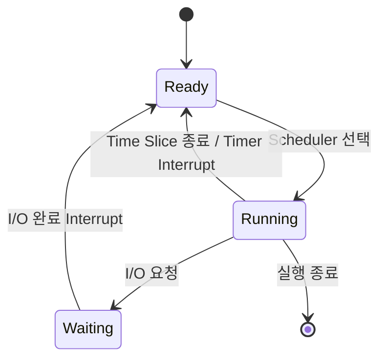

처음 Interrupt(인터럽트)를 공부했을 때는 다음과 같이 이해했다.

> CPU가 현재 작업을 멈추고 다른 작업을 처리하는 기능

틀린 설명은 아니지만, 이 정도로는 실제 실행 흐름이 잘 연결되지 않았다.

- CPU는 왜 실행 중인 작업을 중단해야 할까?
- Interrupt가 발생하면 항상 Context Switching(문맥 교환)이 일어날까?
- I/O 작업이 끝났다는 사실은 누가 알아차릴까?
- I/O가 끝난 스레드는 바로 실행될까?
- Scheduler(스케줄러)는 Interrupt와 어떤 관계가 있을까?
- Java 애플리케이션에서 경험하는 스레드 대기는 OS 수준에서 어떻게 동작할까?

이 질문들을 따라가며 이해한 Interrupt는 단순히 “작업을 중단하는 기능”이 아니었다.

**CPU가 모든 사건을 직접 확인하지 않고, 필요한 사건이 발생했을 때 Kernel(커널)이 제어권을 얻어 처리할 수 있도록 만드는 메커니즘**에 가까웠다.

이번 글에서는 Interrupt의 종류를 나열하기보다 CPU, Kernel, I/O, Scheduler, Thread가 어떤 실행 흐름으로 연결되는지 정리해 본다.

## 1. Interrupt가 필요한 이유

CPU가 디스크나 네트워크 장치의 작업이 끝났는지 계속 확인해야 한다고 생각해 보자.

```text
CPU
 ↓
I/O 끝났나?
 ↓
아직
 ↓
I/O 끝났나?
 ↓
아직
...
```

이처럼 CPU가 장치의 상태를 반복해서 확인하는 방식을 Polling(폴링)이라고 한다. 구현이 단순하고 특정 상황에서는 유용하지만, I/O가 완료될 때까지 CPU가 확인 작업을 반복해야 한다는 비용이 있다.

Interrupt를 사용하면 CPU는 완료될 때까지 기다리는 대신 다른 작업을 실행할 수 있다.

```text
CPU → 다른 작업 수행
        ↓
     I/O 완료
        ↓
    Interrupt 발생
        ↓
CPU가 완료 사실을 인지
```

핵심은 **CPU가 사건이 발생할 때까지 기다리는 것이 아니라, 사건이 발생하기 전까지 다른 일을 할 수 있다는 점**이다.

다만 “Interrupt를 사용하면 CPU가 아무 비용도 들이지 않는다”는 뜻은 아니다. Interrupt가 발생하면 CPU의 실행 흐름이 Kernel로 바뀌고, Kernel은 장치나 프로세스 상태를 처리해야 한다. 중요한 것은 완료 여부를 확인하는 비용을 계속 지불하는 대신, 실제 사건이 발생했을 때 필요한 처리를 수행한다는 것이다.

## 2. Interrupt란 무엇인가

Interrupt는 다음과 같이 정의할 수 있다.

> CPU가 현재 실행 흐름을 잠시 중단하고, 발생한 사건을 처리하기 위한 Interrupt Handler(인터럽트 처리기)로 제어 흐름을 변경하는 메커니즘

실행 흐름을 단순화하면 다음과 같다.

```text
일반 명령어 실행
      ↓
Interrupt 발생
      ↓
현재 실행 상태 일부 저장
      ↓
Kernel의 Interrupt Handler 실행
      ↓
Interrupt 처리
      ↓
기존 작업 복귀 또는 Scheduler 실행
```

여기서 “현재 실행 상태 일부 저장”은 현재 작업을 나중에 이어 실행하기 위한 준비다. 실제로 저장되는 정보와 처리 순서는 CPU 아키텍처와 운영체제에 따라 다르지만, 일반적으로 현재 실행 위치와 권한 수준, 레지스터 같은 실행 문맥이 관련된다.

중요한 점은 **Interrupt 자체가 다음 프로세스나 스레드를 선택하는 것은 아니라는 사실**이다.

Interrupt는 Kernel이 CPU의 제어권을 얻어 사건을 처리할 수 있게 한다. 그 후 현재 작업으로 돌아갈지, Scheduler가 실행되어 다른 작업을 선택할지는 사건의 종류와 Kernel의 판단에 따라 달라진다.

### 시각 자료 1 — Interrupt 전체 흐름

글에 이미지를 추가한다면 다음 위치에 넣을 수 있다. 이미지를 임의로 삽입하지 않고, 아래 프롬프트로 별도 생성하는 방식이다.

**이미지 생성 프롬프트**

```text
Create a clean, minimal system architecture diagram for a Korean developer blog.
Show the execution flow from “Application / CPU” to “Interrupt”, then “Kernel”,
“Interrupt Handler”, “Scheduler”, and finally “Thread Execution”.
Use six clearly separated boxes connected by downward arrows, with a subtle navy,
teal, and white color palette. Add a small side note that Interrupt does not
automatically mean Context Switching. Flat vector style, generous whitespace,
no gradients, no decorative characters, legible English labels, 16:9 layout.
```

## 3. Interrupt의 주요 종류

면접과 백엔드 개발자가 OS를 이해하는 데 필요한 수준에서는 다음 세 가지 관점으로 정리할 수 있다.

### Hardware Interrupt(하드웨어 인터럽트)

CPU 외부의 장치가 사건을 알리기 위해 발생시키는 Interrupt다.

- Disk I/O 완료
- Network Packet 수신
- Keyboard 입력
- Timer Interrupt

예를 들어 디스크가 요청받은 읽기 작업을 끝내면, 장치가 완료 사실을 알리고 CPU가 이를 처리할 수 있다. 실제 장치와 운영체제의 처리 방식은 다양하지만, “외부 장치에서 발생한 사건이 CPU와 Kernel에 전달된다”는 흐름으로 이해하면 된다.

### Exception(예외)

CPU가 명령어를 실행하는 과정에서 발생하는 사건이다.

- Divide By Zero
- Page Fault
- 잘못된 메모리 접근

Hardware Interrupt가 현재 실행 중인 명령어와 직접 관련 없이 외부에서 들어올 수 있는 사건이라면, Exception은 **실행 중인 명령어와 관련해서 발생한다**는 점이 다르다. 따라서 실행한 명령어, 접근한 주소, 현재 권한 같은 실행 문맥이 처리에 중요하다.

### System Call(시스템 호출)

사용자 프로그램이 운영체제 기능을 사용하기 위해 의도적으로 Kernel Mode로 진입하는 요청이다.

```text
Java Application
      ↓
read()
      ↓
System Call
      ↓
Kernel
      ↓
Disk / Network
```

파일이나 네트워크를 읽는 것처럼 애플리케이션이 직접 처리할 수 없는 작업은 OS에 요청해야 한다. 이때 System Call을 통해 사용자 모드에서 Kernel의 서비스를 요청한다.

Hardware Interrupt, Exception, System Call은 모두 완전히 같은 개념은 아니다. 발생 원인과 발생 시점이 다르다. 다만 세 가지 모두 **CPU의 정상적인 실행 흐름을 변경해 Kernel의 처리가 필요해진다**는 관점에서 함께 비교할 수 있다.

## 4. Timer Interrupt와 CPU Scheduling

운영체제는 하나의 실행 흐름이 CPU를 계속 점유하지 않도록 Timer Interrupt(타이머 인터럽트)를 활용할 수 있다.

```text
Thread A 실행
    ↓
Time Slice 종료
    ↓
Timer Interrupt
    ↓
Kernel 진입
    ↓
Scheduler 실행
    ↓
다음 실행 대상 선택
```

이 흐름만 보면 Interrupt가 발생할 때마다 다른 스레드로 바뀌는 것처럼 보일 수 있다. 하지만 다음 문장은 항상 참이 아니다.

> Interrupt가 발생하면 항상 다른 스레드로 Context Switching된다.

Timer Interrupt가 발생하면 Kernel이 CPU 제어권을 얻는다. 그 후 Scheduler가 실행될 수 있지만, Scheduler가 다시 같은 프로세스나 스레드를 선택할 수도 있다. Interrupt Handler 처리 후 기존 실행 흐름으로 그대로 복귀하는 경우도 있다.

따라서 관계를 다음처럼 구분해야 한다.

```text
Interrupt
    ↓
Kernel이 CPU 제어권 획득
    ↓
필요하면 Scheduler 실행
    ↓
실행 대상이 변경되면
Context Switching
```

즉, **Interrupt ≠ Context Switching**이다.

Context Switching은 현재 실행 상태를 저장하고 다른 실행 흐름의 상태를 복원하는 전환 과정이다. Interrupt는 이 과정을 시작하게 만드는 계기가 될 수 있지만, Interrupt 그 자체가 Context Switching과 같은 개념은 아니다.

### 시각 자료 2 — Interrupt와 Context Switching의 관계

**이미지 생성 프롬프트**

```text
Create a simple system architecture decision-flow diagram for a Korean developer blog.
Start with one box labeled “Interrupt 발생”, then “Kernel이 CPU 제어권 획득”.
Split into three clearly labeled branches: “기존 스레드로 복귀”,
“같은 스레드 재선택”, and “다른 스레드로 Context Switching”.
Use the same navy, teal, and white flat vector style across all boxes,
with the third branch visually emphasizing that Context Switching happens only
when the execution target changes. No people, no circuit-board decoration,
legible English and Korean labels, 16:9 layout.
```

## 5. I/O Interrupt의 실행 흐름

이번 학습에서 가장 중요했던 부분은 I/O가 끝난 뒤 스레드가 실행되는 과정이었다.

### 5-1. I/O 요청과 Waiting 상태

Thread A가 디스크 읽기를 요청했다고 가정해 보자.

```text
Thread A
Running
   ↓
Disk I/O 요청
   ↓
Waiting
```

Blocking I/O 모델에서는 Thread A가 디스크의 결과를 기다리는 동안 계속 CPU를 사용할 필요가 없다. Kernel은 Thread A를 Waiting 또는 Blocked 상태로 바꾸고, CPU에서 실행할 수 있는 다른 Thread B를 선택할 기회를 얻는다.

```text
CPU
 ↓
Thread B 실행
```

여기서 Thread A가 Waiting이 되었다는 것은 Thread A가 사라졌다는 뜻이 아니다. I/O 요청과 그 결과를 이어서 처리하기 위한 실행 문맥은 유지되며, 작업이 완료되면 다시 실행 가능한 상태가 될 수 있다.

### 5-2. I/O 완료와 Hardware Interrupt

이후 디스크 작업이 완료되면, 일반적인 장치 주도 방식에서는 다음과 같은 흐름이 이어진다.

```text
Disk I/O 완료
      ↓
Hardware Interrupt
      ↓
CPU → Kernel
      ↓
Kernel이 I/O 완료 인지
      ↓
Thread A
Waiting → Ready
```

Kernel의 장치 드라이버와 I/O 처리 코드는 어떤 요청이 완료되었는지 확인하고, 그 결과를 기다리던 Thread A를 Ready 상태로 깨울 수 있다.

다만 모든 OS와 장치가 항상 같은 방식으로 동작한다고 단정할 수는 없다. 현대 시스템은 Interrupt와 Polling을 조합하거나, 장치의 완료 큐를 확인하는 방식 등 여러 최적화 방식을 사용한다. 여기서는 운영체제의 기본 실행 흐름을 이해하기 위한 일반적인 모델을 다룬다.

### 5-3. Ready가 곧 Running은 아니다

가장 많이 헷갈린 부분은 다음과 같다.

> I/O가 완료되면 해당 스레드가 바로 실행된다.

일반적으로 I/O 완료 직후 Thread A는 먼저 다음 상태가 된다.

```text
Waiting → Ready
```

Ready는 실행할 수 있는 상태이지, 지금 CPU에서 실행 중이라는 뜻은 아니다. Scheduler가 실행 가능한 작업 중 Thread A를 선택해야 다음 상태가 된다.

```text
Ready → Running
```

따라서 I/O 완료와 Thread 실행 사이에는 Scheduler의 선택 과정이 있을 수 있다. 다른 스레드가 이미 CPU를 사용하고 있거나, 우선순위가 높은 작업이 있거나, 현재 CPU와 실행 큐의 상황이 다르면 Thread A가 Ready가 된 직후 바로 실행되지 않을 수 있다.

### 시각 자료 3 — I/O 요청부터 재실행까지

**이미지 생성 프롬프트**

```text
Create a clean horizontal state-transition diagram for a Korean developer blog.
Show the exact sequence “Running” → “I/O Request” → “Waiting” →
“I/O Completion Interrupt” → “Ready” → “Scheduler” → “Running”.
Visually separate the Waiting state from the Ready state, and add a small note:
“I/O completion does not mean immediate Running”. Use a minimal flat vector
system architecture style, navy, teal, amber accent for the interrupt,
white background, generous spacing, no decorative elements, 16:9 layout.
```

## 6. Kernel이 중심에 있다는 점

Interrupt를 공부하면서 “누가 무엇을 바꾸는가”를 구분하는 것이 중요했다.

애플리케이션이 직접 다음 작업을 수행하는 것은 아니다.

- CPU를 다른 스레드로 교체하기
- 장치의 I/O 완료를 처리하기
- 스레드를 Running 상태로 변경하기

이런 작업을 관리하는 주체는 운영체제 Kernel이다.

```text
Application
     ↓
System Call
     ↓
Kernel
     ↓
Device

Device
     ↓
Interrupt
     ↓
Kernel
     ↓
Thread State 변경
     ↓
Scheduler
```

애플리케이션은 System Call을 통해 Kernel에 작업을 요청한다. Kernel은 장치와 프로세스 상태를 관리한다. 장치에서 Interrupt가 발생하면 Kernel은 해당 사건을 처리하고, 필요한 경우 기다리던 스레드의 상태를 변경하거나 Scheduler가 실행될 수 있도록 한다.

이 관점에서 Interrupt는 **Hardware와 Kernel, Application 실행 흐름을 연결하는 메커니즘**이라고 볼 수 있다.

## 7. Process State와 연결하기

지금까지의 내용을 상태 변화로 묶으면 다음과 같다. `Running`, `Ready`, `Waiting`은 실행 흐름을 설명하기 위한 일반적인 상태 이름이며, 실제 OS의 상태 이름과 세부 전환 조건은 구현에 따라 달라질 수 있다.



각 전환을 다시 정리하면 다음과 같다.

### Time Slice 종료

```text
Running
   ↓
Timer Interrupt
   ↓
Ready
```

Timer Interrupt 이후 Scheduler가 다른 실행 대상을 선택하면 Context Switching이 일어날 수 있다. 반대로 같은 스레드가 다시 선택되면 실행 대상 변경 없이 복귀할 수도 있다.

### I/O 요청

```text
Running
   ↓
I/O 요청
   ↓
Waiting
```

실행 중인 스레드가 결과를 기다려야 하면 Kernel은 해당 스레드를 대기 상태로 전환할 수 있다.

### I/O 완료

```text
Waiting
   ↓
I/O Completion Interrupt
   ↓
Ready
```

I/O 완료를 알게 된 Kernel이 대기 중인 스레드를 깨우면, 스레드는 바로 Running이 아니라 Ready가 된다.

### Scheduler 선택

```text
Ready
  ↓
Running
```

Scheduler가 실행 가능한 스레드를 선택하고 실제 실행 대상으로 전환할 때 Running 상태가 된다.

## 8. Java/Spring 개발자 관점에서 보기

운영체제의 Interrupt는 Java 코드에서 직접 보이는 경우가 많지 않다. 하지만 백엔드 개발자는 Interrupt가 만들어 내는 추상화된 결과를 계속 경험하고 있다.

예를 들어 다음 코드는 단순한 메서드 호출처럼 보인다.

```java
String result = externalApiClient.call();
```

Blocking 방식의 네트워크 호출이라면 내부적으로 다음과 같은 흐름이 관여할 수 있다.

```text
Java Thread
    ↓
Network I/O
    ↓
OS System Call
    ↓
Thread Waiting
    ↓
Network 작업
    ↓
Interrupt 또는 I/O 완료 통지
    ↓
Kernel
    ↓
Thread Ready
    ↓
Scheduler
    ↓
Thread Running
```

개발자는 `call()`이 반환될 때까지의 모든 과정을 직접 다루지 않는다. JVM과 라이브러리, OS Kernel이 각자의 역할을 수행하고, Java Thread는 결과를 처리할 수 있는 시점에 다시 실행된다.

다만 이 흐름이 모든 JVM 구현과 모든 OS에서 정확히 같은 순서와 방식으로 동작한다고 단정해서는 안 된다. Non-blocking I/O, 비동기 API, Virtual Thread, OS의 네트워크 스택 구현 등에 따라 관찰되는 동작은 달라질 수 있다. 여기서 중요한 것은 특정 구현의 내부 코드를 외우는 것이 아니라, **애플리케이션의 메서드 호출 뒤에 Kernel과 Scheduler를 거치는 실행 흐름이 존재할 수 있다는 관점**이다.

또한 Java의 `Thread.interrupt()`는 Hardware Interrupt와 다른 개념이다.

```java
thread.interrupt();
```

이 메서드는 보통 대상 Java Thread에 인터럽트 요청을 나타내는 상태를 설정하고, 해당 스레드가 대기 중이라면 관련 API가 `InterruptedException`을 발생시키는 식으로 협력적 취소를 지원한다. OS가 장치에서 받는 Hardware Interrupt를 Java 코드가 직접 발생시키는 것과는 전혀 다르다.

## 9. Spring Thread Pool과 연결하기

전통적인 Spring MVC의 Blocking 처리 모델에서 HTTP 요청은 WAS의 Worker Thread가 처리한다. 단순화하면 다음과 같은 흐름이다.

```text
Request
 ↓
Controller
 ↓
Service
 ↓
DB Query
 ↓
I/O Waiting
```

DB Query나 외부 API 응답을 기다리는 동안 해당 Worker Thread가 CPU를 계속 사용하는 것은 아니다. 운영체제는 실행 가능한 다른 스레드에 CPU를 배분할 수 있다.

이 과정에서 다음 개념들이 서로 연결된다.

- **Interrupt**: 외부 장치나 OS 수준의 사건을 Kernel에 전달
- **Process / Thread State**: 실행 중, 실행 가능, 대기 상태를 관리
- **Scheduler**: 실행 가능한 작업 중 CPU를 사용할 대상을 선택
- **Context Switching**: 실행 대상이 바뀔 때 문맥을 저장하고 복원
- **Thread Pool**: 요청 처리를 위한 Worker Thread를 재사용
- **I/O-bound 작업**: CPU보다 외부 자원 대기 시간이 큰 작업

다만 I/O를 기다린다고 해서 Thread Pool의 스레드가 사라지는 것은 아니다. Blocking 모델에서는 해당 Worker Thread가 요청을 계속 맡은 채 대기할 수 있다. CPU는 다른 스레드로 넘어갈 수 있지만, 애플리케이션 관점에서는 Thread Pool의 자원 하나가 점유되어 있다.

그래서 Thread Pool의 적정 크기를 Interrupt 하나만으로 결정할 수는 없다. CPU 코어 수, DB Connection Pool, 외부 API의 처리량과 Rate Limit, 메모리, 타임아웃, 실제 부하를 함께 봐야 한다.

예를 들어 Tomcat Worker Thread가 200개여도 DB Connection Pool이 20개라면 DB를 동시에 사용하는 요청은 다른 지점에서 제한된다.

```text
HTTP Thread Pool = 200
DB Connection Pool = 20

→ 요청 스레드가 진입할 수 있는 수와
  DB를 실제로 사용할 수 있는 수는 다름
→ Connection을 기다리는 스레드 증가 가능
→ 응답 시간과 메모리 사용량 증가 가능
```

결국 Interrupt는 Thread Pool 크기를 결정하는 공식이 아니다. Interrupt, 상태 전환, Scheduler, I/O 대기를 하나의 실행 흐름으로 이해하면 Thread Pool이 왜 CPU와 downstream 자원의 영향을 함께 받는지 설명할 수 있다.

## 10. 헷갈리기 쉬운 부분 정리

### 1. Interrupt가 발생하면 무조건 Context Switching이 발생한다?

그렇지 않다.

> Interrupt로 Kernel이 CPU 제어권을 얻더라도 실행 대상이 변경되지 않을 수 있다.

Interrupt Handler 처리 후 기존 스레드로 복귀할 수도 있고, Scheduler가 같은 스레드를 다시 선택할 수도 있다. 실행 대상이 실제로 바뀌는 경우에 Context Switching이 발생한다.

### 2. I/O가 완료되면 해당 스레드가 바로 실행된다?

일반적으로 바로 Running이 되는 것은 아니다.

> I/O 완료 후에는 보통 Waiting → Ready 상태가 되고, Scheduler가 선택해야 Ready → Running이 된다.

Ready는 실행 가능한 상태이고 Running은 현재 CPU에서 실행 중인 상태다. 두 상태를 구분해야 한다.

### 3. Scheduler가 Interrupt를 발생시킨다?

표현을 구분해야 한다.

> Timer 등으로 Interrupt가 발생하면 Kernel이 Scheduling을 수행할 기회를 얻을 수 있다.

Scheduler는 실행 대상을 선택하는 주체다. Timer Interrupt는 일정 시간이 지났음을 Kernel에 알리고, 그 결과 Scheduler가 실행될 수 있는 계기를 제공한다.

### 4. Java가 직접 Interrupt Handler를 처리한다?

Hardware Interrupt 처리는 OS Kernel과 장치 드라이버의 영역이다. Java 애플리케이션은 그 위의 추상화 수준에서 결과를 경험한다.

`Thread.interrupt()`는 Java Thread에 취소나 중단 의사를 전달하는 협력적 메커니즘이고, 장치가 CPU에 보내는 Hardware Interrupt와는 서로 다른 개념이다.

## 11. 이전 학습 내용과 연결하기

이번 글은 다음 학습 주제들과 자연스럽게 이어진다.

- Process vs Thread: 실행 단위와 자원 공유 범위
- PCB와 Context Switching: 실행 상태를 저장하고 이후 복원하는 방법
- Process Address Space: 프로세스가 사용하는 메모리 구조
- Thread Pool: Worker Thread를 재사용하고 동시 요청 수를 제한하는 방법
- 동시성과 Scheduling: 여러 실행 흐름에 CPU와 자원을 배분하는 방법

특히 PCB와는 다음 정도로 연결하면 충분하다.

> Context Switching이 필요한 경우 현재 CPU 실행 상태를 저장하고 이후 복원할 수 있어야 한다.

PCB나 스레드의 실행 문맥은 전환에 필요한 상태를 관리하는 개념이고, Interrupt는 Kernel이 사건을 처리하도록 CPU의 제어 흐름을 바꾸는 개념이다. 둘은 관련될 수 있지만 같은 개념은 아니다.

이 블로그에 이미 작성된 글 중에서는 [스레드는 많을수록 좋을까? Context Switching과 Thread Pool의 관계](/posts/thread-pool-context-switching/)와 직접 이어진다. 그 글이 스레드 수와 Context Switching 비용, Thread Pool의 병목을 다뤘다면, 이번 글은 그 실행 흐름에 Interrupt와 I/O 완료 통지가 어떻게 들어오는지 설명한다.

## 마무리

처음에는 Interrupt를 다음처럼 생각했다.

> CPU 작업을 중단하는 기능

하지만 지금은 다음과 같이 이해하는 편이 더 정확하다고 생각한다.

> CPU가 모든 사건을 직접 확인하지 않고, 필요한 사건이 발생했을 때 Kernel이 제어권을 얻어 처리할 수 있도록 만드는 메커니즘

I/O가 완료되면 Kernel이 이를 인지하고, 대기 중인 스레드를 Waiting에서 Ready로 옮길 수 있다. 그 스레드가 바로 실행되는 것은 아니며, Scheduler의 선택을 거쳐 Running 상태가 된다. Timer Interrupt가 발생해도 항상 다른 스레드로 Context Switching되는 것은 아니다.

이 흐름을 이해하고 나니 다음 개념들이 각각 떨어진 OS 용어가 아니라 하나의 실행 흐름으로 연결되기 시작했다.

```text
Interrupt
    ↓
Kernel
    ↓
Process / Thread State
    ↓
Scheduler
    ↓
Context Switching
    ↓
Thread 실행
```

Java/Spring 개발자가 OS의 Interrupt를 직접 구현할 일은 많지 않을 수 있다. 그래도 DB와 외부 API를 기다리는 요청 스레드, Thread Pool의 대기, 응답이 다시 실행되는 시점까지 생각해 보면 이 흐름은 애플리케이션 성능과 동시성을 이해하는 기반이 된다.

