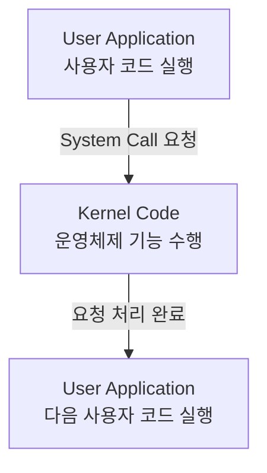

운영체제를 공부하면서 `System Call`이라는 용어를 처음 접했을 때는 단순히 이렇게 이해했다.

> 사용자 모드에서 커널 모드로 전환하는 것

틀린 설명은 아니지만, 이것만으로는 `fork()`, `exec()`, `wait()`가 왜 필요한지 한 번에 연결되지 않았다.

이번 글에서는 다음 질문에서 출발해 보려고 한다.

> **사용자 프로그램은 왜 운영체제의 기능을 직접 실행하지 못하고 System Call을 거쳐야 할까?**

이 질문을 따라가면 System Call은 단순한 모드 전환이 아니라, 사용자 프로그램과 운영체제가 맡은 역할을 나누는 경계라는 점을 이해할 수 있다. 그리고 Shell에서 프로그램 하나를 실행하는 과정 속에서 `fork`, `exec`, `wait`가 프로세스의 생성부터 종료까지 어떻게 이어지는지도 볼 수 있다.

## 1. System Call은 왜 필요한가

프로그램이 실행되면 CPU, 메모리, 파일, 네트워크 장치 같은 자원을 사용한다. 만약 모든 사용자 프로그램이 이 자원을 제한 없이 직접 조작할 수 있다면 어떤 문제가 생길까?

- 다른 프로세스의 메모리를 읽거나 덮어쓸 수 있다.
- 여러 프로그램이 같은 디스크나 네트워크 장치를 동시에 조작하면서 충돌할 수 있다.
- 특정 프로그램이 CPU를 계속 점유해 다른 프로그램이 실행되지 않을 수 있다.
- 파일 권한을 무시하고 중요한 데이터를 수정할 수 있다.

운영체제는 이런 문제를 막기 위해 실행 권한을 크게 두 수준으로 나눈다.

- `User Mode(사용자 모드)`: 일반 애플리케이션이 실행되는 제한된 권한의 영역
- `Kernel Mode(커널 모드)`: 운영체제가 CPU, 메모리, 장치, 프로세스 등을 관리하는 영역

애플리케이션은 제한된 환경에서 실행되고, 중요한 자원에 대한 접근은 운영체제가 검증하고 조정한다. 예를 들어 Java 프로그램이 파일을 읽을 때 JVM 코드만으로 디스크를 직접 제어하는 것이 아니다. JVM과 라이브러리가 운영체제가 제공하는 인터페이스를 요청하고, 커널이 파일 권한과 장치 상태를 확인한 뒤 실제 작업을 처리한다.

여기서 주의할 점이 있다.

> **System Call이 발생하면 프로세스 자체가 커널 모드가 되는 것은 아니다.**

정확히는 사용자 코드가 실행되던 CPU의 제어 흐름이 운영체제가 제공하는 커널 코드로 넘어간다. 커널이 요청을 처리한 다음에는 다시 사용자 코드의 실행 지점으로 돌아온다.



즉, `User Mode`와 `Kernel Mode`는 CPU가 현재 어떤 권한 수준에서 어떤 코드를 실행하는지를 설명하는 개념이다. System Call은 사용자 프로그램이 직접 할 수 없는 작업을 운영체제에 요청하고, 그 요청을 처리할 수 있도록 제어 흐름을 커널 코드로 전달하는 방법이다.

## 2. System Call이란 무엇인가

System Call(시스템 콜)은 다음과 같이 정의할 수 있다.

> **사용자 프로그램이 커널이 관리하는 기능을 요청하기 위한 인터페이스**

대표적인 요청은 다음과 같다.

- 파일 읽기와 쓰기
- 네트워크 통신
- 프로세스 생성
- 자식 프로세스 종료 대기
- 메모리 할당이나 매핑
- 프로세스 종료

사용자 프로그램이 파일 읽기 함수를 호출하면 내부적으로는 운영체제에 파일 작업을 요청하는 과정이 필요하다. 네트워크 요청이나 프로세스 생성도 마찬가지다. 애플리케이션은 필요한 정보를 전달하고, 운영체제는 권한과 자원 상태를 확인한 뒤 작업을 수행한다.

따라서 System Call을 “커널 모드로 전환하는 기능”이라고만 정의하면 중요한 부분이 빠진다. **핵심은 사용자 프로그램이 직접 수행할 수 없는 운영체제 기능을 요청하는 방법이라는 점**이다. 모드 전환은 그 요청을 안전하게 처리하기 위해 함께 일어나는 실행 환경의 변화다.

## 3. System Call과 Interrupt의 차이

앞서 [Interrupt는 왜 필요한가? CPU와 Kernel의 실행 흐름 이해하기](/posts/interrupt-execution-flow/)에서 CPU의 실행 흐름을 바꾸는 사건을 정리했다. System Call도 CPU의 제어 흐름을 커널 코드로 넘긴다는 점에서 Interrupt와 연결되지만, 발생 원인은 다르다.

### Hardware Interrupt(하드웨어 인터럽트)

CPU 외부의 장치가 사건을 알리기 위해 발생시킨다.

- 키보드 입력
- 디스크 I/O 완료
- 네트워크 패킷 수신
- Timer Interrupt

현재 실행 중인 프로그램이 직접 요청하지 않아도 장치에서 사건이 발생하면 CPU에 전달될 수 있다. 특히 실행 중인 명령어와 직접 관계없이 발생할 수 있다는 점에서 비동기적인 사건으로 설명한다.

### Exception(예외)

CPU가 명령어를 실행하는 과정에서 발생하는 사건이다.

- 0으로 나누기
- 잘못된 메모리 접근
- Page Fault

실행 중인 명령어와 관련해 발생하므로 Hardware Interrupt와 구분된다. 어떤 명령어가 실행 중이었고 어떤 주소에 접근했는지가 처리에 중요하다.

### System Call(시스템 콜)

사용자 프로그램이 운영체제 기능을 사용하기 위해 **의도적으로 요청하는 것**이다. CPU의 실행 흐름이 커널 코드로 넘어간다는 점은 Exception과 비슷하지만, 프로그램이 특정 운영체제 서비스를 요청하기 위해 발생시킨다는 점이 핵심이다.

| 구분 | 발생 원인 | 예시 |
| --- | --- | --- |
| Hardware Interrupt | 외부 장치의 사건 | 디스크 읽기 완료, 타이머 |
| Exception | 명령어 실행 중 발생한 사건 | 0으로 나누기, Page Fault |
| System Call | 사용자 프로그램의 의도적인 요청 | 파일 읽기, 프로세스 생성 |

System Call도 CPU의 실행 흐름을 커널 코드로 넘기지만, 하드웨어 장치가 비동기적으로 발생시키는 Hardware Interrupt와는 발생 원인이 다르다. 이 차이를 구분하면 “System Call도 Interrupt인가?”라는 질문에 대해, 구현상 trap이나 software interrupt 계열의 명령어를 사용할 수 있지만 개념적으로는 사용자 프로그램의 운영체제 기능 요청이라는 목적이 다르다고 설명할 수 있다.

## 4. `fork()` — 새로운 프로세스 생성

`fork()`는 현재 실행 중인 프로세스를 기준으로 새로운 자식 프로세스를 만드는 System Call이다. 하지만 “자식 프로세스를 만든다”에서 멈추면 실행 흐름을 이해하기 어렵다.

`fork()`가 성공하면 부모와 자식은 이후 서로 독립적인 프로세스가 된다. 각각 운영체제가 관리하는 실행 상태와 실행 문맥을 가지며, 운영체제는 두 프로세스를 별도의 실행 단위로 스케줄링한다.

또한 `fork()` 호출 결과를 통해 부모와 자식을 구분할 수 있다.

- 부모 프로세스: 새로 만들어진 자식의 PID를 반환받는다.
- 자식 프로세스: `0`을 반환받는다.
- 실패: 부모 프로세스에서 오류를 나타내는 값이 반환된다.

같은 코드에서 `fork()` 이후 부모와 자식의 실행이 갈라지는 이유가 여기에 있다. 두 프로세스가 같은 지점에서 이어서 실행할 수 있지만, 이후에는 서로 다른 프로세스다.

### Process Address Space와 Copy-on-Write

새 프로세스가 만들어진다는 것은 운영체제가 별도로 관리하는 **독립적인 프로세스 주소 공간과 실행 상태가 생긴다**는 의미다. 부모와 자식이 같은 주소를 사용하더라도 서로의 메모리를 마음대로 바꿀 수 있는 구조는 아니다.

다만 현대 운영체제는 `fork()` 직후 부모의 모든 메모리를 즉시 복사하지 않을 수 있다. `Copy-on-Write(쓰기 시 복사)`를 사용하면 부모와 자식이 초기에는 같은 물리 메모리 페이지를 참조하다가, 실제 수정이 발생한 부분만 복사한다.

> **Copy-on-Write는 부모와 자식이 초기에는 같은 물리 메모리를 참조하다가 실제 수정이 발생할 때 필요한 부분을 복사하는 최적화다.**

논리적으로는 독립된 주소 공간을 제공하면서도, 당장 복사할 필요가 없는 메모리까지 모두 복사하는 비용을 줄일 수 있다.

## 5. `fork()` 이후 부모와 자식은 누가 먼저 실행되는가

다음과 같은 오해를 자주 할 수 있다.

> `fork()`를 호출하면 항상 부모가 먼저 실행되거나, 항상 자식이 먼저 실행되는가?

정답은 아니다. `fork()` 이후 부모와 자식은 모두 실행 가능한 프로세스가 된다. 어떤 프로세스가 먼저 CPU를 할당받을지는 `Scheduler(스케줄러)`의 선택에 달려 있다.

```text
Parent Process
      │
    fork()
      │
 ┌────┴────┐
 ▼         ▼
Parent    Child
  │         │
  └── Scheduler가 실행 순서를 결정
```

부모와 자식은 각각 PCB(Process Control Block)에 관리 정보를 가지고, 스케줄러는 실행 가능한 프로세스 중 하나를 선택한다. 이미 실행 중인 다른 프로세스가 있는지, 우선순위와 실행 큐의 상태가 어떤지에 따라 실제 순서는 달라질 수 있다.

따라서 `fork()` 이후 부모와 자식의 출력 순서를 코드만 보고 단정하면 안 된다. 특정 순서가 필요하다면 프로세스 간 동기화나 `wait()` 같은 별도의 제어가 필요하다.

## 6. `exec()` — 현재 프로세스에서 다른 프로그램 실행

`exec()`를 이해할 때 가장 중요한 문장은 다음과 같다.

> **`exec()`는 새로운 프로세스를 생성하는 기능이 아니다.**

`exec()` 계열 System Call은 현재 프로세스의 프로그램 이미지를 새로운 프로그램으로 교체한다. 프로세스의 PID와 같은 프로세스 자체의 정체성은 유지하면서, 실행할 코드와 데이터 영역을 새로운 프로그램으로 바꾼다고 이해하면 된다.

| System Call | 하는 일 |
| --- | --- |
| `fork()` | 새로운 프로세스를 생성한다. |
| `exec()` | 현재 프로세스의 실행 프로그램을 다른 프로그램으로 교체한다. |

`exec()`가 성공하면 기존 프로그램의 실행 흐름으로 돌아오지 않는다. 새로운 프로그램이 같은 프로세스 안에서 실행되기 때문이다. 반대로 프로그램 교체에 실패한 경우에는 호출한 프로그램에서 오류를 처리할 수 있다.

### Shell에서 명령어를 실행하는 이유

Shell에서 다음 명령어를 실행한다고 해 보자.

```bash
$ java MyApplication
```

Shell 프로세스 자체에서 바로 `exec()`를 호출하면 Shell의 프로그램 이미지가 Java 프로그램으로 교체된다. 그러면 명령어가 끝난 뒤 원래 Shell로 돌아올 수 없다.

그래서 일반적인 개념 흐름은 다음과 같다.

```mermaid
flowchart TD
    A[Shell Process] -->|fork()| B[Parent Shell]
    A -->|fork()| C[Child Process]
    B -->|wait()| D[자식 종료 상태 회수]
    C -->|exec(java)| E[Java Program 실행]
    E --> F[자식 프로세스 종료]
    F --> D
```

1. Shell이 `fork()`로 자식 프로세스를 만든다.
2. 자식 프로세스가 `exec()`로 실행할 프로그램을 Java 프로그램으로 교체한다.
3. 부모 Shell은 계속 존재하면서 자식의 종료를 기다린다.

이렇게 하면 명령어가 끝난 뒤에도 Shell에서 다음 명령어를 입력할 수 있다. 실제 Shell의 구현은 백그라운드 실행, 파이프, 리다이렉션 등으로 더 복잡하지만, 운영체제 개념을 학습할 때는 `fork → exec` 흐름만으로도 핵심을 이해할 수 있다.

## 7. `wait()` — 부모가 자식의 종료를 기다리는 이유

`wait()`는 단순히 부모 프로세스를 멈추는 함수가 아니다. 부모 프로세스가 자식 프로세스의 종료 여부와 종료 상태(exit status)를 확인하고 회수하는 역할을 한다.

자식 프로세스가 작업을 끝내면 운영체제는 부모가 확인할 수 있도록 종료 상태를 남긴다. 부모가 `wait()` 또는 관련 System Call을 호출하면 이 상태를 전달받고, 운영체제는 더 이상 필요하지 않은 자식의 관리 정보를 정리할 수 있다.

### Zombie Process

자식이 종료했지만 부모가 아직 종료 상태를 회수하지 않은 경우를 `Zombie Process(좀비 프로세스)`라고 한다.

> **좀비 프로세스는 실행은 종료되었지만 부모 프로세스가 아직 종료 상태를 회수하지 않은 자식 프로세스다.**

좀비 프로세스는 작업을 계속 실행하고 있는 것이 아니다. 이미 종료되었지만, 부모에게 전달할 종료 상태와 운영체제가 관리하는 일부 정보가 남아 있는 상태다. 부모가 `wait()`를 호출해 상태를 회수하면 운영체제는 이 관리 정보를 정리한다.

따라서 `wait()`의 의미는 “자식이 끝날 때까지 무조건 기다린다”보다 넓다.

- 자식 프로세스가 종료했는지 확인한다.
- 자식의 종료 상태를 전달받는다.
- 종료된 자식의 관리 정보를 운영체제가 정리하도록 한다.

## 8. `fork` / `exec` / `wait`를 하나의 흐름으로 이해하기

세 System Call을 각각 외우면 다음처럼 보인다.

- `fork`: 프로세스 생성
- `exec`: 프로그램 교체
- `wait`: 자식 종료 대기 및 상태 회수

하지만 Shell이 명령어를 실행하는 흐름에 넣어 보면 하나의 프로세스 생명주기로 연결된다.

```text
Shell
  │
  │ fork()
  ▼
Child Process 생성
  │
  │ exec(java)
  ▼
Java Program 실행
  │
  ▼
자식 프로세스 종료

Shell
  │
  │ wait()
  ▼
자식 종료 상태 확인 및 회수
```

이 흐름에서 부모 Shell은 자식 프로세스를 만들고, 자식은 자신의 프로그램 이미지를 Java 프로그램으로 바꾼다. 부모는 자식이 종료될 때까지 기다린 뒤 종료 상태를 회수한다.

**`fork()`는 실행 주체를 만들고, `exec()`는 그 실행 주체가 수행할 프로그램을 정하며, `wait()`는 자식의 종료를 부모가 정리하는 단계다.** 이것이 세 System Call을 함께 이해해야 하는 이유다.

## 9. Process, PCB, Scheduler와 연결하기

이전까지 배운 Process 개념과 연결하면 각 System Call의 역할이 더 분명해진다.

### `fork()`와 Process

새로운 프로세스가 만들어지므로 운영체제는 새로운 실행 단위를 관리해야 한다. 새 프로세스에는 PID, 상태, 실행에 필요한 정보가 부여되고, 운영체제는 이를 스케줄링 대상에 추가한다.

### `exec()`와 Process Address Space

`exec()`는 프로세스 자체를 새로 만드는 것이 아니라 현재 프로세스의 프로그램 이미지를 교체한다. 따라서 “새 프로그램이 실행되었다”와 “새 프로세스가 만들어졌다”는 항상 같은 뜻이 아니다.

### `wait()`와 프로세스 생명주기

`wait()`는 부모와 자식 사이의 생명주기 관리와 관련 있다. 자식이 종료했는지 확인하고 종료 상태를 회수함으로써 종료된 자식의 관리 정보를 정리한다.

### PCB와 실행 상태

프로세스가 생성되면 운영체제는 PCB(Process Control Block)에 PID, 프로세스 상태, CPU 실행 정보 등 프로세스를 관리하기 위한 정보를 유지한다. 부모와 자식이 서로 다른 프로세스라는 것은 운영체제가 이들을 각각 관리하고 스케줄링한다는 의미이기도 하다.

## 10. Context Switching과 System Call 구분하기

다음 질문에 대한 답은 “항상 그렇지는 않다”이다.

> **System Call이 발생하면 항상 Context Switching이 발생하는가?**

System Call이 호출되면 사용자 코드에서 커널 코드로 `Mode Switching`이 발생할 수 있다. 하지만 커널이 요청을 처리한 뒤 같은 프로세스의 사용자 코드로 바로 돌아올 수 있다.

```text
System Call
→ User Mode / Kernel Mode 전환

Context Switching
→ 실행 중인 Process / Thread 변경
```

`Context Switching(문맥 교환)`은 현재 CPU를 사용하던 프로세스나 스레드의 실행 상태를 저장하고, 다른 실행 단위의 상태를 복원해 CPU를 넘기는 과정이다. Mode Switching은 권한 수준과 실행 코드가 바뀌는 것이고, Context Switching은 CPU를 사용하는 실행 단위가 바뀌는 것이다.

다만 둘이 한 흐름에서 함께 발생할 수는 있다. 예를 들어 System Call 중 파일이나 네트워크 I/O를 기다려야 한다면 현재 프로세스가 `Waiting` 상태로 바뀔 수 있다. 그러면 Scheduler가 다른 실행 가능한 프로세스를 선택하고, 그때 Context Switching이 발생할 수 있다.

```text
System Call
  ↓
I/O 대기로 현재 프로세스가 Waiting
  ↓
Scheduler가 다른 프로세스 선택
  ↓
필요한 경우 Context Switching
```

그러므로 System Call과 Context Switching은 같은 개념이 아니다. System Call이 Context Switching을 일으킬 수도 있지만, 모든 System Call이 반드시 Context Switching을 일으키는 것은 아니다.

## 11. Java/Spring 개발과 연결하기

Java 애플리케이션도 결국 운영체제 위에서 실행되는 하나의 프로세스다.

```bash
java -jar app.jar
```

이 명령어를 실행하면 Shell의 요청을 통해 JVM 프로세스가 생성되고, 운영체제는 PID와 실행 상태를 관리한다. Spring Boot 애플리케이션이 다음 작업을 수행할 때도 JVM 내부 코드만으로 모든 일이 끝나는 것은 아니다.

- 파일을 읽고 쓴다.
- 네트워크 요청을 보내고 응답을 받는다.
- DB와 통신한다.
- 로그를 파일이나 표준 출력에 기록한다.

이 작업들은 최종적으로 운영체제가 제공하는 파일, 소켓, 프로세스, 메모리 관련 기능을 사용한다. Java 개발자가 직접 `fork()`를 호출할 일은 많지 않더라도 다음 대상을 이해할 때 같은 기반 개념이 필요하다.

- JVM 프로세스
- Docker Container 내부의 프로세스
- Shell Script와 배포 스크립트
- CI/CD에서 실행되는 프로세스
- Java의 `ProcessBuilder`

예를 들어 `ProcessBuilder`로 외부 명령을 실행하면 Java 프로그램이 운영체제에 새로운 프로세스 실행을 요청하는 흐름을 이해해야 한다. 명령이 끝날 때까지 `process.waitFor()`로 기다리는 것도 부모가 자식의 종료를 확인하는 `wait()`와 연결해서 볼 수 있다. Java API가 운영체제 System Call을 그대로 노출하는 것은 아니지만, 프로세스 생명주기를 다루는 문제의식은 이어진다.

또한 [스레드는 많을수록 좋을까? Context Switching과 Thread Pool의 관계](/posts/thread-pool-context-switching/)에서 다룬 것처럼, 프로세스와 스레드의 실행 상태를 이해하는 일은 서버 성능과도 연결된다. 어떤 작업이 CPU를 사용하는지, 어떤 작업이 I/O를 기다리는지에 따라 운영체제의 Scheduler와 애플리케이션의 실행 흐름이 달라진다.

## 12. 헷갈리기 쉬운 부분 정리

### System Call은 프로세스 자체를 Kernel Mode로 바꾸는가?

프로세스 자체의 성격이 바뀌는 것이 아니다. CPU의 제어 흐름이 사용자 코드에서 커널 코드로 넘어갔다가 다시 돌아오는 것이다.

### `exec()`는 새로운 프로세스를 만드는가?

아니다. 현재 프로세스의 프로그램 이미지를 교체한다. 새로운 프로세스가 필요하면 보통 `fork()`로 프로세스를 만든 뒤 자식 프로세스에서 `exec()`를 호출한다.

### `wait()` 중인 부모는 자식이 종료하면 자원을 모두 잃는가?

아니다. 부모 프로세스는 자식의 종료 상태를 회수하기 위해 기다리는 것이다. 자식이 좀비 상태로 남아 있을 때 `wait()`를 호출하면 운영체제가 종료된 자식의 관리 정보를 정리할 수 있다.

### `fork()` 직후 부모와 자식 중 누가 먼저 실행되는가?

정해져 있지 않다. 두 프로세스가 실행 가능한 상태가 된 뒤 Scheduler가 실행 순서를 결정한다.

### System Call이 발생하면 항상 Context Switching되는가?

아니다. 같은 프로세스가 커널 요청을 처리하고 사용자 코드로 바로 복귀할 수도 있다. I/O 대기로 현재 프로세스가 Waiting 상태가 되고 다른 실행 단위가 선택될 때 Context Switching이 발생할 수 있다.

## 마무리

처음에는 System Call을 단순히 “User Mode에서 Kernel Mode로 바꾸는 것”이라고 생각했다. 하지만 공부하면서 더 중요한 핵심은 모드 자체가 아니라 다음 문장에 있다는 것을 알게 되었다.

> **사용자 프로그램이 직접 할 수 없는 작업을 운영체제에 요청하고, CPU의 제어 흐름이 그 요청을 처리하는 커널 코드로 넘어간다.**

그리고 `fork`, `exec`, `wait`는 각각 독립된 함수처럼 보이지만 Shell에서 프로그램을 실행하는 과정을 보면 하나의 흐름으로 연결된다.

```text
fork
새로운 실행 주체 생성
        ↓
exec
실행할 프로그램 교체
        ↓
wait
자식 프로세스의 종료 상태 회수
```

이 과정에서 이전에 배운 Process, Process Address Space, PCB, Scheduler, Context Switching, Interrupt 개념도 서로 이어진다.

```text
사용자 프로그램은 시스템 자원을 직접 제어할 수 없다.
        ↓
System Call을 통해 운영체제에 기능을 요청한다.
        ↓
프로세스 생성에는 fork
        ↓
프로그램 교체에는 exec
        ↓
자식 종료 상태 회수에는 wait
        ↓
Process, Scheduler, Context Switching과 연결된다.
```

결국 `fork`는 단순한 생성 함수가 아니고, `exec`는 단순한 실행 함수가 아니며, `wait`는 단순한 대기 함수가 아니다. **운영체제가 프로세스의 생성과 실행, 종료 생명주기를 어떤 경계를 통해 관리하는지 보여 주는 System Call**이라고 이해하면 세 개념을 하나의 실행 흐름으로 볼 수 있다.
