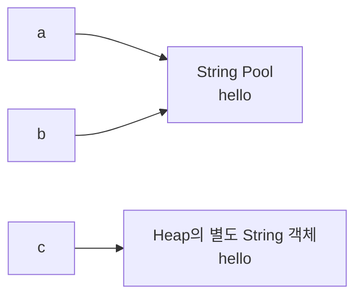
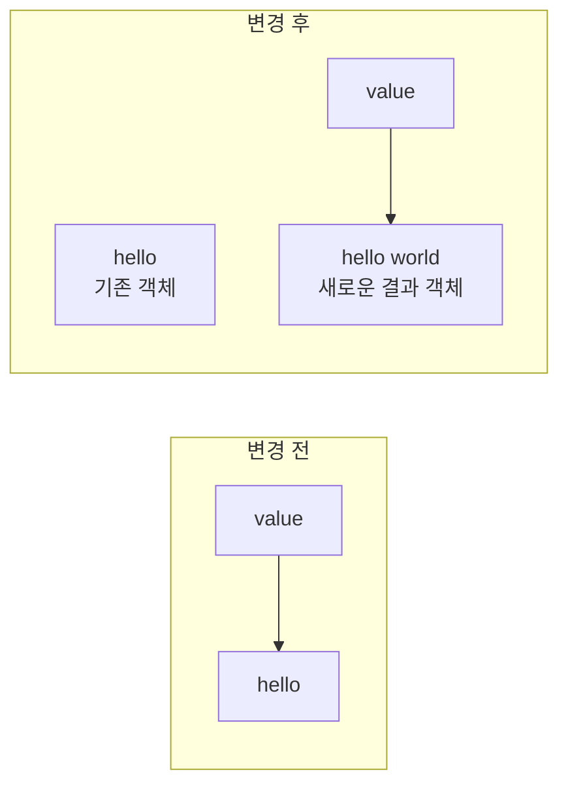
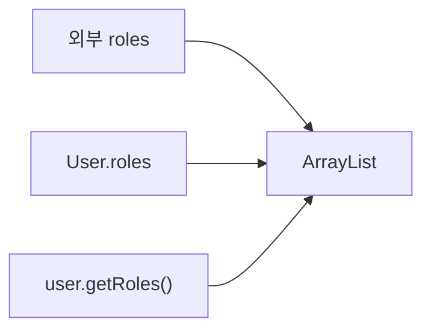

이 주제는 이번에 처음 만난 개념은 아니다. 1월에 [람다에서 JPA 엔티티를 사용하며 `final`과 effectively final을 확인했고](/posts/jpa-lambda-compile-error/), [테스트 때문에 엔티티에 setter를 열면 안 되는 이유](/posts/entity-setter-test/)를 정리하면서 상태 변경의 통로를 어디까지 허용할지 고민했다. 당시에는 컴파일 규칙과 도메인 캡슐화의 문제로 각각 보였던 내용이다.

이후 [변수와 타입](/posts/java-variable-type/) 글에서 참조 타입 변수에는 객체 자체가 아니라 객체를 가리키는 참조값이 저장된다고 정리했고, 어제는 [Object 클래스와 객체 동등성](/posts/java-object-equals-hashcode/)을 통해 참조 동일성과 논리적 동등성, `equals()`와 `hashCode()`의 관계까지 살펴봤다. [캡슐화와 접근 제어자](/posts/java-encapsulation-access-modifier/)에서는 객체가 자신의 상태를 외부에 그대로 노출하지 않아야 한다는 관점도 정리했다.

이번 글은 그 내용을 String에 적용해 보는 다음 단계다. String Pool과 `new String()`의 차이는 참조 관계를 확인하는 사례이고, String의 불변성은 객체 상태와 변수의 참조를 구분하게 만든다. 여기서 `final`, 가변 컬렉션, 방어적 복사까지 이어지면서 “불변 객체를 어떻게 설계할 것인가”라는 질문으로 범위가 넓어졌다.

## 앞서 정리한 참조 개념을 String에 적용하기

String 리터럴과 `new String()`의 차이는 앞서 정리한 참조 관계에 String Pool의 공유 규칙이 얹힌 사례다.

```java
String a = "hello";
String b = "hello";
String c = new String("hello");

System.out.println(a == b);
System.out.println(a == c);
System.out.println(a.equals(c));
```

실행 결과는 다음과 같다.

```text
true
false
true
```

이 결과 자체는 어제 Object 글에서 정리한 규칙으로 설명된다. 다만 String에서는 같은 리터럴을 공유하는 String Pool이 개입하기 때문에 참조 관계를 직접 그려 보면 이해가 더 분명해진다.

## String Pool과 객체 참조

앞서 변수와 타입 글에서 배운 것처럼 `String`도 참조 타입이다. 변수에 저장되는 것은 문자 자체가 아니라 String 객체를 가리키는 참조값이다. 여기에 문자열 리터럴(String literal)을 String Pool에서 관리하고 같은 리터럴의 String 인스턴스를 공유하는 규칙이 더해진다. 이 규칙 때문에 다음 코드의 `a`와 `b`는 동일한 객체를 참조한다.

```java
String a = "hello";
String b = "hello";
```

`new String("hello")`는 다르게 동작한다. `"hello"`라는 리터럴은 String Pool에 존재하지만, `new`는 그 내용을 가진 별도의 String 객체를 새로 만든다. 그래서 `c`는 Pool의 객체가 아니라 새로 생성된 객체를 참조한다.



> **이미지 생성 프롬프트:**
> 기술 블로그에 어울리는 심플한 시스템 다이어그램 스타일. 왼쪽에 변수 `a`, `b`, `c`를 세로로 배치하고, 오른쪽에 `String Pool` 영역과 일반 Heap 영역을 구분한다. `a`와 `b`는 String Pool 안의 동일한 `"hello"` 객체를 가리키고, `c`는 Heap의 별도 `"hello"` String 객체를 가리키는 화살표를 그린다. 같은 문자열 내용과 서로 다른 객체 참조가 대비되도록 표현한다. 흰색 배경, 검정·짙은 남색 선, 강조색은 한 가지 파란색만 사용하고 장식은 배제한다.

이 결과를 보면 `a`, `b`, `c`는 모두 문자열 내용으로는 `hello`를 갖지만 참조 관계는 같지 않다. `a`와 `b`가 같은 객체를 바라보고 `c`가 별도의 객체를 바라본다는 점을 구분하면 앞의 실행 결과가 설명된다.

## `==`와 `equals()`의 복습: 참조인가 내용인가

### `==`는 참조 동일성을 비교한다

참조 타입에서 `==`가 두 변수가 같은 객체를 가리키는지 비교한다는 내용은 변수와 타입 글에서 확인했다. String에서도 객체 내부의 문자열 내용이 아니라 참조 동일성을 비교한다.

```java
String first = new String("hello");
String second = new String("hello");
String third = first;

System.out.println(first == second); // false
System.out.println(first == third);  // true
```

`first`와 `second`는 내용이 같은 별개의 객체다. 반면 `third`에는 `first`의 참조를 대입했으므로 두 변수는 같은 객체를 가리킨다.

### `equals()`는 클래스가 정의한 논리적 동등성을 비교한다

`Object.equals()`의 기본 구현이 참조 동일성을 기준으로 동작한다는 내용은 어제 정리했다. String은 `equals()`를 오버라이딩하여 문자열 내용을 논리적 동등성의 기준으로 사용한다.

```java
String first = new String("hello");
String second = new String("hello");

System.out.println(first.equals(second)); // true
```

서로 다른 객체라도 String의 내용이 같으면 `equals()`는 `true`를 반환한다. 이때 “같다”는 말은 같은 인스턴스라는 뜻이 아니라, String 클래스가 정한 논리적 동등성(logical equality)을 만족한다는 뜻이다.

어제 글에서 확인했듯이 모든 클래스의 `equals()`가 자동으로 필드 값을 비교하는 것은 아니다. 기본 구현을 그대로 쓰는 클래스도 있고, ID만 비교하도록 직접 재정의하는 클래스도 있다. `equals()`가 무엇을 비교하는지는 해당 클래스의 구현과 도메인 규칙에 달려 있다.

## 참조는 바뀌어도 String 객체는 바뀌지 않는다

변수와 타입 글에서 같은 객체를 가리키는 참조값과 객체 내부 상태의 변경을 구분했다. String은 이 차이를 가장 분명하게 보여주는 예다. 문자열을 이어 붙이는 코드를 살펴보자.

```java
String value = "hello";
value = value + " world";
```

겉으로는 `value` 안의 문자열이 수정된 것처럼 보인다. 실제로는 기존 String 객체의 내용이 바뀌지 않는다.



`value = value + " world"`가 실행되면 `hello world`라는 새로운 문자열 결과가 만들어지고, `value`가 그 결과를 참조하도록 대입된다. 기존 `hello` 객체는 그대로 남는다.

> **이미지 생성 프롬프트:**
> 기술 블로그용 메모리 구조 다이어그램. 화면을 왼쪽과 오른쪽으로 나누어 왼쪽에는 `value → "hello"`, 오른쪽에는 기존 `"hello"` 객체는 그대로 둔 채 `value → "hello world"`라는 새 객체를 가리키는 구조를 보여준다. 변수의 참조가 이동한 것과 기존 객체의 내부 값은 변하지 않은 것을 굵은 화살표와 짧은 주석으로 강조한다. Java 코드 조각을 작게 배치하되 전체는 단색 선 중심의 깔끔한 인포그래픽으로 구성한다.

여기서 꼭 구분해야 할 것이 있다.

> 변수의 참조가 바뀌는 것과 객체 내부 상태가 바뀌는 것은 다르다.

String이 불변(immutable)이라는 말은 String 객체가 생성된 뒤 그 객체 내부의 문자열 상태를 변경할 수 없다는 뜻이다. `value`라는 변수는 다른 String 객체를 참조하도록 바뀐다. 변수의 재할당이 가능하다는 이유로 String 객체가 가변이라고 판단하면 안 된다.

String은 외부에서 내부 상태를 바꿀 수 있는 메서드를 제공하지 않고, 문자열을 변환하는 연산은 새로운 String을 반환한다. 구현 내부의 저장 방식은 JDK 버전에 따라 달라질 수 있지만, 사용자가 관찰하는 계약은 “한 번 만들어진 String의 내용은 변하지 않는다”는 것이다.

## 반복 조작에서는 StringBuilder를 사용하는 이유

String의 불변성은 안전한 공유와 예측 가능한 동작에 도움이 된다. 반대로 문자열을 여러 번 이어 붙이는 코드에서는 앞에서 본 새 결과 객체 생성이 반복되기 쉽다.

```java
String result = "";

for (int i = 0; i < 1000; i++) {
    result += i;
}
```

이 코드는 반복할 때마다 이전 문자열과 새로운 값을 합친 결과를 다시 만들어 `result`에 대입하는 구조가 되기 쉽다. 문자열 길이가 커질수록 객체 생성과 기존 내용 복사 비용도 함께 커지기도 한다. 하나의 간단한 연결 표현식은 컴파일러가 최적화하기도 하지만, 반복적인 조작을 코드로 명확하게 표현하려면 가변 버퍼를 사용하는 편이 적절하다.

```java
StringBuilder builder = new StringBuilder();

for (int i = 0; i < 1000; i++) {
    builder.append(i);
}

String result = builder.toString();
```

`StringBuilder`는 내부 상태를 바꿀 수 있는 가변 객체다. 반복 중에는 같은 빌더에 값을 추가하고, 작업이 끝났을 때 `toString()`으로 최종 String을 만든다.

“StringBuilder가 더 빠르다”라고만 기억하기보다 다음 원인과 결과로 연결하는 편이 정확하다.

> String은 불변이므로 반복 수정에서 새로운 결과 객체가 만들어지기 쉽다. StringBuilder는 내부 버퍼를 변경하면서 작업하므로 반복적인 문자열 조작에 적합하다.

## `final`은 불변 객체를 보장하지 않는다

캡슐화 글에서 `private`은 객체가 자신의 상태를 책임진다는 경계를 나타낸다고 정리했다. 그렇다면 `private final List`처럼 선언된 필드는 내부 상태까지 보호할까? 먼저 `final`이 실제로 제한하는 범위를 확인해 보자.

```java
final List<String> roles = new ArrayList<>();

roles.add("USER");
roles.add("ADMIN");
```

`roles`에는 `final`이 붙었지만 `add()`는 정상적으로 실행된다. `final`이 막는 것은 참조 변수의 재할당이지, 참조가 가리키는 객체의 내부 상태 변경이 아니기 때문이다.

```java
roles = new ArrayList<>(); // 컴파일 오류
roles.add("ADMIN");       // 가능
```

둘의 차이는 다음과 같다.

| 구분 | 보호하는 대상 | 예시 |
| --- | --- | --- |
| `final` 참조 | 참조 변수의 재할당 | `roles = otherList` 제한 |
| 불변 객체 | 객체 내부 상태의 변경 | 생성 후 값 변경 불가 |
| 수정 불가 컬렉션 | 컬렉션을 통한 구조 변경 | `add`, `remove` 제한 |

그래서 `final == immutable`은 성립하지 않는다. 불변 객체를 만들려면 필드의 참조를 한 번만 대입하는 것뿐 아니라 객체 내부 상태 자체가 변경되지 않아야 한다. 컬렉션처럼 가변 객체를 필드로 둔다면, 그 객체를 외부에서 바꿀 경로도 함께 차단해야 한다.

## 캡슐화된 것처럼 보이는 컬렉션 필드의 허점

앞선 캡슐화 글에서 getter와 setter를 제공하는 것만으로 캡슐화가 완성되지 않는다고 정리했다. 1월 예약 엔티티 글에서도 상태 전이 규칙을 우회하는 setter를 열지 않는 선택을 했다. 컬렉션 필드는 같은 원칙이 참조 공유 문제로 나타나는 경우다. 다음 `User` 클래스는 겉보기에는 `roles`를 `final`로 관리하고 있다.

```java
public class User {

    private final List<String> roles;

    public User(List<String> roles) {
        this.roles = roles;
    }

    public List<String> getRoles() {
        return roles;
    }
}
```

하지만 생성자에서 전달받은 List 참조를 그대로 저장하고 있다. 외부에서 같은 List를 계속 가지고 있으므로 다음과 같은 변경이 가능하다.

```java
List<String> roles = new ArrayList<>();
roles.add("USER");

User user = new User(roles);

roles.add("ADMIN");
System.out.println(user.getRoles()); // [USER, ADMIN]
```

`User`의 코드를 호출한 쪽이 `user`의 메서드를 호출하지 않았는데도 내부 역할 목록이 바뀌었다. 생성자에 전달한 List와 `User.roles`가 같은 객체를 가리키고 있기 때문이다.



> **이미지 생성 프롬프트:**
> 심플한 기술 블로그 다이어그램. 왼쪽에 `외부 roles`, 오른쪽에 `User.roles`, 아래에 `user.getRoles()`를 배치하고 세 참조가 하나의 `ArrayList` 객체를 함께 가리키는 구조를 보여준다. 이어서 옆에 안전한 구조를 비교 배치한다. 안전한 구조에서는 외부 `ArrayList A`와 `User.roles`가 가리키는 수정 불가한 `List B`를 분리하고, getter는 내부 List B를 반환하되 외부에서 `add`할 수 없다는 주석을 넣는다. 공유 참조와 복사된 참조의 차이가 한눈에 보이는 흑백·파란색 다이어그램으로 구성한다.

getter도 같은 문제를 만든다.

```java
user.getRoles().add("ADMIN");
```

`getRoles()`가 내부 List를 그대로 반환하면 외부 코드는 `User`의 내부 상태를 직접 수정할 여지가 생긴다. 필드에 `final`을 붙였다는 사실만으로는 이 경로를 막지 못한다.

## 방어적 복사로 객체의 상태 소유권을 분리한다

외부에서 전달된 가변 객체를 그대로 저장하지 않고, 객체가 관리할 사본을 만드는 방식을 방어적 복사(defensive copy)라고 한다. 이는 캡슐화 글에서 다룬 “상태 변경의 책임을 객체 안에 둔다”는 원칙을 참조 경계까지 확장한 것이다. String 원소가 들어 있는 역할 목록이라면 다음처럼 작성한다.

```java
import java.util.List;

public class User {

    private final List<String> roles;

    public User(List<String> roles) {
        this.roles = List.copyOf(roles);
    }

    public List<String> getRoles() {
        return roles;
    }
}
```

`List.copyOf(roles)`는 전달받은 List의 내용을 바탕으로 수정할 수 없는 List를 만든다. 이제 생성자에 넘긴 외부 List를 나중에 수정해도 `User`의 역할 목록에는 영향을 주지 않는다. getter가 내부 List를 반환하더라도 `add()`나 `remove()`로 구조를 바꿀 수 없다.

참조 관계는 다음처럼 달라진다.

```text
참조를 그대로 저장한 경우
외부 roles ─────┐
                ▼
             ArrayList
                ▲
                │
User.roles ─────┘

방어적 복사를 적용한 경우
외부 roles ───▶ ArrayList A

User.roles ───▶ 수정 불가한 List B
```

방어적 복사는 단순히 `final`을 추가하는 작업이 아니다. 객체 안에서 관리할 상태의 소유권을 분리하고, 외부가 내부 상태에 접근할 수 있는 통로를 점검하는 작업이다.

다만 `List.copyOf()`는 컬렉션 구조를 복사할 뿐, 원소를 재귀적으로 복사하는 깊은 복사(deep copy)는 아니다. 지금처럼 원소가 String이면 String 자체도 불변이므로 문제가 없다. 만약 `Role` 같은 가변 객체가 원소라면 List를 복사해도 외부가 같은 `Role` 객체로 내부 상태를 바꿀 여지가 있다. 그 경우에는 원소까지 새로운 객체로 만드는 별도의 복사 전략이 필요하다.

## 불변성은 설계의 기본값이지 만능 규칙은 아니다

불변 객체는 생성 후 상태가 바뀌지 않으므로 공유하기 쉽고, 변경 시점을 추적하기도 편하다. 값 자체가 객체의 의미인 Value Object나 생성 이후 내용이 바뀔 필요가 없는 DTO는 불변으로 설계하기 좋은 대상이다.

다만 1월 예약 엔티티 글에서 상태 전이를 막지 않고 setter를 제한했던 것처럼, 캡슐화의 목표가 모든 상태 변경을 없애는 것은 아니다. 주문이나 예약처럼 상태 변화가 도메인 생명주기의 일부인 객체도 있으므로 불변성을 모든 객체에 기계적으로 적용할 수는 없다.

```text
CREATED
   ↓
PAID
   ↓
CANCELED
```

이런 객체를 무조건 불변으로 만들면 상태가 바뀔 때마다 새 객체를 만들어야 한다. 그 구조가 항상 나쁜 것은 아니지만, 도메인의 상태 전이를 표현하는 방식과 잘 맞는지 판단하는 것이 먼저다.

상태 변경이 필요한 엔티티라면 아무 곳에서나 필드를 바꾸게 하기보다, 객체가 자신의 변경 규칙을 책임지도록 만든다.

```java
public void cancel() {
    if (status == OrderStatus.COMPLETED) {
        throw new IllegalStateException("완료된 주문은 취소할 수 없습니다.");
    }

    this.status = OrderStatus.CANCELED;
}
```

`setStatus()`를 열어 두면 호출하는 쪽에서 완료된 주문을 취소하는 등 잘못된 상태를 만든다. `cancel()`처럼 의미 있는 메서드를 제공하면 상태 변경과 검증 규칙을 한곳에 둔다.

불변 객체 설계와 엔티티의 캡슐화는 서로 반대되는 개념이 아니다. 값이 바뀌지 않아야 하는 객체는 불변으로 만들고, 상태 전이가 필요한 객체는 허용된 전이를 메서드로 제한하면 된다.

## 앞선 학습과 연결하며 다시 확인한 경계

### `final`과 effectively final을 객체 불변성과 같은 의미로 묶었다

1월 람다 글에서 effectively final은 람다에서 캡처하는 지역 변수의 재할당 여부와 관련된 개념이었다. 여기서 `final`도 참조 변수의 재할당을 막을 뿐이다. 참조가 가리키는 객체의 변경까지 막으려면 객체 자체가 불변이거나, 외부에 수정 가능한 참조를 노출하지 않아야 한다.

### 참조값의 대입과 객체 상태의 변경을 같은 사건으로 봤다

변수와 타입 글에서 다룬 참조값의 이동 문제다. 변수에 새로운 String 객체의 참조를 다시 대입한 것이며, 기존 String 객체의 내용은 그대로 남아 있다.

### `equals()`를 모든 객체의 공통 값 비교 규칙으로 봤다

Object 글에서 정리한 것처럼 `Object.equals()`의 기본 동작은 참조 동일성 비교다. String처럼 `equals()`를 오버라이딩한 클래스만 자신이 정한 기준에 따라 내용을 비교한다.

### setter를 없애는 것과 불변 객체를 같은 설계로 봤다

캡슐화 글과 1월 예약 엔티티 글에서 상태 변경의 책임을 객체 안에 두는 것과 같은 맥락이다. Value Object처럼 값이 바뀌지 않아야 하는 객체와, 주문처럼 상태 전이가 역할의 일부인 엔티티를 같은 방식으로 설계할 필요는 없다.

## 백엔드 개발과 연결하기

앞선 실무 글에서 엔티티의 상태 변경 통로를 제한했던 이유를 오늘은 Java 참조 모델의 관점에서 다시 설명하게 됐다. DTO나 Value Object를 여러 계층에서 공유할 때 불변성과 참조 경계를 적용하면 값이 중간에 바뀌는 경로를 줄인다. 특히 컬렉션 필드를 외부에 그대로 노출하면 서비스나 컨트롤러 어느 곳에서든 내부 상태까지 수정하는 경로가 남으므로 생성자와 getter 양쪽의 참조 경계를 확인할 필요가 있다.

여러 코드가 하나의 가변 List나 Map을 공유하는 구조도 주의할 대상이다. 변경을 수행한 코드를 찾기 어렵고, 호출 순서에 따라 결과가 달라지기도 한다. 내부에서 복사본을 소유하거나 수정 불가한 형태로 반환하면 이런 추적 비용을 줄인다.

JPA 엔티티처럼 생명주기 동안 상태가 바뀌는 객체는 무조건 불변으로 만들기보다 setter를 그대로 공개하지 않는 방식이 현실적이다. `pay()`, `cancel()`, `changeAddress()`처럼 의도가 드러나는 메서드 안에서 변경 조건을 검사하면 객체가 자신의 상태 규칙을 지키게 된다.

## 오늘의 정리

1월의 `final`과 엔티티 setter 문제, 변수와 타입 글의 참조값, Object 글의 동등성 기준, 캡슐화 글의 상태 책임을 차례로 연결한 뒤 String을 다시 보니 각각의 내용이 하나의 흐름으로 이어졌다. 문자열 리터럴은 Pool을 사용하고 `==`와 `equals()`의 결과가 다른 이유도 이 흐름 안에서 설명된다.

`==`는 참조 동일성을 비교하고, String의 `equals()`는 문자열 내용의 논리적 동등성을 비교한다. String의 불변성은 변수에 새 참조를 대입할 수 없다는 뜻이 아니라, 이미 만들어진 String 객체의 내부 상태를 바꿀 수 없다는 뜻이다. 반복적인 문자열 조작에서 StringBuilder를 사용하는 이유도 이 불변성에서 출발한다.

`final`은 불변 객체를 만드는 조건 중 하나가 될 수 있지만 충분조건은 아니다. 컬렉션 필드를 가진 객체는 생성자에서 외부 참조를 그대로 저장하지 않는지, getter로 내부의 가변 객체를 그대로 반환하지 않는지까지 확인할 필요가 있다. 이때 방어적 복사는 객체가 자신의 상태를 소유하도록 참조 경계를 만든다.

마지막으로 불변성은 모든 객체에 기계적으로 적용하는 규칙이 아니다. 값이 바뀌지 않아야 하는 객체는 불변으로 설계하고, 상태 전이가 필요한 엔티티는 의미 있는 메서드로 변경 규칙을 제한한다.

이제 `final`을 붙이거나 `List`를 필드로 선언할 때 앞서 캡슐화 글에서 던졌던 질문을 참조 관점으로 확장해 보려고 한다.

> 이 객체의 상태를 누가 소유하고 있으며, 외부에서 그 상태를 바꿀 수 있는 참조가 남아 있는가?

이 질문을 기준으로 보면 불변 객체 설계는 키워드 하나를 붙이는 일이 아니라, 객체와 참조의 경계를 설계하는 일이라는 점이 분명해진다.
